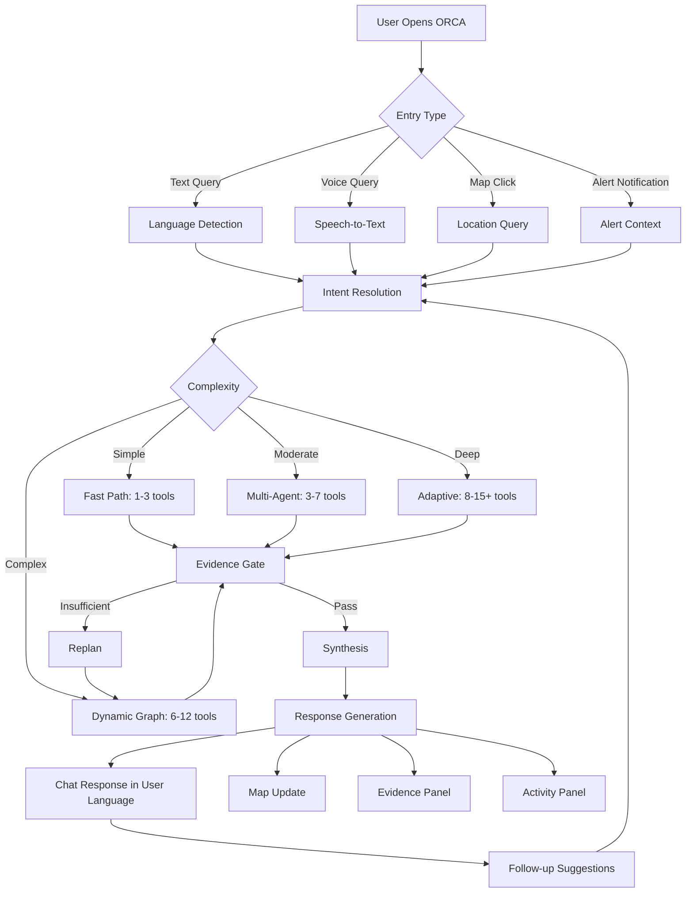

# ORCA Architecture Document 1 — Complete User Flow Architecture

**Project:** ORCA — Marine EcOsystem Reasoning with Collaborative Agents  
**Problem Statement ID:** 26176  
**Organization:** ISRO / Department of Space  
**Document:** User Flow Architecture — All Stakeholder Personas, Interaction Surfaces, and UI Behavior  
**Status:** Planning Phase — Architecture Design  
**Date:** 22 September 2026 (Updated: 26 September 2026)  
**PS Alignment:** This document demonstrates how ORCA's user-facing experience directly satisfies the PS's requirement for an intelligent conversational platform that enables users to interact naturally with marine information, ask questions, explore scenarios, and receive synthesized, evidence-based recommendations.

---

# 0. Design Philosophy

ORCA is **not a chatbot with a map attached**.

It is a **Marine Decision Workspace** — a conversational intelligence platform where the user's question drives an autonomous investigation, and the answer transforms the entire workspace: chat, map, evidence, alerts.

> **Core Principle:** ORCA is a controlled autonomous marine investigation and decision system. The user flow must demonstrate autonomy through adaptive decisions and controlled execution — not through the number of agents or the complexity of infrastructure.

The central interaction model is:

```text
ASK
  ↓
EXPLORE
  ↓
SEE THE MARINE STATE
  ↓
UNDERSTAND WHY
  ↓
REFINE THE QUESTION
  ↓
GET A DECISION
```

Every UI surface exists to serve this loop.

---

# 0.1 PS Capability Traceability — User Flow Edition

Every user flow in this document must visibly demonstrate one or more of the 10 core PS capabilities:

| PS # | Capability | Where It Appears in User Flow |
|------|-----------|------------------------------|
| 1 | Natural language understanding | All flows: user types/speaks in any Indian language |
| 2 | Intent decomposition | Flow 1–8: intent classification + complexity routing |
| 3 | Autonomous planning | Flow 7 (hero demo): visible PLAN → REPLAN chain |
| 4 | Tool & agent selection | All moderate/complex flows: agent activity panel |
| 5 | Multi-agent collaboration | Flow 3–7: parallel agents working on shared investigation |
| 6 | Autonomous data discovery | Flow 5: system finds and selects datasets from catalog |
| 7 | Spatial-temporal reasoning | All flows: location + time + multi-layer data |
| 8 | Evidence-grounded decision | All flows: evidence panel shows source + timestamp |
| 9 | Explainable visualization | All flows: map + charts change based on investigation |
| 10 | Proactive operations | Flow 6 (proactive alerts): system watches and warns |

---

# 1. Stakeholder Personas & Their Decision Contexts

## 1.1 Persona Map

```text
ORCA USERS
│
├── A. FISHERMAN (Primary)
│   ├── Small-vessel operator
│   ├── Mechanized trawler captain
│   └── Fishing cooperative leader
│
├── B. MARINE RESEARCHER
│   ├── Oceanographer
│   ├── Marine biologist
│   └── Climate scientist
│
├── C. COASTAL AUTHORITY
│   ├── Port authority officer
│   ├── Coast guard operations
│   └── Fisheries department official
│
├── D. DISASTER MANAGEMENT
│   ├── NDMA/SDMA official
│   ├── Emergency response coordinator
│   └── Early warning system operator
│
├── E. MARITIME OPERATOR
│   ├── Commercial vessel captain
│   ├── Fleet operations manager
│   └── Offshore platform manager
│
└── F. ENVIRONMENTAL AGENCY
    ├── MPA manager
    ├── Pollution monitoring officer
    └── Ecosystem health assessor
```

## 1.2 Decision Types by Persona

| Persona | Primary Decisions | Time Horizon | Complexity | Language Needs |
|---|---|---|---|---|
| Fisherman | Where to fish, is it safe, what route | Hours–1 day | Simple–Moderate | Regional (Tamil, Telugu, Hindi, Odia, Kannada, Malayalam, Bengali, Gujarati, Marathi) |
| Researcher | Why ecosystem changed, trend analysis | Weeks–Months | Complex–Deep | English, Hindi |
| Coastal Authority | Operational restrictions, hazard zones | Hours–Days | Moderate–Complex | English, Hindi, Regional |
| Disaster Mgmt | Cyclone impact, evacuation zones | Hours | High-Impact | English, Hindi |
| Maritime Operator | Route safety, weather exposure | Hours–Days | Moderate–Complex | English |
| Environmental | Ecosystem anomaly, MPA compliance | Days–Months | Complex | English |

---

# 2. Entry Points — How Users Arrive

```text
ENTRY POINTS
│
├── A. WEB APPLICATION (Desktop/Tablet)
│   └── Full decision workspace
│       Chat + Map + Evidence + Alerts
│
├── B. MOBILE APPLICATION (Progressive Web App)
│   └── Simplified workspace
│       Chat + Map + Quick Alerts
│       Optimized for low-bandwidth coastal areas
│
├── C. VOICE INPUT
│   └── Speech-to-text → Intent → Response
│       Critical for fishermen with limited literacy
│       Regional language support
│
├── D. PROACTIVE ALERTS (Push)
│   └── System-initiated notifications
│       Cyclone warnings
│       Geofence proximity
│       Hazard advisories
│       PFZ availability
│
└── E. SAMUDRA 2.0 INTEGRATION (Future)
    └── Complement existing INCOIS SAMUDRA app
        ORCA adds conversational intelligence layer
```

---

# 3. The Four UI Surfaces

The ORCA interface is a **decision workspace** with four interconnected surfaces.

```text
┌───────────────────────────────────────────────────────────────┐
│  🌊 ORCA            Search marine information...        ⚙ 👤 │
├───────────────┬───────────────────────────────────────────────┤
│               │                                               │
│   SURFACE 1   │              SURFACE 2                        │
│               │                                               │
│  CONVERSATION │           MARINE MAP                          │
│    PANEL      │                                               │
│               │    ┌──────────────────────────┐               │
│  "Where is    │    │  SST  │  CHL  │  PFZ    │               │
│   the nearest │    │  Wind │  Waves│  Current │               │
│   PFZ?"       │    │  Hazard│ Route│  Geofence│               │
│               │    └──────────────────────────┘               │
│   ORCA:       │                                               │
│   "I found    │    [Interactive geospatial layers]            │
│    3 PFZ..."  │    [Progressive layer construction]           │
│               │    [Time-slider for forecasts]                │
│               │                                               │
├───────────────┴───────────────────────────────────────────────┤
│                        SURFACE 3                              │
│                                                               │
│  AGENT ACTIVITY & ANALYSIS PANEL                              │
│  ✓ Location resolved  ✓ 6 sources  ✓ 9 analyses              │
│  ✓ Ocean intelligence  ✓ Weather   ✓ Evidence validated       │
│  → Investigating cause...                                     │
│                                                               │
├───────────────────────────────────────────────────────────────┤
│                        SURFACE 4                              │
│                                                               │
│  EVIDENCE │ REASONING SUMMARY │ DATA SOURCES │ DETAILS        │
│                                                               │
│  Evidence                                                     │
│  ✓ Chlorophyll   INCOIS    2026-09-21    ✓ Fresh              │
│  ✓ SST anomaly   INCOIS    2026-09-21    ✓ Fresh              │
│  ✓ Wind          IMD       Forecast      ✓ Valid              │
│  Method: Regional anomaly + temporal comparison               │
│  Confidence: Evidence sufficient with limitations             │
│                                                               │
└───────────────────────────────────────────────────────────────┘
```

---

## 3.1 Surface 1 — Conversation Panel

**Purpose:** The command interface. Users ask questions, refine queries, and receive explanations.

### Features

```text
CONVERSATION PANEL
│
├── Natural language input (text + voice)
├── Automatic language detection
│   └── Responds in same language as query
│       Emphasis on Indian regional languages:
│       Hindi, Tamil, Telugu, Kannada, Malayalam,
│       Bengali, Odia, Gujarati, Marathi, English
│
├── Multi-turn context
│   └── "Now show tomorrow's conditions"
│   └── "Exclude protected areas"
│   └── "Compare with last month"
│
├── Quick-action suggestions
│   └── Context-aware follow-up buttons
│       [Show on map] [More detail] [Check safety]
│       [Compare alternatives] [Why this result?]
│
├── Structured response cards
│   └── Answer + key metrics + mini-map + confidence
│
└── Voice output (TTS)
    └── Read responses aloud for fishermen
```

### Conversation Types

```text
TYPE 1 — DIRECT QUERY
"What is the SST near Veraval?"
→ Quick answer + map highlight + evidence

TYPE 2 — DECISION QUERY
"Is it safe to go fishing tomorrow morning?"
→ Conditions summary + risk assessment + recommendation + evidence

TYPE 3 — INVESTIGATION QUERY
"Why has fish productivity declined here?"
→ Multi-step analysis + progressive results + evidence panel

TYPE 4 — EXPLORATION QUERY
"Show me areas with high chlorophyll and good conditions"
→ Map layers + filtered view + ranked locations

TYPE 5 — ROUTE QUERY
"What is the safest route from Kochi to the PFZ?"
→ Route on map + alternatives + exposure analysis

TYPE 6 — MONITORING QUERY
"Alert me if cyclone conditions develop"
→ Alert registration + confirmation + monitoring setup
```

### Decision Taxonomy

ORCA classifies the decision underlying each conversation:

| Type | Intent Maps To | Example |
|---|---|---|
| **WHERE** | PFZ, chlorophyll, hazard concentration | "Where should I fish?" |
| **WHEN** | Hazard timing, forecast improvement | "When will conditions improve?" |
| **WHY** | Anomaly, trend, ecosystem investigation | "Why has productivity declined?" |
| **WHAT SHOULD I DO** | Route, risk, operational recommendation | "Is it safe tomorrow?" |
| **WHAT CHANGED** | Temporal comparison, event detection | "How different is today vs last week?" |

This taxonomy helps the Supervisor map conversation intent to the required task graph.

---

## 3.2 Surface 2 — Marine Map

**Purpose:** The primary spatial visualization. Not a passive image — a **stateful interactive workspace**.

### Map Architecture

```text
MARINE MAP ENGINE
│
├── BASE LAYER
│   ├── Bathymetry (GEBCO)
│   ├── Coastline
│   └── Administrative boundaries
│
├── DATA LAYERS (toggleable)
│   ├── Ocean
│   │   ├── SST (color-mapped raster)
│   │   ├── Chlorophyll (color-mapped raster)
│   │   ├── Currents (vector arrows / streamlines)
│   │   └── Fronts (contour lines)
│   │
│   ├── Weather
│   │   ├── Wind (barbs / arrows)
│   │   ├── Wave height (color-mapped)
│   │   ├── Swell (directional)
│   │   └── Rain / cloud (overlay)
│   │
│   ├── Fisheries
│   │   ├── PFZ zones (polygons / markers)
│   │   ├── Tuna advisory zones
│   │   └── Productivity indicators
│   │
│   ├── Hazards
│   │   ├── Cyclone track + cone
│   │   ├── Lightning zones
│   │   ├── Marine warnings (colored regions)
│   │   └── High wave areas
│   │
│   ├── Navigation
│   │   ├── Routes (polylines + waypoints)
│   │   ├── Ports / harbours (markers)
│   │   └── Landing centres
│   │
│   └── Boundaries
│       ├── EEZ (India)
│       ├── International maritime boundary
│       ├── Marine Protected Areas
│       ├── Ecologically Sensitive Zones
│       ├── Restricted zones
│       └── Geofence regions
│
├── INTERACTION
│   ├── Click to query location
│   ├── Draw region for analysis
│   ├── Time slider (current → 5-day forecast)
│   ├── Layer opacity controls
│   └── Compare side-by-side
│
└── AGENT-DRIVEN MAP UPDATES
    ├── Progressive layer construction during investigation
    ├── Highlight query region
    ├── Animate evidence arrival
    └── Decision overlay (go/caution/avoid)
```

### Map State Is Conversational

The user can modify the map through conversation:

```text
USER: "Now only show high-chlorophyll areas"
→ Map filters to chlorophyll threshold

USER: "Exclude protected areas"
→ MPA polygons become exclusion zones

USER: "Show tomorrow's wave conditions"
→ Time slider advances, wave layer updates

USER: "Zoom into the Gulf of Khambhat"
→ Map viewport changes

USER: "Compare this month with last year"
→ Split-screen or temporal overlay
```

Agent tools that modify map state:

```text
viz.map_layer          → add/remove/update a layer
viz.filter_region      → apply spatial filter
viz.time_slice         → change temporal view
viz.route              → draw route on map
viz.geofence           → show boundary zones
viz.highlight          → mark specific area
viz.animate            → progressive layer build
```

### Progressive Map Construction (Hero Demo Feature)

During complex queries, the map builds progressively as evidence arrives:

```text
Step 1 → Highlight query region (e.g., Veraval coast)
Step 2 → SST layer appears
Step 3 → Chlorophyll layer overlays
Step 4 → Wind vectors appear
Step 5 → PFZ markers placed
Step 6 → Hazard zones shown
Step 7 → Final decision overlay (green/yellow/red)
```

This is a **very strong demo** — the user sees the investigation happening spatially.

---

## 3.3 Surface 3 — Agent Activity Panel

**Purpose:** Show the user what ORCA is doing, at a human-readable level.

### Three Display Modes

#### Normal Mode (Default)

```text
╭──────────────────────────────────────────╮
│  🔍 ORCA is investigating this region    │
│                                          │
│  ✓ Location identified: Veraval coast    │
│  ✓ Sea-surface temperature retrieved     │
│  ✓ Chlorophyll data retrieved            │
│  ✓ Historical baseline compared          │
│  → Checking wind and current conditions  │
│  ○ Evidence validation pending           │
╰──────────────────────────────────────────╘
```

#### Expanded Mode (Click to expand)

```text
╭──────────────────────────────────────────╮
│  Ocean Intelligence                      │
│  ✓ SST retrieved      INCOIS  Sep 21     │
│  ✓ Chlorophyll         INCOIS  Sep 21    │
│  ✓ Historical baseline Copernicus        │
│                                          │
│  Weather Intelligence                    │
│  ✓ Wind forecast       IMD    Valid 09:00│
│  ✓ Wave forecast       INCOIS OSF        │
│  → Checking marine advisories            │
│                                          │
│  Geospatial Intelligence                 │
│  ✓ EEZ check passed                      │
│  ✓ No restricted areas found             │
╰──────────────────────────────────────────╘
```

#### Developer/Debug Mode (Toggle)

```text
╭──────────────────────────────────────────╮
│  tool_id: ocean.sst_lookup               │
│  task_id: T-102                          │
│  execution_id: EXE-882                   │
│  latency: 342ms                          │
│  cache: HIT                              │
│  source: INCOIS ERDDAP                   │
│  dataset: sst_daily_global               │
│  status: 200                             │
╰──────────────────────────────────────────╘
```

> [!IMPORTANT]
> The user should **never** see raw API calls (`POST /api/v1/incois`, `HTTP 200`, `Redis GET`) in the normal interface. Only human-readable activity descriptions.

### Workflow Events Streamed to UI

```text
Events (via SSE/WebSocket):
  workflow_started
  intent_resolved
  plan_created
  task_started
  tool_selected
  retrieval_started
  retrieval_completed
  analysis_completed
  replan_started
  validation_started
  validation_passed
  partial_result
  workflow_completed
```

Each event maps to a UI update:

```text
EVENT                    UI CHANGE
────────────────────     ──────────────────────────
workflow_started      →  Activity panel appears
intent_resolved       →  "Understanding your question..."
plan_created          →  "Planning investigation..."
retrieval_started     →  "○ Retrieving SST data..."
retrieval_completed   →  "✓ SST retrieved"
                         Map: SST layer appears
analysis_completed    →  "✓ Ocean analysis complete"
replan_started        →  "→ Investigating further..."
validation_passed     →  "✓ Evidence validated"
workflow_completed    →  Response card appears
```

---

## 3.4 Surface 4 — Evidence & Reasoning Panel

**Purpose:** Explainability. The PS explicitly requires supporting evidence and reasoning.

### Tabs

```text
EVIDENCE │ REASONING SUMMARY │ DATA SOURCES │ DETAILS
```

### Evidence Tab

```text
┌────────────────────────────────────────────────────┐
│  Evidence                                          │
│                                                    │
│  ✓ Chlorophyll     INCOIS       2026-09-21  Fresh  │
│  ✓ SST anomaly     INCOIS/Cop.  2026-09-21  Fresh  │
│  ✓ Wind forecast   IMD          Valid 09:00  Valid  │
│  ✓ Current data    INCOIS OSF   2026-09-21  Fresh  │
│  ✓ Marine advisory IMD          2026-09-21  Active │
│  ✓ EEZ boundary    MarineRegions Static     Valid  │
│                                                    │
│  Method: Regional anomaly comparison               │
│          + temporal baseline analysis               │
│          + multi-variable correlation               │
│                                                    │
│  Confidence: Evidence sufficient                    │
│  Limitations: No in-situ buoy data for this region │
└────────────────────────────────────────────────────┘
```

### Reasoning Summary Tab

```text
┌────────────────────────────────────────────────────┐
│  Reasoning Summary                                 │
│                                                    │
│  Observed:                                         │
│  Chlorophyll is 31% below the seasonal baseline.   │
│                                                    │
│  Analysis:                                         │
│  SST shows a +1.2°C positive anomaly.              │
│  Wind conditions indicate reduced upwelling.       │
│  Current patterns show weakened coastal flow.       │
│                                                    │
│  Assessment:                                       │
│  Conditions are consistent with reduced nutrient    │
│  supply to the surface, which may explain the       │
│  observed decline in chlorophyll productivity.      │
│                                                    │
│  Limitation:                                       │
│  No local in-situ biological observation available. │
│  This is a correlation-based assessment, not a      │
│  confirmed causal determination.                    │
└────────────────────────────────────────────────────┘
```

> [!NOTE]
> **Reasoning Summary vs Private Reasoning:** Show observed evidence, methods, structured findings, uncertainty and limitations. Do NOT expose hidden internal model chain-of-thought. The user sees what data supports the conclusion, not the internal LLM reasoning process.

### Recommendation Structure

Important results should always include:

```text
decision → evidence → valid time → freshness → uncertainty → limitations
```

Example:

```text
Assessment:
  Operational conditions are unfavorable.

Based on:
  IMD marine warning
  INCOIS wave forecast
  wind forecast
  lightning proximity

Valid:
  23 Sep 2026, 06:00–12:00 IST

Limitation:
  No nearby in-situ observation was available.
```

---

# 4. Complete User Flows — Eight PS Scenarios

## Flow 1: "Where is the nearest PFZ today?"

```text
USER INPUT
│ Natural language (any supported language)
│ Voice or text
│
▼
LANGUAGE DETECTION
│ Auto-detect → respond in same language
│
▼
INTENT RESOLUTION
│ intent: pfz_nearest
│ location: user_location or specified location
│ time: today
│
▼
COMPLEXITY: SIMPLE (1-3 tool calls)
│
▼
FAST PATH
│
├── location.resolve_name (if needed)
├── data.retrieve (PFZ advisory)
├── ocean.pfz_context
│
▼
MAP UPDATE
│ PFZ markers appear
│ Distance/bearing calculated
│ User location highlighted
│
▼
RESPONSE
│ Chat: "There are 2 PFZ areas near you today..."
│ Map: PFZ markers + distance lines
│ Evidence: PFZ source + timestamp
│
▼
FOLLOW-UP SUGGESTIONS
│ [Check safety conditions] [Show route] [More details]
```

## Flow 2: "Is it safe to venture into the sea tomorrow morning?"

```text
USER INPUT
│
▼
INTENT: safety_assessment
│ time: tomorrow morning
│ location: user's location
│
▼
COMPLEXITY: COMPLEX (8-10 tool calls)
│
▼
PARALLEL EXECUTION
│
├── Weather Agent (concurrent)
│   ├── weather.wind_forecast
│   ├── weather.wave_forecast
│   ├── weather.swell_forecast
│   ├── weather.lightning
│   ├── weather.cyclone
│   └── weather.marine_warning
│
├── Geospatial Agent (concurrent)
│   └── geo.restricted_zone_check
│
▼
RISK ENGINE
│ risk.combined_context
│
▼
EVIDENCE GATE
│ evidence.validate
│
▼
MAP UPDATE (progressive)
│ Step 1: Location highlighted
│ Step 2: Wind overlay
│ Step 3: Wave height overlay
│ Step 4: Hazard zones
│ Step 5: Decision overlay (go/caution/avoid)
│
▼
RESPONSE
│ Chat: "Based on the available forecast, observations
│        and official advisory..."
│ Map: Multi-layer safety assessment
│ Evidence: 6 sources, validated
│ Activity: 8 analyses completed
│
│ SAFETY-CRITICAL WORDING RULES:
│ ✗ NEVER: "It is completely safe"
│ ✗ NEVER: "It is safe to go"
│ ✓ ALWAYS: "Based on available forecast, observations
│           and official advisory..."
│ ✓ ALWAYS: Cite official advisories
│ ✓ ALWAYS: Include valid time window
│ ✓ ALWAYS: Include limitations/uncertainty
│
│ SEMANTIC BOUNDARY RULES:
│ PFZ = potential fish aggregation context ≠ guaranteed fish
│ high chlorophyll ≠ confirmed HAB
│ chlorophyll ≠ guaranteed fish catch
│ GEBCO = bathymetry/research ≠ official navigation chart
│ HAB indicator ≠ confirmed toxic harmful bloom
│ official tide ≠ approximate moon-phase calculation
```

## Flow 3: "What are the tide, weather, and sea conditions near my fishing location?"

```text
INTENT: conditions_overview
│
▼
COMPLEXITY: MODERATE (5-7 tool calls, concurrent)
│
▼
PARALLEL EXECUTION
│
├── Tide retrieval
├── Wind lookup/forecast
├── Wave lookup/forecast
├── Swell data
├── Current data
│
▼
VALIDATION + SYNTHESIS
│
▼
RESPONSE
│ Chat: Structured conditions summary
│ Map: Multi-layer overlay at location
│ Evidence: Source + freshness for each parameter
```

## Flow 4: "Are there any lightning or cyclone alerts?"

```text
INTENT: hazard_check
│
▼
COMPLEXITY: SIMPLE (2-4 tool calls)
│
▼
FAST PATH
│
├── weather.lightning_lookup
├── weather.cyclone_track
├── weather.marine_warning
│
▼
RESPONSE
│ Chat: Active alerts listed with severity
│ Map: Hazard zones highlighted
│ Evidence: Official IMD/INCOIS source
│
│ ⚠ ORCA passes through official warnings
│   It does NOT independently assess cyclone risk
```

## Flow 5: "Which regions show high chlorophyll and favourable SST?"

```text
INTENT: ecosystem_discovery
│
▼
COMPLEXITY: MODERATE (4-6 tool calls)
│
▼
PARALLEL
│
├── ocean.chlorophyll_lookup (regional)
├── ocean.sst_lookup (regional)
├── ocean.chlorophyll_statistics
├── ocean.sst_statistics
│
▼
SPATIAL ANALYSIS
│ Identify overlap regions
│
▼
MAP UPDATE
│ Chlorophyll heatmap
│ SST overlay
│ High-productivity zones highlighted
│
▼
RESPONSE
│ Chat: Ranked regions with values
│ Map: Color-coded productivity potential
│ Evidence: Satellite + temporal context
```

## Flow 6: "What is the safest route considering weather and sea-state?"

```text
INTENT: route_optimization
│
▼
COMPLEXITY: COMPLEX (8-12 tool calls)
│
▼
SEQUENTIAL + PARALLEL
│
├── Location resolution (origin + destination)
├── route.generate_candidates
├── PARALLEL per route:
│   ├── route.wave_exposure
│   ├── route.wind_exposure
│   ├── route.current_effect
│   ├── route.hazard_intersection
│   └── geo.restricted_zone_check
├── route.compare
├── route.optimize_astar
│
▼
MAP UPDATE
│ Multiple route options drawn
│ Color-coded by safety
│ Weather overlay along routes
│
▼
RESPONSE
│ Chat: Route comparison + recommendation
│ Map: Routes with exposure analysis
│ Evidence: Weather + hazard data per route segment
```

## Flow 7: "Why has fish productivity declined in this region?"

```text
INTENT: ecosystem_change_investigation
│
▼
COMPLEXITY: DEEP (8-15+ tool calls, ADAPTIVE)
│
▼
PHASE 1 — INITIAL INVESTIGATION (parallel)
│
├── ocean.chlorophyll_lookup (current)
├── ocean.chlorophyll_statistics (historical)
├── ocean.sst_lookup (current)
├── ocean.sst_statistics (historical)
│
▼
PHASE 2 — OBSERVE RESULTS
│ Planner examines evidence
│ Chlorophyll: significantly below baseline
│ SST: slight positive anomaly
│
│ → Evidence insufficient to explain decline
│ → REPLAN: Add environmental drivers
│
▼
PHASE 3 — ADAPTIVE EXPANSION (parallel)
│
├── weather.wind_lookup (recent pattern)
├── ocean.current_speed (recent)
├── ocean.upwelling_indicator
├── ecosystem.hab_indicator (if relevant)
│
▼
PHASE 4 — SCIENTIFIC ANALYSIS
│
├── ecosystem.state_build
├── ecosystem.historical_compare
├── ecosystem.event_detect
│
▼
EVIDENCE GATE
│ evidence.validate (all claims)
│
▼
MAP UPDATE (progressive throughout)
│ Step 1: Region highlighted
│ Step 2: Chlorophyll heatmap (current vs historical)
│ Step 3: SST overlay
│ Step 4: Wind patterns
│ Step 5: Current vectors
│ Step 6: Decision synthesis layer
│
▼
RESPONSE
│ Chat: Multi-paragraph explanation with evidence
│ Map: Multi-layer environmental analysis
│ Evidence: 6+ sources, methodology disclosed
│ Reasoning: Correlation-based assessment
│ Limitations: Explicitly stated
│
│ ✓ "Conditions are consistent with reduced upwelling"
│ ✗ "Upwelling has stopped" (unsupported claim)
```

> [!TIP]
> **This is the hero demo.** It demonstrates adaptive replanning — the system autonomously recognizes insufficient evidence and expands its investigation. This is exactly what "agentic AI" means in the PS context.

## Flow 8: "Which fishing zones should be avoided due to hazards or geofencing?"

```text
INTENT: avoidance_zone_query
│
▼
COMPLEXITY: MODERATE (5-8 tool calls)
│
▼
PARALLEL
│
├── geo.geofence_check (all zones)
├── geo.mpa_check
├── geo.restricted_zone_check
├── geo.eez_check
├── weather.marine_warning
├── weather.cyclone_proximity
│
▼
SPATIAL MERGE
│ Union of all avoidance zones
│
▼
MAP UPDATE
│ Red: Restricted areas
│ Orange: Hazard warnings
│ Yellow: Caution zones (marine advisories)
│ Hatched: MPA boundaries
│
▼
RESPONSE
│ Chat: List of zones + reasons
│ Map: Comprehensive avoidance overlay
│ Evidence: Regulatory source + hazard source
```

---

# 5. Multi-Turn Conversation Flow

ORCA supports contextual multi-turn conversations:

```text
TURN 1: "What are the conditions near Kochi?"
→ Full conditions report + map

TURN 2: "How about tomorrow morning?"
→ Same location, shifted to forecast
→ Map updates to forecast view

TURN 3: "Is it safe to go fishing then?"
→ Safety assessment using already-retrieved context + new forecast data
→ Risk overlay added to map

TURN 4: "Show me the nearest PFZ"
→ PFZ markers added to existing map
→ Distance from Kochi calculated

TURN 5: "What route should I take?"
→ Route from Kochi to PFZ
→ Weather exposure along route

TURN 6: "Compare with the Mangaluru PFZ"
→ Second route calculated
→ Side-by-side comparison
```

### Context Management

```text
SESSION STATE
│
├── Current location (resolved)
├── Current time context
├── Active map layers
├── Previous evidence (referenced, not re-fetched)
├── Conversation history (summarized)
├── User preferences
│   ├── Language
│   ├── Vessel type
│   ├── Risk tolerance
│   └── Saved locations
└── Active alerts/monitoring
```

---

# 6. Proactive Alert Flow

Not all ORCA interactions start with a user query.

```text
MARINE ALERT & MONITORING ENGINE
│
├── Continuous checks
│   ├── Cyclone trajectory vs user locations
│   ├── Marine warnings for subscribed regions
│   ├── Geofence proximity (if vessel tracked)
│   ├── PFZ availability changes
│   └── Hazard condition changes
│
▼
EVENT DETECTION
│
▼
ALERT CANDIDATE
│
├── alert.create_candidate
│
▼
VALIDATION
│
├── alert.validate (is this genuine?)
│
▼
DEDUPLICATION
│
├── alert.dedupe (already sent?)
│   Uses event fingerprint:
│     event_type + region + severity + time_window + source
│
│   Example: same cyclone warning + same region
│           + same severity + same validity window
│           → deduplicate (do NOT re-alert)
│
▼
POLICY CHECK
│
├── Severity-based routing
├── User subscription check
├── Delivery channel selection
│
▼
ALERT DELIVERY
│
├── Push notification (default)
├── SMS (for low-connectivity, critical)
├── In-app alert banner
├── Voice alert (critical hazards only)
│
│   Alert carries:
│     source, event, severity, location,
│     timestamp, validity, reason
│
│   A critical alert must be traceable to
│   the source and validation record.
│
▼
USER INTERACTION
│
├── View alert details
├── "Show on map"
├── "What should I do?"
│   → Contextual recommendation
└── Acknowledge / dismiss
```

---

# 7. Language & Accessibility Flow

```text
USER INPUT
│ Any Indian regional language
│ Text or voice
│
▼
LANGUAGE DETECTION
│ Automatic identification
│ Supported: Hindi, Tamil, Telugu, Kannada,
│   Malayalam, Bengali, Odia, Gujarati,
│   Marathi, English + others
│
▼
INTENT PROCESSING
│ Language-agnostic intent resolution
│
▼
AGENT EXECUTION
│ Internal processing in canonical form
│
▼
RESPONSE GENERATION
│ Synthesized in detected language
│
▼
DELIVERY
│
├── Text response (in user's language)
├── Voice response (TTS in user's language)
├── Map labels (localized where possible)
└── Alert text (in user's language)
```

### Accessibility Features

```text
ACCESSIBILITY
│
├── Voice input (critical for low-literacy fishermen)
├── Voice output (TTS responses)
├── Large touch targets (mobile/wet hands)
├── Offline-capable quick references
├── High-contrast mode (outdoor visibility)
├── Simple/expert mode toggle
└── Pictographic hazard indicators
```

---

# 8. Mobile-First Design Considerations

For fishermen at sea:

```text
MOBILE PRIORITIES
│
├── 1. Fast response (< 5s for simple queries)
├── 2. Low bandwidth tolerance
│   └── Text-first, map-on-demand
├── 3. Offline capabilities
│   └── Cached PFZ, weather, alerts
│   └── Last-known conditions
├── 4. One-tap actions
│   └── "Is it safe?" [large button]
│   └── "Nearest PFZ" [large button]
│   └── "Emergency" [always visible]
├── 5. Voice-first interaction
│   └── Speak query in regional language
│   └── Hear response spoken back
└── 6. Battery-conscious
    └── Minimal background processing
    └── Push alerts only
```

---

# 9. Error & Degradation Flows

```text
SCENARIO                     USER EXPERIENCE
──────────────────────────   ────────────────────────────────────
Source unavailable         → "Some data is temporarily unavailable.
                              Here's what we know from other sources..."
                              + partial map + reduced confidence

Partial data returned      → "Results are based on limited data.
                              [X] source could not be reached."
                              + evidence panel shows gaps

Slow response (> 5s)       → Streaming progress:
                              "Still working... SST retrieved..."
                              + partial results shown progressively

No data for region         → "No current data available for this
                              specific area. Nearest data is from..."
                              + suggest nearby region

Budget exhausted           → "I've collected the most important
                              information. Some additional analysis
                              was not completed."

Conflicting sources        → "Two sources show different values.
                              [Source A]: X  [Source B]: Y
                              The difference may be due to..."

User cancellation          → Partial results preserved
                              "Here's what I found so far..."
```

---

# 10. Response Structure

Every ORCA response returns **structured output**, not just text:

```json
{
  "response_id": "RSP-001",
  "language": "ta",
  "text": "...",
  "voice_text": "...",
  "confidence": "sufficient",
  "evidence_count": 6,
  "map_updates": [
    {"action": "add_layer", "layer": "sst", "data_ref": "..."},
    {"action": "add_markers", "type": "pfz", "data_ref": "..."},
    {"action": "highlight_region", "bbox": [...]}
  ],
  "evidence_refs": ["EV-91", "EV-93", "EV-94"],
  "claims": [
    {"claim_id": "CLM-4", "text": "SST is 28.4°C", "evidence_refs": ["EV-91"]},
    {"claim_id": "CLM-5", "text": "Chlorophyll is below baseline", "evidence_refs": ["EV-93"]}
  ],
  "follow_up_suggestions": [
    "Check safety conditions",
    "Show route to PFZ",
    "Compare with yesterday"
  ],
  "warnings": [],
  "limitations": ["No buoy data available for this region"]
}
```

---

# 11. Complete User Journey Map



---

# 12. Streaming Communication & UI Truthfulness

### Streaming Communication Flow

```text
POST /v1/chat → workflow_id → SSE/WebSocket → workflow events → UI updates
```

This avoids polling and allows long-running adaptive investigations to remain visible in real time.

### UI Truthfulness Rule

The UI must **not** show fake progress. Backend events drive UI state:

```text
Backend: task_started           → UI: "Retrieving SST..."
Backend: retrieval_completed    → UI: "✓ SST retrieved"
Backend: analysis_completed     → UI: "✓ Ocean analysis complete"
Backend: validation_passed      → UI: "✓ Evidence validated"
Backend: workflow_completed     → UI: Response card appears
```

Every progress indicator reflects actual backend state, never simulated animation.

---

# 13. V1 Geographic Scope

V1 targets a focused **Gujarat / Arabian Sea** prototype.

Primary data: SST, chlorophyll, wind, waves, currents, PFZ, bathymetry, marine warnings, basic tide, geofences.

Core reasoning: SST anomaly, chlorophyll anomaly, historical comparison, front/basic upwelling context, wind/wave/hazard, spatial constraints, basic route, evidence.

---

# 14. Hero Demo & Secondary Demos

### Hero Demo Query

> "Why has fish productivity declined in this region, and is it suitable for operations tomorrow?"

This single workflow demonstrates:

```text
context → planning → data discovery → parallel retrieval → ocean analysis →
adaptive expansion → weather → spatial constraints → risk → evidence → synthesis
```

### Secondary Demos (short paths)

```text
"Where is the nearest PFZ today?"              → SIMPLE
"Are there lightning or cyclone alerts?"        → SIMPLE
"What are tide/weather/sea conditions?"         → MODERATE
"What is the safest route?"                     → COMPLEX
"Which zones should be avoided?"                → MODERATE
```

---

# 15. Technology Stack for UI

```text
FRONTEND
│
├── Framework: Next.js / React
├── Map Engine: MapLibre GL JS (open-source)
│   └── Alternative: Leaflet + deck.gl for heavy layers
├── Raster Visualization: deck.gl BitmapLayer / TileLayer
│   └── SST, Chlorophyll, Waves as color-mapped rasters
├── Vector Visualization: MapLibre native
│   └── PFZ polygons, routes, boundaries, markers
├── Charts: D3.js / Recharts
│   └── Time series, bar charts, comparison charts
├── Real-time: Server-Sent Events (SSE)
│   └── Agent activity streaming
│   └── Progressive map updates
├── Voice: Web Speech API
│   └── Speech-to-text input
│   └── Text-to-speech output
├── i18n: ICU MessageFormat
│   └── 10+ Indian languages
│
BACKEND (API Gateway → UI)
│
├── WebSocket / SSE endpoint for workflow events
├── REST API for queries and data
├── GeoJSON/MVT for map layers
└── Static tile service for raster layers
```

---

# 16. Summary — What Makes ORCA's User Flow Unique

```text
1. CONVERSATION DRIVES EVERYTHING
   The question changes the map, evidence, and analysis.

2. MAP IS STATEFUL AND PROGRESSIVE
   Not a static image — builds as investigation progresses.

3. EVIDENCE IS FIRST-CLASS
   Every answer has a "Why this result?" panel.

4. ACTIVITY IS VISIBLE BUT ABSTRACTED
   Users see what ORCA is doing, not raw API calls.

5. MULTI-TURN IS CONTEXTUAL
   Previous answers inform next questions.

6. LANGUAGE IS AUTOMATIC
   Ask in Tamil, get answer in Tamil.

7. PROACTIVE, NOT JUST REACTIVE
   Alerts come to the user without asking.

8. MOBILE-FIRST FOR FISHERMEN
   Voice, large buttons, offline, low bandwidth.

9. DECISION WORKSPACE, NOT CHATBOT
   Chat + Map + Evidence + Alerts = integrated platform.
```

---

# 17. PS Fulfillment Verification — User Flow Document

This section verifies that every PS requirement is traceable through the user flows documented above.

```text
✓ PS-1  Natural language understanding
        → Section 7 (Language & Accessibility): 10+ Indian languages auto-detected
        → Every flow starts with language-agnostic intent resolution

✓ PS-2  Intent decomposition
        → Section 3 (Intent Resolution): WHAT / WHERE / WHEN / WHY / HOW extracted
        → Every flow shows intent → complexity → plan chain

✓ PS-3  Autonomous planning
        → Flow 7 (Hero Demo): visible PLAN → OBSERVE → REPLAN cycle
        → Section 4 (Complexity Router): task graph created autonomously

✓ PS-4  Tool & agent selection
        → Section 4: each flow shows which agents/tools are selected
        → Agent activity panel shows tool execution in real-time

✓ PS-5  Multi-agent collaboration
        → Flow 3-7: parallel agents (Ocean + Weather + Geo + Decision)
        → Section 5 (Multi-Turn): context shared across agents

✓ PS-6  Autonomous data discovery
        → Flow 5: system discovers datasets from catalog, selects best
        → Data Agent maps requirements to sources without user guidance

✓ PS-7  Spatial-temporal reasoning
        → All flows: location resolved + time normalized + multi-layer analysis
        → Map is a live spatial reasoning workspace

✓ PS-8  Evidence-grounded decision
        → Section 10 (Response Structure): every claim has evidence_refs
        → Section 12 (UI Truthfulness): no fake progress, only real state

✓ PS-9  Explainable visualization
        → Section 2 (UI Surfaces): Map + Charts + Evidence Panel
        → Every flow shows investigation-driven map updates

✓ PS-10 Proactive operations
        → Section 6 (Proactive Alert Flow): system monitors and alerts
        → Geofencing, cyclone tracking, marine warning push
```

> [!IMPORTANT]
> **The PS is not asking for a UI that shows "AI agents thinking."**
> It is asking for a system that lets a user: **ASK → EXPLORE → SEE → UNDERSTAND → REFINE → DECIDE.**
> The best ORCA UI is: Conversation + live geospatial workspace + evidence/execution panel, with the agentic tool activity visible at a human level and the detailed tool/API trace available only as a technical/debug view.

---

# 18. Investigation Activity UI Contract

> Replaces any prior reference to "Thinking Stream". The UI must show **verified backend events**, not hidden chain-of-thought.

## Investigation Activity = WHAT ORCA DID

```text
V Request understood
V Location resolved
V SST forecast retrieved
V Wave forecast retrieved
V Marine advisory checked
-> Comparing marine conditions
! Current observation unavailable
-> Reassessing evidence sufficiency
V Operational risk assessed
V Decision ready
```

## Why This Result = WHAT SUPPORTS THE RESULT

```text
Conditions assessed as MODERATE OPERATIONAL RISK.

Supporting evidence:
- Wind 12 km/h NW (INCOIS OSF, retrieved 13:45 IST)
- Wave height 1.2m (INCOIS OSF, retrieved 13:45 IST)
- No active marine warning (IMD, checked 13:46 IST)

Limitation:
- No nearby in-situ observation available
- Assessment based on forecast data with 12-hour lead time
```

## What MUST NEVER appear in Investigation Activity

```text
raw system prompts
private chain-of-thought
hidden reasoning tokens
API keys / secrets
unfiltered stack traces
internal database queries
private model metadata
```

Use human-readable state transitions instead.

---

# 19. Human Decision Boundary

> ORCA is decision SUPPORT, not autonomous vessel control.

```text
ORCA
 |
 v
assessment
 |
 v
options
 |
 v
evidence
 |
 v
HUMAN DECISION (not ORCA decision)
```

### V1 Hard Rules

```text
NO autonomous physical control
NO automatic navigation command
NO absolute safety guarantee
NO replacement of official IMD/INCOIS warnings
```

### Correct Wording

DO NOT say: "It is safe."
DO say: "Available evidence indicates LOW operational risk for the requested time window, subject to the listed limitations."

DO NOT say: "SST caused the productivity decline."
DO say: "The SST change is associated with the observed productivity decline and is consistent with known mechanisms."

---

# 20. Risk Vocabulary Contract

All user-facing risk communication must use this controlled vocabulary:

```text
Operational Risk Levels:
  LOW        - conditions favorable for intended activity
  MODERATE   - conditions acceptable with caution
  HIGH       - conditions unfavorable; activity not recommended
  CRITICAL   - active hazard; do not proceed

Fishing Suitability:
  FAVORABLE  - conditions support productive fishing
  MARGINAL   - conditions partially support fishing
  UNFAVORABLE - conditions do not support fishing

Evidence Confidence:
  HIGH       - multiple corroborating sources, recent data
  MODERATE   - limited sources or partial coverage
  LOW        - single source, stale data, or significant gaps
```

DO NOT mix: safe, moderately safe, good, dangerous, bad, risky — without explicit semantics.
