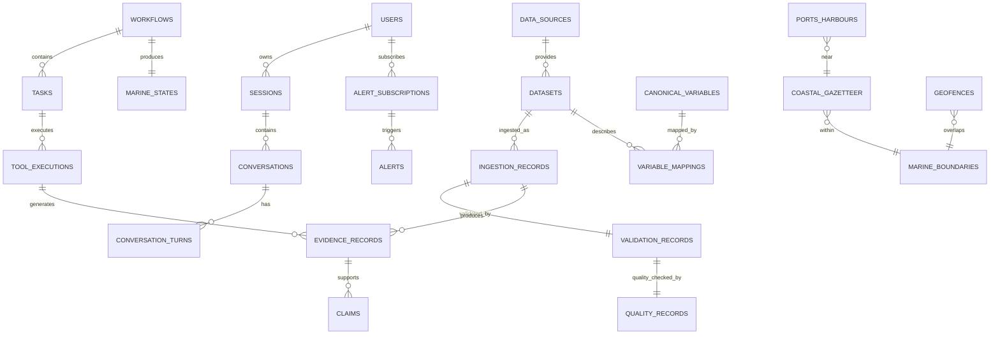

# ORCA Architecture Document 4 — Database Design

**Project:** ORCA — Marine EcOsystem Reasoning with Collaborative Agents  
**Problem Statement ID:** 26176  
**Organization:** ISRO / Department of Space  
**Document:** Complete Database Schema, Storage Layout, Indexing & Data Lifecycle  
**Status:** Planning Phase — Architecture Design  
**Date:** 22 September 2026 (Updated: 26 September 2026)  
**PS Alignment:** This document defines the storage backbone that makes ORCA's evidence-grounded decisions possible. Every table exists to serve one purpose: turning raw marine data into trustworthy evidence that the agentic investigation loop can cite, trace, and explain.

---

# 0. Storage Architecture Overview

ORCA uses **four distinct storage technologies**, each chosen for a specific data class:

```text
┌────────────────────────────────────────────────────────────────────────┐
│                        ORCA STORAGE ARCHITECTURE                       │
├───────────────────┬────────────────────┬──────────────┬────────────────┤
│   POSTGRESQL      │   OBJECT STORAGE   │   PARQUET    │     REDIS      │
│   + POSTGIS       │   S3 / MinIO       │   Analytics  │     Cache      │
├───────────────────┼────────────────────┼──────────────┼────────────────┤
│ Metadata          │ Raw scientific     │ Historical   │ Hot cache      │
│ Workflows         │ NetCDF, Zarr       │ time-series  │ Session state  │
│ Evidence          │ GeoTIFF, HDF       │ Observations │ Workflow state │
│ Source registry   │ GRIB, CSV, JSON    │ Vessel data  │ In-flight dedup│
│ Dataset catalog   │ Normalized chunks  │ Climatology  │ Rate limits    │
│ Spatial geometry  │ Derived artifacts  │ Feature      │ Idempotency    │
│ GIS boundaries    │ Raster tiles (COG) │ tables       │ Query results  │
│ Ports & harbours  │ Climatology ref    │              │ Lock state     │
│ Users & sessions  │                    │              │                │
│ Alerts            │                    │              │                │
│ Marine State refs │                    │              │                │
│ Memory + Context  │                    │              │                │
└───────────────────┴────────────────────┴──────────────┴────────────────┘
```

### The Rule

| Data Class | Goes To | Why |
|---|---|---|
| Raw scientific files | **S3/MinIO** | Immutable binary blobs, versioned, no query needed on content |
| Structured metadata, relationships, GIS | **PostgreSQL + PostGIS** | Relational integrity, spatial indexing, transactional consistency |
| Large analytical time-series | **Parquet** | Columnar scan performance, cheap bulk storage |
| Ephemeral operational state | **Redis** | Sub-millisecond access, automatic expiry, no durability needed |

---

# 1. Entity Relationship Overview



---

# 2. PostgreSQL + PostGIS — Complete Schema

## 2.1 Extensions Required

```sql
CREATE EXTENSION IF NOT EXISTS postgis;
CREATE EXTENSION IF NOT EXISTS postgis_topology;
CREATE EXTENSION IF NOT EXISTS pg_trgm;       -- fuzzy text search for gazetteer
CREATE EXTENSION IF NOT EXISTS btree_gist;    -- exclusion constraints
CREATE EXTENSION IF NOT EXISTS "uuid-ossp";   -- UUID generation
CREATE EXTENSION IF NOT EXISTS vector;         -- pgvector for semantic memory retrieval
```

---

## 2.2 Data Pipeline Tables

### data_sources

The registry of all external data providers ORCA can connect to.

```sql
CREATE TABLE data_sources (
    source_id           TEXT PRIMARY KEY,              -- e.g. 'incois', 'mosdac', 'imd'
    display_name        TEXT NOT NULL,                 -- e.g. 'INCOIS'
    organization        TEXT NOT NULL,                 -- e.g. 'Indian National Centre for Ocean Information Services'
    source_type         TEXT NOT NULL                  -- 'government_ocean' | 'government_weather' | 'satellite' | 'international' | 'gis'
                        CHECK (source_type IN ('government_ocean','government_weather','satellite','international','gis','research')),
    base_url            TEXT,                          -- e.g. 'https://erddap.incois.gov.in'
    access_method       TEXT NOT NULL                  -- 'erddap' | 'rest_api' | 'ftp' | 'wms' | 'wfs' | 'opendap' | 'download'
                        CHECK (access_method IN ('erddap','rest_api','ftp','wms','wfs','opendap','download','static')),
    authentication      TEXT DEFAULT 'none'            -- 'none' | 'api_key' | 'oauth' | 'token'
                        CHECK (authentication IN ('none','api_key','oauth','token')),
    trust_class         TEXT NOT NULL DEFAULT 'STANDARD'
                        CHECK (trust_class IN ('AUTHORITATIVE','OFFICIAL','STANDARD','SUPPLEMENTARY','RESEARCH')),
    rate_limit          TEXT,                          -- e.g. '10/min', '100/hour'
    health_status       TEXT DEFAULT 'UNKNOWN'         -- 'HEALTHY' | 'DEGRADED' | 'DOWN' | 'UNKNOWN'
                        CHECK (health_status IN ('HEALTHY','DEGRADED','DOWN','UNKNOWN')),
    last_health_check   TIMESTAMPTZ,
    last_verified       DATE,
    notes               TEXT,
    created_at          TIMESTAMPTZ NOT NULL DEFAULT NOW(),
    updated_at          TIMESTAMPTZ NOT NULL DEFAULT NOW()
);
```

### datasets

The catalog of every dataset ORCA knows about — what variables, where, when, how.

```sql
CREATE TABLE datasets (
    dataset_id              TEXT PRIMARY KEY,               -- e.g. 'incois_sst_daily'
    source_id               TEXT NOT NULL REFERENCES data_sources(source_id),
    display_name            TEXT NOT NULL,                  -- e.g. 'INCOIS Daily SST (L3)'
    variables               TEXT[] NOT NULL,                -- e.g. '{sea_surface_temperature,quality_flag}'
    category                TEXT NOT NULL                   -- 'ocean' | 'weather' | 'fisheries' | 'hazard' | 'gis' | 'bathymetry'
                            CHECK (category IN ('ocean','weather','fisheries','hazard','gis','bathymetry','ecosystem','advisory')),
    data_type               TEXT NOT NULL                   -- 'observation' | 'forecast' | 'advisory' | 'reanalysis' | 'static' | 'historical'
                            CHECK (data_type IN ('observation','forecast','advisory','reanalysis','static','historical')),
    processing_level        TEXT,                           -- 'L1' | 'L2' | 'L3' | 'L4' | 'derived'
    format                  TEXT NOT NULL,                  -- 'netcdf' | 'zarr' | 'geotiff' | 'hdf' | 'grib' | 'csv' | 'json' | 'geojson' | 'shapefile'
    spatial_coverage_bbox   DOUBLE PRECISION[4],            -- [lon_min, lat_min, lon_max, lat_max]
    spatial_coverage_geom   GEOMETRY(Polygon, 4326),        -- PostGIS geometry for spatial queries
    spatial_resolution_km   DOUBLE PRECISION,               -- e.g. 1.0, 4.0, 25.0
    temporal_start          DATE,
    temporal_end            DATE,                            -- NULL = ongoing/present
    temporal_resolution     TEXT,                           -- 'hourly' | '3hourly' | '6hourly' | 'daily' | 'weekly' | 'monthly' | 'static'
    update_frequency        TEXT,                           -- 'realtime' | 'hourly' | 'daily' | 'weekly' | 'monthly' | 'on_demand'
    access_endpoint         TEXT,                           -- specific API/URL for this dataset
    access_protocol_detail  JSONB,                         -- protocol-specific config (ERDDAP dataset_id, API params etc.)
    role                    TEXT DEFAULT 'primary'          -- 'primary' | 'fallback' | 'supplementary' | 'reference'
                            CHECK (role IN ('primary','fallback','supplementary','reference')),
    fallback_dataset_id     TEXT REFERENCES datasets(dataset_id),
    quality_info            TEXT,
    license                 TEXT,
    version                 TEXT,
    is_active               BOOLEAN DEFAULT TRUE,
    last_verified           DATE,
    created_at              TIMESTAMPTZ NOT NULL DEFAULT NOW(),
    updated_at              TIMESTAMPTZ NOT NULL DEFAULT NOW()
);

CREATE INDEX idx_datasets_source ON datasets(source_id);
CREATE INDEX idx_datasets_category ON datasets(category);
CREATE INDEX idx_datasets_variables ON datasets USING GIN(variables);
CREATE INDEX idx_datasets_spatial ON datasets USING GIST(spatial_coverage_geom);
```

### ingestion_records

Every time ORCA retrieves data from a source, it creates an immutable ingestion record.

```sql
CREATE TABLE ingestion_records (
    ingestion_id        UUID PRIMARY KEY DEFAULT uuid_generate_v4(),
    dataset_id          TEXT NOT NULL REFERENCES datasets(dataset_id),
    workflow_id         UUID,                          -- which workflow triggered this retrieval
    retrieval_id        UUID,                          -- retrieval request ID (for dedup)

    -- Raw payload reference (S3/MinIO)
    raw_payload_ref     TEXT NOT NULL,                  -- s3://orca-raw/incois/sst/2026-09-21/...
    raw_checksum        TEXT NOT NULL,                  -- sha256:abc123...
    raw_format          TEXT NOT NULL,                  -- 'netcdf' | 'zarr' | 'geotiff' etc.
    byte_size           BIGINT,

    -- What was requested
    request_region_bbox DOUBLE PRECISION[4],
    request_region_geom GEOMETRY(Polygon, 4326),
    request_time_start  TIMESTAMPTZ,
    request_time_end    TIMESTAMPTZ,
    request_variables   TEXT[],
    request_depth       DOUBLE PRECISION,

    -- What was received
    received_variables  TEXT[],
    received_time_start TIMESTAMPTZ,
    received_time_end   TIMESTAMPTZ,
    received_lat_min    DOUBLE PRECISION,
    received_lat_max    DOUBLE PRECISION,
    received_lon_min    DOUBLE PRECISION,
    received_lon_max    DOUBLE PRECISION,
    spatial_resolution  DOUBLE PRECISION,               -- degrees
    time_dimensions     INTEGER,
    lat_dimensions      INTEGER,
    lon_dimensions      INTEGER,

    -- Status
    status              TEXT NOT NULL DEFAULT 'INGESTED'
                        CHECK (status IN ('INGESTED','VALIDATED','QUALITY_CHECKED','NORMALIZED','FAILED','REJECTED')),
    immutable           BOOLEAN NOT NULL DEFAULT TRUE,

    ingested_at         TIMESTAMPTZ NOT NULL DEFAULT NOW(),
    source_latency_ms   INTEGER                        -- how long the source took to respond
);

CREATE INDEX idx_ingestion_dataset ON ingestion_records(dataset_id);
CREATE INDEX idx_ingestion_workflow ON ingestion_records(workflow_id);
CREATE INDEX idx_ingestion_time ON ingestion_records(ingested_at);
CREATE INDEX idx_ingestion_spatial ON ingestion_records USING GIST(request_region_geom);
```

### validation_records

Structural validation results (Step 2 of the pipeline).

```sql
CREATE TABLE validation_records (
    validation_id       UUID PRIMARY KEY DEFAULT uuid_generate_v4(),
    ingestion_id        UUID NOT NULL REFERENCES ingestion_records(ingestion_id),

    overall_status      TEXT NOT NULL                   -- 'PASS' | 'PARTIAL' | 'FAIL'
                        CHECK (overall_status IN ('PASS','PARTIAL','FAIL')),

    -- Individual checks stored as JSONB array
    checks              JSONB NOT NULL,
    /*
        Example checks array:
        [
            {"check": "file_parse", "status": "PASS"},
            {"check": "required_variables", "status": "PASS", "expected": [...], "found": [...]},
            {"check": "coordinates", "status": "PASS", "found": ["latitude","longitude"]},
            {"check": "time_dimension", "status": "PASS"},
            {"check": "dimensions", "status": "PASS", "expected": {...}},
            {"check": "schema_match", "status": "PASS", "expected_schema_version": "incois_sst_v2"}
        ]
    */

    failed_checks       TEXT[],                        -- list of check names that failed
    warning_message     TEXT,

    validated_at        TIMESTAMPTZ NOT NULL DEFAULT NOW()
);

CREATE INDEX idx_validation_ingestion ON validation_records(ingestion_id);
CREATE INDEX idx_validation_status ON validation_records(overall_status);
```

### quality_records

Scientific quality assessment results (Step 3 of the pipeline).

```sql
CREATE TABLE quality_records (
    quality_id          UUID PRIMARY KEY DEFAULT uuid_generate_v4(),
    ingestion_id        UUID NOT NULL REFERENCES ingestion_records(ingestion_id),
    variable            TEXT NOT NULL,                  -- which canonical variable was assessed

    -- Quality assessment
    overall_quality     TEXT NOT NULL                   -- 'VALID' | 'SUSPECT' | 'MISSING' | 'STALE' | 'INVALID' | 'UNAVAILABLE'
                        CHECK (overall_quality IN ('VALID','SUSPECT','MISSING','STALE','INVALID','UNAVAILABLE')),
    quality_score       DOUBLE PRECISION,               -- 0.0 to 1.0

    -- Range validity
    range_check_status  TEXT,                           -- 'PASS' | 'FAIL' | 'WARNING'
    out_of_range_count  INTEGER DEFAULT 0,
    total_points        INTEGER,

    -- Quality flags from source
    flag_valid_count    INTEGER,
    flag_suspect_count  INTEGER,
    flag_bad_count      INTEGER,
    flag_missing_count  INTEGER,
    valid_fraction      DOUBLE PRECISION,               -- fraction of valid observations

    -- Temporal freshness
    observation_time    TIMESTAMPTZ,
    age_hours           DOUBLE PRECISION,
    freshness           TEXT                            -- 'FRESH' | 'ACCEPTABLE' | 'STALE' | 'EXPIRED'
                        CHECK (freshness IN ('FRESH','ACCEPTABLE','STALE','EXPIRED')),
    freshness_threshold_hours DOUBLE PRECISION,

    -- Spatial coverage
    coverage_fraction   DOUBLE PRECISION,               -- 0.0 to 1.0

    -- Processing level
    processing_level    TEXT,                           -- 'L1' | 'L2' | 'L3' | 'L4'

    -- Full check details
    checks_detail       JSONB,                         -- detailed per-check results

    quality_at          TIMESTAMPTZ NOT NULL DEFAULT NOW()
);

CREATE INDEX idx_quality_ingestion ON quality_records(ingestion_id);
CREATE INDEX idx_quality_variable ON quality_records(variable);
CREATE INDEX idx_quality_overall ON quality_records(overall_quality);
```

---

## 2.3 Semantic Crosswalk Tables

### canonical_variables

The master list of ORCA's unified variable names and units.

```sql
CREATE TABLE canonical_variables (
    canonical_name      TEXT PRIMARY KEY,               -- e.g. 'sea_surface_temperature'
    display_name        TEXT NOT NULL,                  -- e.g. 'Sea Surface Temperature'
    canonical_unit      TEXT NOT NULL,                  -- e.g. 'degC'
    category            TEXT NOT NULL,                  -- 'ocean' | 'weather' | 'gis' | 'ecosystem'
    cf_standard_name    TEXT,                           -- CF convention standard_name if applicable
    valid_range_min     DOUBLE PRECISION,               -- e.g. -2.0 for SST
    valid_range_max     DOUBLE PRECISION,               -- e.g. 40.0 for SST
    description         TEXT,
    created_at          TIMESTAMPTZ NOT NULL DEFAULT NOW()
);
```

### variable_mappings

How each provider's raw field maps to the canonical variable.

```sql
CREATE TABLE variable_mappings (
    mapping_id          SERIAL PRIMARY KEY,
    canonical_name      TEXT NOT NULL REFERENCES canonical_variables(canonical_name),
    dataset_id          TEXT NOT NULL REFERENCES datasets(dataset_id),
    source_field        TEXT NOT NULL,                  -- field name in source data (e.g. 'thetao', 'sst')
    source_unit         TEXT NOT NULL,                  -- native unit (e.g. 'K', 'degC')
    transform           TEXT NOT NULL DEFAULT 'none',   -- 'none' | 'subtract_273.15' | 'multiply_0.01' etc.
    transform_formula   TEXT,                           -- human-readable formula
    notes               TEXT,
    created_at          TIMESTAMPTZ NOT NULL DEFAULT NOW(),

    UNIQUE(canonical_name, dataset_id, source_field)
);

CREATE INDEX idx_mapping_canonical ON variable_mappings(canonical_name);
CREATE INDEX idx_mapping_dataset ON variable_mappings(dataset_id);
```

---

## 2.4 Spatial / GIS Tables

### coastal_gazetteer

Curated list of 50–100 coastal landmarks for V1 (Gujarat focus).

```sql
CREATE TABLE coastal_gazetteer (
    location_id         SERIAL PRIMARY KEY,
    canonical_name      TEXT NOT NULL UNIQUE,           -- e.g. 'veraval', 'porbandar', 'gulf_of_khambhat'
    display_name        TEXT NOT NULL,                  -- e.g. 'Veraval'
    display_name_local  JSONB,                         -- {"gu": "વેરાવળ", "hi": "वेरावल"}
    aliases             TEXT[],                        -- alternate names, spellings
    location_type       TEXT NOT NULL                   -- 'port' | 'harbour' | 'coast' | 'offshore' | 'gulf' | 'strait' | 'island' | 'landmark'
                        CHECK (location_type IN ('port','harbour','coast','offshore','gulf','strait','island','landmark','fishing_centre','landing_centre')),
    point               GEOMETRY(Point, 4326) NOT NULL,
    representative_bbox GEOMETRY(Polygon, 4326),        -- bounding box for "near X" queries
    offshore_radius_km  DOUBLE PRECISION DEFAULT 50,    -- default search radius for marine queries
    state               TEXT,                           -- 'Gujarat', 'Maharashtra', etc.
    district            TEXT,
    is_active           BOOLEAN DEFAULT TRUE,
    created_at          TIMESTAMPTZ NOT NULL DEFAULT NOW()
);

CREATE INDEX idx_gazetteer_point ON coastal_gazetteer USING GIST(point);
CREATE INDEX idx_gazetteer_bbox ON coastal_gazetteer USING GIST(representative_bbox);
CREATE INDEX idx_gazetteer_name ON coastal_gazetteer USING GIN(canonical_name gin_trgm_ops);
CREATE INDEX idx_gazetteer_aliases ON coastal_gazetteer USING GIN(aliases);
```

### marine_boundaries

EEZ, territorial waters, MPA, restricted zones — all as PostGIS geometries.

```sql
CREATE TABLE marine_boundaries (
    boundary_id         SERIAL PRIMARY KEY,
    name                TEXT NOT NULL,                  -- e.g. 'India EEZ', 'Gulf of Kutch MPA'
    boundary_type       TEXT NOT NULL
                        CHECK (boundary_type IN ('eez','territorial_sea','contiguous_zone','mpa','restricted','no_fishing','international_boundary','state_maritime')),
    authority           TEXT,                           -- e.g. 'MoEFCC', 'Indian Navy', 'MarineRegions'
    geometry            GEOMETRY(MultiPolygon, 4326) NOT NULL,
    properties          JSONB,                         -- additional attributes
    source              TEXT,                          -- e.g. 'MarineRegions.org', 'ProtectedSeas'
    effective_from      DATE,
    effective_until     DATE,                           -- NULL = currently active
    is_active           BOOLEAN DEFAULT TRUE,
    created_at          TIMESTAMPTZ NOT NULL DEFAULT NOW(),
    updated_at          TIMESTAMPTZ NOT NULL DEFAULT NOW()
);

CREATE INDEX idx_boundaries_geom ON marine_boundaries USING GIST(geometry);
CREATE INDEX idx_boundaries_type ON marine_boundaries(boundary_type);
```

### geofences

User-defined or system-defined alert boundaries.

```sql
CREATE TABLE geofences (
    geofence_id         UUID PRIMARY KEY DEFAULT uuid_generate_v4(),
    name                TEXT NOT NULL,
    geofence_type       TEXT NOT NULL                   -- 'alert_zone' | 'monitoring_zone' | 'exclusion_zone' | 'custom'
                        CHECK (geofence_type IN ('alert_zone','monitoring_zone','exclusion_zone','custom')),
    geometry            GEOMETRY(Polygon, 4326) NOT NULL,
    created_by          UUID REFERENCES users(user_id),
    reason              TEXT,
    is_active           BOOLEAN DEFAULT TRUE,
    effective_from      TIMESTAMPTZ DEFAULT NOW(),
    effective_until     TIMESTAMPTZ,
    created_at          TIMESTAMPTZ NOT NULL DEFAULT NOW()
);

CREATE INDEX idx_geofences_geom ON geofences USING GIST(geometry);
CREATE INDEX idx_geofences_type ON geofences(geofence_type);
```

### ports_harbours

Reference data for maritime infrastructure.

```sql
CREATE TABLE ports_harbours (
    port_id             SERIAL PRIMARY KEY,
    name                TEXT NOT NULL,
    name_local          JSONB,                         -- {"gu": "...", "hi": "..."}
    port_type           TEXT NOT NULL                   -- 'major' | 'minor' | 'fishing_harbour' | 'landing_centre'
                        CHECK (port_type IN ('major','minor','fishing_harbour','landing_centre','anchorage')),
    location            GEOMETRY(Point, 4326) NOT NULL,
    state               TEXT,
    district            TEXT,
    gazette_ref         INTEGER REFERENCES coastal_gazetteer(location_id),
    facilities          TEXT[],                        -- e.g. '{fuel,ice,repair,auction}'
    communication       TEXT[],                        -- e.g. '{vhf,mobile}'
    max_vessel_loa_m    DOUBLE PRECISION,
    tidal_range_m       DOUBLE PRECISION,
    approach_depth_m    DOUBLE PRECISION,
    source              TEXT,
    is_active           BOOLEAN DEFAULT TRUE,
    created_at          TIMESTAMPTZ NOT NULL DEFAULT NOW()
);

CREATE INDEX idx_ports_location ON ports_harbours USING GIST(location);
CREATE INDEX idx_ports_type ON ports_harbours(port_type);
```

---

## 2.5 Evidence & Provenance Tables

### evidence_records

Every piece of evidence ORCA produces — the audit trail from data to claim.

```sql
CREATE TABLE evidence_records (
    evidence_id         TEXT PRIMARY KEY,               -- e.g. 'EV-91'
    workflow_id         UUID NOT NULL,
    task_id             UUID,
    ingestion_id        UUID REFERENCES ingestion_records(ingestion_id),

    -- What evidence this is
    evidence_type       TEXT NOT NULL                   -- 'retrieval' | 'analysis' | 'derived' | 'advisory' | 'spatial' | 'reconciliation'
                        CHECK (evidence_type IN ('retrieval','analysis','derived','advisory','spatial','reconciliation')),
    variable            TEXT,                           -- canonical variable name
    source_id           TEXT REFERENCES data_sources(source_id),
    dataset_id          TEXT REFERENCES datasets(dataset_id),

    -- Data type semantics
    data_type           TEXT NOT NULL                   -- 'observation' | 'forecast' | 'advisory' | 'derived' | 'historical' | 'static'
                        CHECK (data_type IN ('observation','forecast','advisory','derived','historical','static')),

    -- Temporal metadata
    observation_time    TIMESTAMPTZ,                    -- when measurement happened
    forecast_issue_time TIMESTAMPTZ,                    -- when forecast was generated
    forecast_valid_time TIMESTAMPTZ,                    -- when forecast applies
    lead_time_hours     DOUBLE PRECISION,
    retrieval_time      TIMESTAMPTZ,                    -- when ORCA downloaded it

    -- Freshness
    freshness           TEXT                            -- 'FRESH' | 'ACCEPTABLE' | 'STALE' | 'EXPIRED'
                        CHECK (freshness IN ('FRESH','ACCEPTABLE','STALE','EXPIRED')),
    age_hours           DOUBLE PRECISION,

    -- Quality
    quality_status      TEXT                            -- 'VALID' | 'SUSPECT' | 'MISSING' | 'STALE' | 'INVALID'
                        CHECK (quality_status IN ('VALID','SUSPECT','MISSING','STALE','INVALID','UNAVAILABLE')),
    quality_score       DOUBLE PRECISION,

    -- Spatial reference
    region_name         TEXT,
    region_geom         GEOMETRY(Polygon, 4326),
    spatial_coverage    DOUBLE PRECISION,               -- 0.0 to 1.0

    -- Scientific result (compact)
    result_summary      JSONB,                         -- the structured result the LLM sees
    /*
        Example:
        {
            "mean": 28.2, "min": 27.7, "max": 28.8,
            "anomaly": 1.1, "unit": "degC",
            "method": "regional_mean_anomaly",
            "baseline_years": 30
        }
    */

    -- Engine reference (if derived)
    engine              TEXT,                           -- 'ocean_engine' | 'weather_engine' | 'risk_engine' etc.
    method              TEXT,                           -- computation method name
    method_version      TEXT,
    input_evidence_ids  TEXT[],                         -- evidence this was derived from

    -- Object storage reference for full result
    full_result_ref     TEXT,                           -- s3://orca-derived/...

    created_at          TIMESTAMPTZ NOT NULL DEFAULT NOW()
);

CREATE INDEX idx_evidence_workflow ON evidence_records(workflow_id);
CREATE INDEX idx_evidence_variable ON evidence_records(variable);
CREATE INDEX idx_evidence_source ON evidence_records(source_id);
CREATE INDEX idx_evidence_type ON evidence_records(evidence_type);
CREATE INDEX idx_evidence_spatial ON evidence_records USING GIST(region_geom);
CREATE INDEX idx_evidence_time ON evidence_records(created_at);
```

### claims

Every factual claim in an ORCA response, linked to supporting evidence.

```sql
CREATE TABLE claims (
    claim_id            TEXT PRIMARY KEY,               -- e.g. 'CLM-4'
    workflow_id         UUID NOT NULL,
    claim_text          TEXT NOT NULL,                  -- e.g. 'SST is 28.4°C, which is 1.1°C above seasonal baseline'
    claim_type          TEXT NOT NULL                   -- 'observation' | 'analysis' | 'recommendation' | 'warning' | 'limitation'
                        CHECK (claim_type IN ('observation','analysis','recommendation','warning','limitation')),
    evidence_ids        TEXT[] NOT NULL,                -- e.g. '{EV-91, EV-93}'
    confidence          TEXT,                           -- 'HIGH' | 'MODERATE' | 'LOW'
    is_safety_critical  BOOLEAN DEFAULT FALSE,
    created_at          TIMESTAMPTZ NOT NULL DEFAULT NOW()
);

CREATE INDEX idx_claims_workflow ON claims(workflow_id);
CREATE INDEX idx_claims_evidence ON claims USING GIN(evidence_ids);
```

---

## 2.6 Workflow Engine Tables

### workflows

Top-level orchestration record for each user query.

```sql
CREATE TABLE workflows (
    workflow_id         UUID PRIMARY KEY DEFAULT uuid_generate_v4(),
    conversation_id     UUID NOT NULL,
    user_id             UUID REFERENCES users(user_id),

    -- Intent
    original_query      TEXT NOT NULL,
    detected_language   TEXT,                           -- ISO 639-1 code
    intent              TEXT,                           -- e.g. 'safety_assessment', 'pfz_nearest'
    decision_type       TEXT                            -- 'WHERE' | 'WHEN' | 'WHY' | 'WHAT_SHOULD_I_DO' | 'WHAT_CHANGED'
                        CHECK (decision_type IN ('WHERE','WHEN','WHY','WHAT_SHOULD_I_DO','WHAT_CHANGED')),
    complexity          TEXT                            -- 'SIMPLE' | 'MODERATE' | 'COMPLEX' | 'DEEP'
                        CHECK (complexity IN ('SIMPLE','MODERATE','COMPLEX','DEEP')),

    -- Context
    region_name         TEXT,
    region_geom         GEOMETRY(Polygon, 4326),
    target_time         TIMESTAMPTZ,
    time_type           TEXT,                           -- 'current' | 'forecast' | 'historical'

    -- Execution
    status              TEXT NOT NULL DEFAULT 'PLANNING'
                        CHECK (status IN ('PLANNING','EXECUTING','REPLANNING','VALIDATING','SYNTHESIZING','COMPLETED','FAILED','CANCELLED','TIMEOUT')),
    planned_task_count  INTEGER,
    completed_task_count INTEGER DEFAULT 0,
    replan_count        INTEGER DEFAULT 0,
    max_replan          INTEGER DEFAULT 3,

    -- Budget
    budget_max_tools    INTEGER DEFAULT 15,
    budget_used_tools   INTEGER DEFAULT 0,
    budget_max_time_sec INTEGER DEFAULT 120,

    -- Result
    marine_state_id     UUID,
    response_id         TEXT,
    evidence_ids        TEXT[],
    confidence          TEXT,                           -- 'SUFFICIENT' | 'SUFFICIENT_WITH_LIMITATIONS' | 'INSUFFICIENT'

    -- Timing
    started_at          TIMESTAMPTZ NOT NULL DEFAULT NOW(),
    completed_at        TIMESTAMPTZ,
    total_latency_ms    INTEGER
);

CREATE INDEX idx_workflows_user ON workflows(user_id);
CREATE INDEX idx_workflows_conversation ON workflows(conversation_id);
CREATE INDEX idx_workflows_status ON workflows(status);
CREATE INDEX idx_workflows_time ON workflows(started_at);
CREATE INDEX idx_workflows_spatial ON workflows USING GIST(region_geom);
```

### tasks

Individual tasks within a workflow (each maps to an agent action).

```sql
CREATE TABLE tasks (
    task_id             UUID PRIMARY KEY DEFAULT uuid_generate_v4(),
    workflow_id         UUID NOT NULL REFERENCES workflows(workflow_id),
    parent_task_id      UUID REFERENCES tasks(task_id),

    -- Task definition
    agent               TEXT NOT NULL,                  -- 'data_agent' | 'ocean_agent' | 'weather_agent' | 'geo_agent' | 'risk_agent'
    task_type           TEXT NOT NULL,                  -- 'retrieval' | 'analysis' | 'spatial' | 'risk' | 'reconciliation'
    description         TEXT,

    -- Dependencies
    depends_on          UUID[],                        -- task_ids this task waits for
    execution_order     INTEGER,
    is_parallel         BOOLEAN DEFAULT FALSE,

    -- Status
    status              TEXT NOT NULL DEFAULT 'PENDING'
                        CHECK (status IN ('PENDING','QUEUED','RUNNING','COMPLETED','FAILED','SKIPPED','CANCELLED')),
    retry_count         INTEGER DEFAULT 0,
    max_retries         INTEGER DEFAULT 2,

    -- Result
    result_summary      JSONB,
    evidence_ids        TEXT[],
    error_message       TEXT,
    error_code          TEXT,

    -- Timing
    queued_at           TIMESTAMPTZ,
    started_at          TIMESTAMPTZ,
    completed_at        TIMESTAMPTZ,
    latency_ms          INTEGER
);

CREATE INDEX idx_tasks_workflow ON tasks(workflow_id);
CREATE INDEX idx_tasks_status ON tasks(status);
CREATE INDEX idx_tasks_agent ON tasks(agent);
```

### tool_executions

Detailed record of every tool call.

```sql
CREATE TABLE tool_executions (
    execution_id        UUID PRIMARY KEY DEFAULT uuid_generate_v4(),
    task_id             UUID NOT NULL REFERENCES tasks(task_id),
    workflow_id         UUID NOT NULL,

    -- Tool info
    tool_id             TEXT NOT NULL,                  -- e.g. 'ocean.sst_lookup'
    tool_class          TEXT NOT NULL                   -- 'READ_ONLY' | 'ANALYSIS' | 'STATE_CHANGING' | 'SIDE_EFFECT'
                        CHECK (tool_class IN ('READ_ONLY','ANALYSIS','STATE_CHANGING','SIDE_EFFECT')),

    -- Input/Output
    input_params        JSONB,                         -- tool input parameters
    output_summary      JSONB,                         -- compact result
    output_ref          TEXT,                           -- s3 reference for large results

    -- Execution details
    status              TEXT NOT NULL DEFAULT 'PENDING'
                        CHECK (status IN ('PENDING','RUNNING','COMPLETED','FAILED','TIMEOUT','SKIPPED')),
    cache_hit           BOOLEAN DEFAULT FALSE,
    source_id           TEXT,                           -- which data source was queried
    dataset_id          TEXT,

    -- Error handling
    error_code          TEXT,
    error_message       TEXT,
    retry_count         INTEGER DEFAULT 0,
    fallback_used       BOOLEAN DEFAULT FALSE,
    fallback_tool_id    TEXT,

    -- Timing
    started_at          TIMESTAMPTZ,
    completed_at        TIMESTAMPTZ,
    latency_ms          INTEGER,

    -- Evidence produced
    evidence_id         TEXT
);

CREATE INDEX idx_tool_exec_task ON tool_executions(task_id);
CREATE INDEX idx_tool_exec_workflow ON tool_executions(workflow_id);
CREATE INDEX idx_tool_exec_tool ON tool_executions(tool_id);
CREATE INDEX idx_tool_exec_time ON tool_executions(started_at);
```

---

## 2.7 Marine State Table

### marine_states

The central intermediate representation — every completed workflow produces one.

```sql
CREATE TABLE marine_states (
    marine_state_id     UUID PRIMARY KEY DEFAULT uuid_generate_v4(),
    workflow_id         UUID NOT NULL UNIQUE REFERENCES workflows(workflow_id),

    -- Context
    region_name         TEXT,
    region_geom         GEOMETRY(Polygon, 4326),
    reference_time      TIMESTAMPTZ NOT NULL,
    time_type           TEXT NOT NULL,                  -- 'current' | 'forecast_valid' | 'historical'

    -- Marine State content (structured JSONB)
    ocean_state         JSONB,
    /*  {
            "sst": {"value": 28.2, "unit": "degC", "evidence_id": "EV-91", "type": "observation"},
            "sst_anomaly": {"value": 1.1, "unit": "degC", "evidence_id": "EV-93"},
            "chlorophyll": {"value": 0.8, "unit": "mg/m3", "evidence_id": "EV-94"},
            "chlorophyll_anomaly": {"value": -0.31, "unit": "fraction"},
            "current_speed": null,
            "current_note": "Unavailable (source timeout)"
        }
    */

    atmosphere_state    JSONB,
    /*  {
            "wind_speed": {"value": 8.2, "unit": "m/s", "evidence_id": "EV-96"},
            "wave_height": {"value": 2.1, "unit": "m", "evidence_id": "EV-97"},
            "marine_warning": {"active": true, "severity": "MODERATE", "source": "IMD"},
            "cyclone_active": false,
            "lightning_proximity": null
        }
    */

    ecosystem_state     JSONB,
    /*  {
            "productivity_state": "BELOW_BASELINE",
            "pfz_available": true,
            "pfz_count": 2,
            "front_detected": false,
            "hab_indicator": "NONE"
        }
    */

    geography_state     JSONB,
    /*  {
            "eez_status": "WITHIN_INDIA",
            "mpa_nearby": false,
            "restricted_zones_nearby": true,
            "nearest_port": {"name": "Veraval", "distance_km": 42},
            "bathymetry_range": {"min_m": 15, "max_m": 200}
        }
    */

    temporal_state      JSONB,
    /*  {
            "query_refers_to": "future",
            "lead_time_hours": 30,
            "data_freshness": {"ocean": "ACCEPTABLE", "weather": "FRESH", "advisory": "ACTIVE"}
        }
    */

    -- Coverage & confidence
    coverage            JSONB,
    /*  {
            "available_variables": 8,
            "unavailable_variables": 1,
            "coverage_fraction": 0.89,
            "limitations": ["No current observation", "No nearby buoy"]
        }
    */

    evidence_ids        TEXT[] NOT NULL,
    confidence          TEXT                            -- 'SUFFICIENT' | 'SUFFICIENT_WITH_LIMITATIONS' | 'INSUFFICIENT'
                        CHECK (confidence IN ('SUFFICIENT','SUFFICIENT_WITH_LIMITATIONS','INSUFFICIENT')),

    constructed_at      TIMESTAMPTZ NOT NULL DEFAULT NOW()
);

CREATE INDEX idx_marine_state_workflow ON marine_states(workflow_id);
CREATE INDEX idx_marine_state_spatial ON marine_states USING GIST(region_geom);
CREATE INDEX idx_marine_state_time ON marine_states(reference_time);
```

---

## 2.8 Alert System Tables

### alert_subscriptions

What users want to be notified about.

```sql
CREATE TABLE alert_subscriptions (
    subscription_id     UUID PRIMARY KEY DEFAULT uuid_generate_v4(),
    user_id             UUID NOT NULL REFERENCES users(user_id),
    event_type          TEXT NOT NULL                   -- 'cyclone' | 'marine_warning' | 'geofence' | 'pfz' | 'hazard' | 'weather_change'
                        CHECK (event_type IN ('cyclone','marine_warning','geofence','pfz','hazard','weather_change','custom')),
    region_geom         GEOMETRY(Polygon, 4326),        -- geographic area of interest
    region_name         TEXT,
    severity_threshold  TEXT DEFAULT 'WARNING'          -- 'INFO' | 'WARNING' | 'SEVERE' | 'CRITICAL'
                        CHECK (severity_threshold IN ('INFO','WARNING','SEVERE','CRITICAL')),
    delivery_channels   TEXT[] DEFAULT '{push}',        -- '{push,sms,email,voice}'
    is_active           BOOLEAN DEFAULT TRUE,
    created_at          TIMESTAMPTZ NOT NULL DEFAULT NOW(),
    updated_at          TIMESTAMPTZ NOT NULL DEFAULT NOW()
);

CREATE INDEX idx_alert_sub_user ON alert_subscriptions(user_id);
CREATE INDEX idx_alert_sub_region ON alert_subscriptions USING GIST(region_geom);
CREATE INDEX idx_alert_sub_type ON alert_subscriptions(event_type);
```

### alerts

Generated alerts with deduplication fingerprint.

```sql
CREATE TABLE alerts (
    alert_id            UUID PRIMARY KEY DEFAULT uuid_generate_v4(),
    subscription_id     UUID REFERENCES alert_subscriptions(subscription_id),
    user_id             UUID NOT NULL REFERENCES users(user_id),

    -- Event
    event_type          TEXT NOT NULL,
    severity            TEXT NOT NULL
                        CHECK (severity IN ('INFO','WARNING','SEVERE','CRITICAL')),
    title               TEXT NOT NULL,
    body                TEXT NOT NULL,
    body_local          JSONB,                         -- localized body text

    -- Source
    source_id           TEXT,
    evidence_id         TEXT,
    source_event_id     TEXT,                          -- original warning ID from IMD/INCOIS

    -- Spatial
    region_name         TEXT,
    region_geom         GEOMETRY(Polygon, 4326),

    -- Temporal
    valid_from          TIMESTAMPTZ,
    valid_until         TIMESTAMPTZ,

    -- Deduplication fingerprint
    dedup_fingerprint   TEXT NOT NULL,                  -- hash of: event_type + region + severity + time_window + source
    /*
        Example:  sha256("cyclone:arabian_sea:SEVERE:2026-09-23T00:00Z-2026-09-25T00:00Z:imd")
        Same fingerprint = same event, do NOT re-alert
    */

    -- Delivery status
    delivery_status     TEXT NOT NULL DEFAULT 'PENDING'
                        CHECK (delivery_status IN ('PENDING','SENT','DELIVERED','FAILED','ACKNOWLEDGED','DISMISSED')),
    delivery_channel    TEXT,                           -- 'push' | 'sms' | 'in_app' | 'voice'
    delivered_at        TIMESTAMPTZ,
    acknowledged_at     TIMESTAMPTZ,

    created_at          TIMESTAMPTZ NOT NULL DEFAULT NOW()
);

CREATE INDEX idx_alerts_user ON alerts(user_id);
CREATE INDEX idx_alerts_type ON alerts(event_type);
CREATE INDEX idx_alerts_severity ON alerts(severity);
CREATE INDEX idx_alerts_dedup ON alerts(dedup_fingerprint);
CREATE INDEX idx_alerts_delivery ON alerts(delivery_status);
CREATE INDEX idx_alerts_spatial ON alerts USING GIST(region_geom);
CREATE UNIQUE INDEX idx_alerts_dedup_unique ON alerts(dedup_fingerprint, user_id) WHERE delivery_status != 'DISMISSED';
```

---

## 2.9 User & Session Tables

### users

```sql
CREATE TABLE users (
    user_id             UUID PRIMARY KEY DEFAULT uuid_generate_v4(),
    role                TEXT NOT NULL DEFAULT 'fisherman'
                        CHECK (role IN ('fisherman','researcher','coastal_authority','disaster_mgmt','maritime_operator','environmental','admin')),
    display_name        TEXT,
    preferred_language  TEXT DEFAULT 'en',              -- ISO 639-1
    preferred_region    TEXT,                           -- default region for queries
    preferred_region_geom GEOMETRY(Point, 4326),
    vessel_type         TEXT,                           -- 'mechanized' | 'motorized' | 'traditional' | 'commercial' | NULL
    risk_tolerance      TEXT DEFAULT 'moderate'         -- 'conservative' | 'moderate' | 'aggressive'
                        CHECK (risk_tolerance IN ('conservative','moderate','aggressive')),
    notification_prefs  JSONB DEFAULT '{"push": true, "sms": false, "voice": false}',
    created_at          TIMESTAMPTZ NOT NULL DEFAULT NOW(),
    last_active_at      TIMESTAMPTZ
);
```

### sessions

```sql
CREATE TABLE sessions (
    session_id          UUID PRIMARY KEY DEFAULT uuid_generate_v4(),
    user_id             UUID NOT NULL REFERENCES users(user_id),
    device_type         TEXT,                           -- 'web' | 'mobile' | 'voice'
    started_at          TIMESTAMPTZ NOT NULL DEFAULT NOW(),
    last_activity_at    TIMESTAMPTZ NOT NULL DEFAULT NOW(),
    is_active           BOOLEAN DEFAULT TRUE,
    session_context     JSONB                          -- cached preferences, active region, etc.
);

CREATE INDEX idx_sessions_user ON sessions(user_id);
CREATE INDEX idx_sessions_active ON sessions(is_active) WHERE is_active = TRUE;
```

### conversations

```sql
CREATE TABLE conversations (
    conversation_id     UUID PRIMARY KEY DEFAULT uuid_generate_v4(),
    session_id          UUID NOT NULL REFERENCES sessions(session_id),
    user_id             UUID NOT NULL REFERENCES users(user_id),
    started_at          TIMESTAMPTZ NOT NULL DEFAULT NOW(),
    last_turn_at        TIMESTAMPTZ,
    turn_count          INTEGER DEFAULT 0,

    -- Accumulated context
    active_region       TEXT,
    active_region_geom  GEOMETRY(Polygon, 4326),
    active_time_context TEXT,                           -- 'current' | 'tomorrow_morning' etc.
    active_map_layers   TEXT[],
    detected_language   TEXT,

    is_active           BOOLEAN DEFAULT TRUE
);

CREATE INDEX idx_conversations_session ON conversations(session_id);
CREATE INDEX idx_conversations_user ON conversations(user_id);
```

### conversation_turns

```sql
CREATE TABLE conversation_turns (
    turn_id             UUID PRIMARY KEY DEFAULT uuid_generate_v4(),
    conversation_id     UUID NOT NULL REFERENCES conversations(conversation_id),
    turn_number         INTEGER NOT NULL,

    -- User input
    user_input_text     TEXT,
    user_input_voice    BOOLEAN DEFAULT FALSE,
    detected_language   TEXT,

    -- System response
    workflow_id         UUID REFERENCES workflows(workflow_id),
    response_text       TEXT,
    response_language   TEXT,
    response_voice_text TEXT,                           -- simplified text for TTS

    -- Response metadata
    confidence          TEXT,
    evidence_count      INTEGER,
    map_updates         JSONB,                         -- map commands generated
    follow_up_suggestions TEXT[],
    warnings            TEXT[],
    limitations         TEXT[],

    created_at          TIMESTAMPTZ NOT NULL DEFAULT NOW(),
    response_latency_ms INTEGER
);

CREATE INDEX idx_turns_conversation ON conversation_turns(conversation_id);
CREATE INDEX idx_turns_workflow ON conversation_turns(workflow_id);
```

---

# 3. Object Storage — S3/MinIO Bucket Structure

```text
orca-raw/
├── incois/
│   ├── sst/
│   │   └── 2026-09-21/
│   │       └── sst_daily_ard_20260921.nc
│   ├── chlorophyll/
│   ├── currents/
│   ├── pfz/
│   ├── argo/
│   └── buoy/
├── mosdac/
│   ├── ocm3/
│   ├── scatsat/
│   └── insat/
├── imd/
│   ├── forecasts/
│   ├── warnings/
│   ├── cyclone/
│   └── lightning/
├── copernicus/
│   ├── sst/
│   └── currents/
├── gebco/
│   └── bathymetry/
└── gis/
    ├── boundaries/
    └── coastlines/

orca-normalized/
├── sst/
│   └── 2026-09-21/
│       └── gujarat_sst.zarr/           ← Zarr chunks
├── chlorophyll/
├── currents/
├── wind/
└── waves/

orca-derived/
├── anomalies/
│   ├── sst_anomaly_20260921.zarr
│   └── chl_anomaly_20260921.zarr
├── fronts/
├── risk/
├── routes/
└── marine_states/
    └── MS-1201.json

orca-tiles/
├── sst/
│   └── 2026-09-21/
│       └── {z}/{x}/{y}.png             ← Pre-rendered raster tiles
├── chlorophyll/
├── wave_height/
├── bathymetry/
└── risk/

orca-climatology/
├── sst/
│   └── monthly_means_30yr.zarr
├── chlorophyll/
│   └── monthly_means_20yr.zarr
└── currents/
    └── monthly_means_20yr.zarr
```

### Bucket Rules

| Bucket | Mutability | Retention | Purpose |
|---|---|---|---|
| `orca-raw` | **IMMUTABLE** — never modified after write | 90 days (then archive) | Provenance, reproducibility |
| `orca-normalized` | Replace on re-ingestion | 30 days | Working analytical data |
| `orca-derived` | Replace on re-computation | 14 days | Scientific engine outputs |
| `orca-tiles` | Replace on re-render | 7 days | Map visualization cache |
| `orca-climatology` | Updated monthly/quarterly | Permanent | Baseline reference |

### Object Naming Convention

```text
s3://orca-{layer}/{source}/{variable}/{date}/{filename}.{ext}

Examples:
s3://orca-raw/incois/sst/2026-09-21/sst_daily_ard_20260921.nc
s3://orca-normalized/mosdac/chlorophyll/2026-09-21/gujarat_chl.zarr
s3://orca-derived/anomalies/sst_anomaly_20260921_gujarat.zarr
s3://orca-tiles/sst/2026-09-21/8/173/114.png
```

---

# 4. Parquet — Analytical Tables

Stored on object storage but queried via DuckDB or Spark.

```text
parquet/
├── observations/
│   ├── sst_timeseries_gujarat.parquet
│   ├── chlorophyll_timeseries_gujarat.parquet
│   └── wave_timeseries_gujarat.parquet
├── climatology/
│   ├── sst_monthly_means.parquet
│   └── chlorophyll_monthly_means.parquet
├── events/
│   ├── cyclone_tracks.parquet
│   └── marine_warnings_history.parquet
├── fisheries/
│   └── pfz_history.parquet
└── analytics/
    └── workflow_metrics.parquet
```

### Observation Time-Series Schema (Parquet)

| Column | Type | Description |
|---|---|---|
| `timestamp` | TIMESTAMP | Observation/valid time (UTC) |
| `variable` | STRING | Canonical variable name |
| `latitude` | FLOAT64 | Latitude |
| `longitude` | FLOAT64 | Longitude |
| `value` | FLOAT64 | Measured/forecast value |
| `unit` | STRING | Canonical unit |
| `data_type` | STRING | observation / forecast |
| `source_id` | STRING | INCOIS / MOSDAC / IMD |
| `dataset_id` | STRING | Specific dataset |
| `quality` | STRING | VALID / SUSPECT / MISSING |
| `ingestion_id` | STRING | Link to PostgreSQL |

### Climatology Schema (Parquet)

| Column | Type | Description |
|---|---|---|
| `month` | INT32 | Calendar month (1-12) |
| `variable` | STRING | Canonical variable name |
| `latitude` | FLOAT64 | Grid latitude |
| `longitude` | FLOAT64 | Grid longitude |
| `mean` | FLOAT64 | Climatological mean |
| `std` | FLOAT64 | Standard deviation |
| `percentile_10` | FLOAT64 | 10th percentile |
| `percentile_90` | FLOAT64 | 90th percentile |
| `sample_years` | INT32 | Years in computation |
| `source` | STRING | Source dataset |

---

# 5. Redis — Ephemeral State

Redis stores **nothing that must survive a restart**. All durable state lives in PostgreSQL.

### Key Patterns

```text
CACHE KEYS
─────────────────────────────────────────────────────────────
cache:retrieval:{dataset}:{region}:{time}:{vars}   → cached retrieval result ref
cache:evidence:{evidence_id}                       → compact evidence JSON
cache:marine_state:{region}:{time_bucket}          → recent marine state
cache:pfz:{date}                                   → current PFZ advisory
cache:weather:{region}:{valid_time}                → weather forecast cache
cache:tile:{layer}:{z}:{x}:{y}                     → tile cache pointer

WORKFLOW STATE
─────────────────────────────────────────────────────────────
wf:{workflow_id}:status                            → current workflow status
wf:{workflow_id}:tasks                             → task list with status
wf:{workflow_id}:budget                            → remaining budget counters

SESSION STATE
─────────────────────────────────────────────────────────────
session:{session_id}:context                       → active context JSON
session:{session_id}:map_state                     → current map layers/viewport
session:{session_id}:language                      → detected language

IN-FLIGHT DEDUPLICATION
─────────────────────────────────────────────────────────────
inflight:{cache_key_hash}                          → retrieval already in progress
                                                     (prevents duplicate API calls)

RATE LIMITING
─────────────────────────────────────────────────────────────
ratelimit:{source_id}:minute                       → counter (expires 60s)
ratelimit:{source_id}:hour                         → counter (expires 3600s)
ratelimit:user:{user_id}:minute                    → user rate limit

IDEMPOTENCY
─────────────────────────────────────────────────────────────
idempotency:{request_hash}                         → previous response ref
```

### TTL Policies

| Key Pattern | TTL | Rationale |
|---|---|---|
| `cache:retrieval:*` | 1–6 hours | Marine data changes at most every few hours |
| `cache:evidence:*` | 2 hours | Evidence is workflow-specific |
| `cache:marine_state:*` | 1 hour | Marine state updates frequently |
| `cache:pfz:*` | 12 hours | PFZ advisories issued daily |
| `cache:weather:*` | 3 hours | Forecasts update every 6 hours |
| `cache:tile:*` | 1 hour | Tiles regenerate on new data |
| `wf:*` | 30 minutes | Workflows complete within minutes |
| `session:*` | 2 hours | Session inactivity timeout |
| `inflight:*` | 60 seconds | Retrieval should complete in <60s |
| `ratelimit:*` | Per-window | Auto-expiring counters |
| `idempotency:*` | 5 minutes | Prevent rapid duplicate submissions |

### What NEVER Goes in Redis

```text
✗ Multi-gigabyte scientific arrays
✗ Raw NetCDF/Zarr data
✗ Evidence audit trail (must be durable)
✗ Workflow history (must be durable)
✗ User data (must be durable)
✗ Alert history (must be durable)
```

---

# 6. Indexing Strategy

## PostgreSQL Indexes Summary

| Table | Index | Type | Purpose |
|---|---|---|---|
| `datasets` | `spatial_coverage_geom` | **GiST** | "Find datasets covering this region" |
| `datasets` | `variables` | **GIN** | "Find datasets with SST variable" |
| `ingestion_records` | `request_region_geom` | **GiST** | "Find ingestions for this area" |
| `coastal_gazetteer` | `point` | **GiST** | "Find nearest port/harbour" |
| `coastal_gazetteer` | `canonical_name` | **GIN (trigram)** | "Fuzzy name search: Veraval, Veravl, verawal" |
| `marine_boundaries` | `geometry` | **GiST** | `ST_Intersects` and `ST_DWithin` queries |
| `evidence_records` | `region_geom` | **GiST** | "Evidence for this region" |
| `alerts` | `dedup_fingerprint, user_id` | **Unique partial** | Prevent duplicate alerts (WHERE not dismissed) |
| `workflows` | `status` | **B-tree** | Active workflow monitoring |
| `tool_executions` | `tool_id` | **B-tree** | Tool usage analytics |

## Critical Query Patterns

```sql
-- 1. Dataset discovery: "Find SST datasets covering Gujarat"
SELECT * FROM datasets
WHERE 'sea_surface_temperature' = ANY(variables)
  AND ST_Intersects(spatial_coverage_geom, ST_MakeEnvelope(65, 18, 73, 24, 4326))
  AND is_active = TRUE
ORDER BY CASE role WHEN 'primary' THEN 1 WHEN 'fallback' THEN 2 ELSE 3 END;

-- 2. Location resolution: "Find Veraval"
SELECT * FROM coastal_gazetteer
WHERE canonical_name % 'veraval'     -- trigram similarity
   OR 'veraval' = ANY(aliases)
ORDER BY similarity(canonical_name, 'veraval') DESC
LIMIT 5;

-- 3. Boundary check: "Is this point inside EEZ?"
SELECT boundary_type, name FROM marine_boundaries
WHERE ST_Contains(geometry, ST_SetSRID(ST_MakePoint(71.0, 20.7), 4326))
  AND is_active = TRUE;

-- 4. Evidence for workflow
SELECT * FROM evidence_records
WHERE workflow_id = 'W-100'
ORDER BY created_at;

-- 5. Alert dedup check
SELECT alert_id FROM alerts
WHERE dedup_fingerprint = 'sha256:...'
  AND user_id = '...'
  AND delivery_status != 'DISMISSED';

-- 6. Nearby ports
SELECT name, port_type,
       ST_Distance(location::geography, ST_SetSRID(ST_MakePoint(71.0, 20.7), 4326)::geography) / 1000 AS distance_km
FROM ports_harbours
WHERE ST_DWithin(location::geography, ST_SetSRID(ST_MakePoint(71.0, 20.7), 4326)::geography, 100000)
ORDER BY distance_km
LIMIT 5;

-- 7. Recent ingestions for a dataset
SELECT * FROM ingestion_records
WHERE dataset_id = 'incois_sst_daily'
  AND ingested_at > NOW() - INTERVAL '24 hours'
  AND status != 'FAILED'
ORDER BY ingested_at DESC;

-- 8. Workflow analytics
SELECT date_trunc('hour', started_at) AS hour,
       complexity,
       COUNT(*) AS workflow_count,
       AVG(total_latency_ms) AS avg_latency_ms,
       AVG(budget_used_tools) AS avg_tools_used
FROM workflows
WHERE started_at > NOW() - INTERVAL '7 days'
  AND status = 'COMPLETED'
GROUP BY 1, 2
ORDER BY 1;
```

---

# 7. Data Lifecycle & Retention

```text
┌──────────────────────────────────────────────────────────────────┐
│                    DATA LIFECYCLE                                  │
├────────────────┬──────────────┬───────────────┬──────────────────┤
│   HOT          │   WARM       │   COLD        │   ARCHIVE        │
│   (0-24h)      │   (1-30d)    │   (30-90d)    │   (90d+)         │
├────────────────┼──────────────┼───────────────┼──────────────────┤
│ Redis cache    │ PostgreSQL   │ Parquet       │ S3 Glacier       │
│ Active wf      │ Recent       │ Historical    │ Compressed raw   │
│ Current data   │ evidence     │ observations  │ Audit logs       │
│ Session state  │ Recent wf    │ Old workflows │                  │
│ Live tiles     │ Normalized   │ Old evidence  │                  │
│                │ data         │               │                  │
└────────────────┴──────────────┴───────────────┴──────────────────┘
```

### Retention Policy

| Data Type | Hot | Warm | Cold | Archive |
|---|---|---|---|---|
| Redis cache | TTL-based | — | — | — |
| Workflow records | Active | 30 days | 90 days | Parquet export |
| Evidence records | Active | 30 days | 90 days | Parquet export |
| Tool execution logs | Active | 14 days | 60 days | Parquet export |
| Ingestion records | Active | 30 days | 90 days | Delete metadata, keep raw |
| Raw scientific files | — | 30 days S3 | 90 days S3 | Glacier |
| Normalized data | — | 30 days | Delete | — |
| Derived data | — | 14 days | Delete | — |
| Tiles | 7 days | Delete | — | — |
| Climatology | Permanent | Permanent | — | — |
| GIS boundaries | Permanent | Permanent | — | — |
| Gazetteer | Permanent | Permanent | — | — |
| User records | Permanent | Permanent | — | — |
| Conversations | Active | 90 days | 1 year | Delete |

---

# 8. Pipeline Step ↔ Database Mapping

This shows exactly which storage each pipeline step reads from and writes to:

| Pipeline Step | Reads From | Writes To |
|---|---|---|
| **1. Data Discovery** | `datasets`, `data_sources`, `variable_mappings` (PG) | — |
| **2. Retrieval** | `datasets` (PG), external APIs | `orca-raw/` (S3), `ingestion_records` (PG) |
| **3. Structural Validation** | `orca-raw/` (S3), `ingestion_records` (PG) | `validation_records` (PG) |
| **4. Quality Check** | `orca-raw/` (S3), `ingestion_records` (PG) | `quality_records` (PG) |
| **5. Normalization** | `orca-raw/` (S3), `variable_mappings` (PG) | `orca-normalized/` (S3/Zarr) |
| **6. Spatial Alignment** | `orca-normalized/` (S3), `marine_boundaries` (PG) | Analytical arrays (memory/Zarr) |
| **7. Temporal Alignment** | `orca-normalized/` (S3) | Analytical arrays (memory/Zarr) |
| **8. Missing Data** | All pipeline results | `evidence_records` (PG) with gap notes |
| **9. Reconciliation** | Multiple normalized sources | `evidence_records` (PG) |
| **10. Derived Features** | Normalized data, `orca-climatology/` (S3) | `orca-derived/` (S3), `evidence_records` (PG) |
| **11. Scientific Engines** | Derived data, Marine State inputs | `evidence_records` (PG) |
| **12. Marine State** | All evidence | `marine_states` (PG), `orca-derived/marine_states/` (S3) |
| **13. Evidence Gate** | `evidence_records` (PG) | `claims` (PG) |
| **14. LLM Synthesis** | `marine_states` (PG), `evidence_records` (PG) | `conversation_turns` (PG) |
| **15. Visualization** | `orca-tiles/` (S3), `orca-derived/` (S3) | Map tile cache (Redis) |
| **16. Alerts** | Monitoring engine, `alert_subscriptions` (PG) | `alerts` (PG), push/SMS |

---

# 9. Seed Data — V1 Gujarat Prototype

### Data Sources (Seed)

```sql
INSERT INTO data_sources (source_id, display_name, organization, source_type, base_url, access_method, trust_class) VALUES
('incois',      'INCOIS',       'Indian National Centre for Ocean Information Services', 'government_ocean',   'https://erddap.incois.gov.in',      'erddap',   'AUTHORITATIVE'),
('mosdac',      'MOSDAC',       'ISRO Meteorological & Oceanographic Satellite Data',   'satellite',          'https://www.mosdac.gov.in',          'rest_api', 'AUTHORITATIVE'),
('imd',         'IMD',          'India Meteorological Department',                       'government_weather', 'https://mausam.imd.gov.in',          'rest_api', 'AUTHORITATIVE'),
('copernicus',  'Copernicus',   'Copernicus Marine Service',                             'international',      'https://data.marine.copernicus.eu',  'rest_api', 'OFFICIAL'),
('noaa',        'NOAA',         'US National Oceanic and Atmospheric Administration',    'international',      'https://coastwatch.pfeg.noaa.gov',   'erddap',   'OFFICIAL'),
('gebco',       'GEBCO',        'General Bathymetric Chart of the Oceans',               'international',      'https://www.gebco.net',              'download', 'OFFICIAL'),
('marineregions','MarineRegions','Flanders Marine Institute',                             'gis',                'https://www.marineregions.org',       'wfs',     'STANDARD');
```

### Canonical Variables (Seed)

```sql
INSERT INTO canonical_variables (canonical_name, display_name, canonical_unit, category, cf_standard_name, valid_range_min, valid_range_max) VALUES
('sea_surface_temperature',  'Sea Surface Temperature',     'degC',  'ocean',   'sea_surface_temperature',                    -2.0,   40.0),
('chlorophyll_a',            'Chlorophyll-a',               'mg/m3', 'ocean',   'mass_concentration_of_chlorophyll_a_in_sea_water', 0.0, 100.0),
('current_speed',            'Ocean Current Speed',         'm/s',   'ocean',   'sea_water_speed',                             0.0,    5.0),
('current_direction',        'Ocean Current Direction',     'degrees','ocean',  NULL,                                           0.0,  360.0),
('wind_speed',               'Wind Speed',                 'm/s',   'weather', 'wind_speed',                                   0.0,  100.0),
('wind_direction',           'Wind Direction',              'degrees','weather','wind_from_direction',                           0.0,  360.0),
('wind_gust',                'Wind Gust',                   'm/s',   'weather', 'wind_speed_of_gust',                           0.0,  150.0),
('significant_wave_height',  'Significant Wave Height',     'm',     'weather', 'sea_surface_wave_significant_height',          0.0,   30.0),
('wave_period',              'Wave Period',                 's',     'weather', 'sea_surface_wave_mean_period',                  0.0,   30.0),
('swell_height',             'Swell Height',                'm',     'weather', 'sea_surface_swell_wave_significant_height',    0.0,   20.0),
('swell_direction',          'Swell Direction',             'degrees','weather',NULL,                                            0.0,  360.0),
('rainfall_rate',            'Rainfall Rate',               'mm/hr', 'weather', 'rainfall_rate',                                0.0,  500.0),
('sea_level_pressure',       'Sea Level Pressure',          'hPa',   'weather', 'air_pressure_at_mean_sea_level',             850.0, 1100.0),
('depth',                    'Bathymetric Depth',           'm',     'gis',     'sea_floor_depth_below_sea_surface',            0.0, 11000.0);
```

---

# 10. Summary — Database Design Principles

```text
1. FOUR TECHNOLOGIES, EACH FOR ITS PURPOSE
   PostgreSQL: relationships, metadata, spatial, provenance
   S3/MinIO:   immutable scientific files, tiles, derived artifacts
   Parquet:    large analytical time-series, historical data
   Redis:      ephemeral cache, session, dedup, rate limits

2. RAW IS IMMUTABLE
   orca-raw/ bucket is never modified after write.
   Every value is traceable back to its source file.

3. EVERY EVIDENCE HAS A RECORD
   evidence_records table is the audit trail from data to claim.
   No claim in ORCA response exists without an evidence_id.

4. SPATIAL IS FIRST-CLASS
   PostGIS geometry columns on datasets, ingestions, evidence,
   marine states, alerts, boundaries, gazetteer, geofences.
   Spatial queries are deterministic SQL, not LLM reasoning.

5. TEMPORAL SEMANTICS ARE PRESERVED
   observation_time ≠ forecast_issue_time ≠ forecast_valid_time
   ≠ retrieval_time. The schema preserves all four.

6. DEDUPLICATION AT EVERY LEVEL
   Retrieval dedup:  Redis in-flight keys
   Alert dedup:      fingerprint unique index
   Cache dedup:      normalized cache keys

7. LIFECYCLE IS EXPLICIT
   Hot → Warm → Cold → Archive with clear TTL and retention.

8. SEED DATA ENABLES V1 DEMO
   7 data sources, 14 canonical variables, Gujarat gazetteer
   are pre-loaded. No runtime discovery needed for demo.

9. EVERY TABLE HAS A PIPELINE STEP OWNER
   Section 8 maps each pipeline step to its read/write tables.
   No orphan tables, no unused schemas.

10. THE DATABASE SERVES THE SCIENCE
    Storage is not an afterthought — it is the backbone of
    RAW → VALIDATED → NORMALIZED → ALIGNED → DERIVED → MARINE STATE.
```

---

# 11. PS Fulfillment Verification - Database Document

```text
V PS-6  Autonomous data discovery and retrieval
        -> data_sources: registry of all providers ORCA can query
        -> datasets: catalog with spatial coverage, variables, access endpoints
        -> variable_mappings: semantic crosswalk from provider fields to canonical names
        -> ingestion_records: immutable audit trail of every retrieval

V PS-7  Spatial-temporal reasoning
        -> PostGIS geometry columns on: datasets, ingestion_records, evidence_records,
          marine_states, alerts, marine_boundaries, coastal_gazetteer, geofences
        -> Temporal semantics: observation_time != forecast_issue_time != forecast_valid_time
        -> GiST indexes enable sub-millisecond spatial queries

V PS-8  Evidence-grounded decision
        -> evidence_records: every piece of evidence with provenance, quality, freshness
        -> claims: every factual statement linked to evidence_ids
        -> No-Evidence -> No-Claim enforced at the database level
        -> marine_states: unified snapshot with coverage + confidence assessment

V PS-5  Multi-source correlation
        -> canonical_variables: unified naming across all providers
        -> quality_records: per-variable quality assessment enables cross-source comparison
        -> reconciliation evidence_type: tracks agreement/disagreement between sources

V PS-9  Explainable visualization
        -> orca-tiles/ bucket: pre-rendered raster tiles for map display
        -> orca-derived/ bucket: scientific engine outputs for chart generation
        -> Redis cache: tile caching + session map state

V PS-10 Proactive operations
        -> alert_subscriptions: what users want to be notified about
        -> alerts: generated alerts with dedup fingerprint (prevents spam)
        -> geofences: user-defined and system-defined monitoring boundaries

V PS-1  Natural language understanding
        -> coastal_gazetteer: fuzzy name matching (pg_trgm) for "Veraval", "verawal", "veravl"
        -> conversations + conversation_turns: multi-turn context tracking

V PS-3  Autonomous planning
        -> workflows: task plan with complexity, budget, replan count
        -> tasks: individual task execution with dependencies and parallel flag
        -> tool_executions: detailed audit of every tool call with timing
```

### Database Tables -> Hero Investigation Loop

```text
Hero Loop Step              Primary Tables Used

ASK + UNDERSTAND         ->  users, sessions, conversations, conversation_turns
                             coastal_gazetteer (location resolution)
PLAN                     ->  workflows (created), tasks (planned)
DISCOVER DATA            ->  data_sources, datasets, variable_mappings
RETRIEVE                 ->  ingestion_records, orca-raw/ (S3)
VALIDATE                 ->  validation_records, quality_records
CORRELATE                ->  canonical_variables, orca-normalized/ (S3)
OBSERVE STATE            ->  marine_states, evidence_records
EVIDENCE GATE            ->  evidence_records, claims
REPLAN                   ->  workflows (replan_count++), tasks (new tasks)
DECIDE + EXPLAIN         ->  claims, marine_states, conversation_turns
VISUALIZE                ->  orca-tiles/, orca-derived/ (S3), Redis tile cache
ALERT                    ->  alert_subscriptions, alerts, geofences
```

> **The database serves the investigation. Every table exists because a step in the hero loop needs it.**

---

# 12. NEW DATABASE TABLES: Event, Decision, Scenario, Uncertainty, Investigation

> These tables extend the existing schema. They are ADDITIONS, not replacements.

## 12.1 Event Intelligence Tables

```sql
-- Marine events detected by the Event and Change Engine
CREATE TABLE marine_events (
    event_id UUID PRIMARY KEY,
    event_type TEXT NOT NULL,
    -- PRODUCTIVITY_DECLINE, MARINE_HEAT_ANOMALY, CYCLONE_APPROACH,
    -- CHLOROPHYLL_ANOMALY, HIGH_WAVE_EVENT, GEOFENCE_ENTRY, etc.
    status TEXT NOT NULL,
    -- CANDIDATE, VALIDATING, ACTIVE, EVOLVING, ENDED, ARCHIVED, REJECTED
    geometry GEOMETRY(Geometry, 4326),
    start_time TIMESTAMPTZ,
    end_time TIMESTAMPTZ,
    detected_at TIMESTAMPTZ NOT NULL,
    reference_time TIMESTAMPTZ,
    magnitude JSONB,
    -- {"value": -0.31, "unit": "fraction"}
    baseline JSONB,
    -- {"type": "seasonal_climatology", "version": "v1"}
    persistence_seconds BIGINT,
    uncertainty JSONB,
    confidence TEXT,
    -- HIGH, MODERATE, LOW
    detection_method TEXT,
    detection_method_version TEXT,
    created_at TIMESTAMPTZ NOT NULL DEFAULT NOW(),
    updated_at TIMESTAMPTZ NOT NULL DEFAULT NOW()
);

CREATE INDEX idx_events_geometry ON marine_events USING GIST(geometry);
CREATE INDEX idx_events_time ON marine_events(start_time);
CREATE INDEX idx_events_type ON marine_events(event_type);
CREATE INDEX idx_events_status ON marine_events(status);

-- Links events to their supporting evidence
CREATE TABLE event_evidence (
    id UUID PRIMARY KEY,
    event_id UUID REFERENCES marine_events(event_id),
    evidence_id UUID REFERENCES evidence_records(evidence_id),
    relationship TEXT NOT NULL,
    -- PRIMARY, CORROBORATING, CONTRADICTING
    created_at TIMESTAMPTZ NOT NULL DEFAULT NOW()
);

-- Tracks relationships between events
CREATE TABLE event_relationships (
    id UUID PRIMARY KEY,
    parent_event_id UUID REFERENCES marine_events(event_id),
    child_event_id UUID REFERENCES marine_events(event_id),
    relationship_type TEXT NOT NULL,
    -- CAUSED_BY, ASSOCIATED_WITH, PRECEDED_BY, EVOLVED_INTO
    created_at TIMESTAMPTZ NOT NULL DEFAULT NOW()
);
```

## 12.2 Decision Trade-off Tables

```sql
-- Options evaluated in a decision
CREATE TABLE decision_options (
    option_id UUID PRIMARY KEY,
    workflow_id UUID REFERENCES workflows(workflow_id),
    option_type TEXT NOT NULL,
    -- ROUTE, FISHING_ZONE, DEPARTURE_TIME, LOCATION
    option_data JSONB NOT NULL,
    feasible BOOLEAN NOT NULL,
    infeasibility_reason TEXT,
    created_at TIMESTAMPTZ NOT NULL DEFAULT NOW()
);

-- Criteria used to evaluate options
CREATE TABLE decision_criteria (
    criterion_id UUID PRIMARY KEY,
    workflow_id UUID REFERENCES workflows(workflow_id),
    criterion_name TEXT NOT NULL,
    -- operational_risk, travel_time, distance, wave_exposure, fishing_suitability
    criterion_type TEXT NOT NULL,
    -- HARD_CONSTRAINT, SOFT_OBJECTIVE
    weight DOUBLE PRECISION,
    direction TEXT,
    -- MINIMIZE, MAXIMIZE
    created_at TIMESTAMPTZ NOT NULL DEFAULT NOW()
);

-- Hard constraints applied
CREATE TABLE decision_constraints (
    constraint_id UUID PRIMARY KEY,
    workflow_id UUID REFERENCES workflows(workflow_id),
    constraint_type TEXT NOT NULL,
    -- RESTRICTED_ZONE, EEZ_BOUNDARY, VESSEL_CAPABILITY, OFFICIAL_WARNING
    constraint_data JSONB,
    options_eliminated INTEGER DEFAULT 0,
    created_at TIMESTAMPTZ NOT NULL DEFAULT NOW()
);

-- User/stakeholder preference profiles
CREATE TABLE decision_preferences (
    preference_id UUID PRIMARY KEY,
    user_id UUID REFERENCES users(user_id),
    stakeholder_type TEXT NOT NULL,
    objectives JSONB NOT NULL,
    -- {"operational_risk": 0.45, "fishing_suitability": 0.30, ...}
    is_default BOOLEAN DEFAULT FALSE,
    created_at TIMESTAMPTZ NOT NULL DEFAULT NOW()
);

-- Scores for each option against each criterion
CREATE TABLE decision_scores (
    score_id UUID PRIMARY KEY,
    option_id UUID REFERENCES decision_options(option_id),
    criterion_id UUID REFERENCES decision_criteria(criterion_id),
    raw_value DOUBLE PRECISION,
    normalized_value DOUBLE PRECISION,
    weighted_value DOUBLE PRECISION,
    evidence_ids UUID[],
    created_at TIMESTAMPTZ NOT NULL DEFAULT NOW()
);

-- Trade-off analysis results
CREATE TABLE decision_tradeoffs (
    tradeoff_id UUID PRIMARY KEY,
    workflow_id UUID REFERENCES workflows(workflow_id),
    selected_option_id UUID REFERENCES decision_options(option_id),
    pareto_set UUID[],
    -- array of non-dominated option_ids
    sensitivity JSONB,
    -- {"risk_priority_high": "Route B", "risk_priority_medium": "Route A"}
    explanation TEXT,
    created_at TIMESTAMPTZ NOT NULL DEFAULT NOW()
);
```

## 12.3 Scenario Tables

```sql
-- Scenario comparison runs
CREATE TABLE scenario_runs (
    scenario_id UUID PRIMARY KEY,
    workflow_id UUID REFERENCES workflows(workflow_id),
    scenario_type TEXT NOT NULL,
    -- TEMPORAL_SHIFT, SPATIAL_SHIFT, PARAMETER_CHANGE, WHAT_IF_EVENT
    baseline_state_id UUID,
    created_at TIMESTAMPTZ NOT NULL DEFAULT NOW()
);

-- Parameters for each scenario variant
CREATE TABLE scenario_parameters (
    id UUID PRIMARY KEY,
    scenario_id UUID REFERENCES scenario_runs(scenario_id),
    variant_name TEXT NOT NULL,
    -- "departure_6am", "departure_9am"
    parameter_changes JSONB NOT NULL,
    -- {"time_window": {"start": "06:00", "end": "12:00"}}
    result_state_id UUID,
    created_at TIMESTAMPTZ NOT NULL DEFAULT NOW()
);

-- Results comparison
CREATE TABLE scenario_results (
    id UUID PRIMARY KEY,
    scenario_id UUID REFERENCES scenario_runs(scenario_id),
    comparison_data JSONB NOT NULL,
    -- differences between variants
    recommendation TEXT,
    created_at TIMESTAMPTZ NOT NULL DEFAULT NOW()
);
```

## 12.4 Marine State Versioning Tables

```sql
-- Versioned marine state snapshots
CREATE TABLE marine_state_versions (
    state_id UUID PRIMARY KEY,
    parent_state_id UUID REFERENCES marine_state_versions(state_id),
    region_geom GEOMETRY(Geometry, 4326),
    reference_time TIMESTAMPTZ NOT NULL,
    state_type TEXT NOT NULL,
    -- current, forecast, historical, derived
    forecast_issue_time TIMESTAMPTZ,
    forecast_valid_time TIMESTAMPTZ,
    depth_min_m DOUBLE PRECISION,
    depth_max_m DOUBLE PRECISION,
    source_set_hash TEXT,
    processing_version TEXT,
    quality JSONB,
    uncertainty JSONB,
    payload_ref TEXT,
    -- S3/MinIO path to Zarr/NetCDF payload
    created_at TIMESTAMPTZ NOT NULL DEFAULT NOW()
);

CREATE INDEX idx_state_geometry ON marine_state_versions USING GIST(region_geom);
CREATE INDEX idx_state_time ON marine_state_versions(reference_time);

-- Tracks what changed between state versions
CREATE TABLE marine_state_deltas (
    delta_id UUID PRIMARY KEY,
    from_state_id UUID REFERENCES marine_state_versions(state_id),
    to_state_id UUID REFERENCES marine_state_versions(state_id),
    changed_variables JSONB NOT NULL,
    -- {"wave_height": {"old": 1.2, "new": 2.1}, ...}
    trigger_evidence_ids UUID[],
    created_at TIMESTAMPTZ NOT NULL DEFAULT NOW()
);
```

## 12.5 Uncertainty Tables

```sql
-- Uncertainty records for evidence and decisions
CREATE TABLE uncertainty_records (
    uncertainty_id UUID PRIMARY KEY,
    target_type TEXT NOT NULL,
    -- EVIDENCE, MARINE_STATE, DECISION, EVENT
    target_id UUID NOT NULL,
    freshness_score DOUBLE PRECISION,
    spatial_score DOUBLE PRECISION,
    quality_score DOUBLE PRECISION,
    source_agreement_score DOUBLE PRECISION,
    composite_confidence DOUBLE PRECISION,
    uncertainty_sources JSONB,
    created_at TIMESTAMPTZ NOT NULL DEFAULT NOW()
);

-- V2: Propagation run tracking
CREATE TABLE uncertainty_propagation_runs (
    run_id UUID PRIMARY KEY,
    workflow_id UUID REFERENCES workflows(workflow_id),
    method TEXT NOT NULL,
    -- WEIGHTED_MEAN, MONTE_CARLO, ENSEMBLE
    input_uncertainties UUID[],
    output_uncertainty_id UUID REFERENCES uncertainty_records(uncertainty_id),
    parameters JSONB,
    created_at TIMESTAMPTZ NOT NULL DEFAULT NOW()
);
```

## 12.6 Investigation Event Tables

```sql
-- Backend events streamed to Investigation Activity UI
CREATE TABLE investigation_events (
    event_id UUID PRIMARY KEY,
    workflow_id UUID REFERENCES workflows(workflow_id),
    sequence INTEGER NOT NULL,
    event_type TEXT NOT NULL,
    -- REQUEST_RECEIVED, REQUEST_UNDERSTOOD, CONTEXT_RESOLVED,
    -- PLAN_CREATED, TASK_STARTED, TASK_COMPLETED, TASK_FAILED,
    -- DATASET_DISCOVERED, DATASET_SELECTED, RETRIEVAL_STARTED,
    -- RETRIEVAL_COMPLETED, PROCESSING_STARTED, PROCESSING_COMPLETED,
    -- EVENT_DETECTED, STATE_UPDATED, EVIDENCE_GAP_DETECTED,
    -- REPLAN_STARTED, REPLAN_COMPLETED, SCENARIO_STARTED,
    -- SCENARIO_COMPLETED, VALIDATION_STARTED, VALIDATION_PASSED,
    -- VALIDATION_FAILED, DECISION_READY, VISUALIZATION_UPDATED,
    -- ALERT_CREATED, WORKFLOW_COMPLETED
    display_title TEXT NOT NULL,
    status TEXT NOT NULL,
    -- pending, running, completed, failed, skipped
    timestamp TIMESTAMPTZ NOT NULL DEFAULT NOW(),
    evidence_refs UUID[],
    user_visible BOOLEAN NOT NULL DEFAULT TRUE
);

CREATE INDEX idx_investigation_workflow ON investigation_events(workflow_id);
CREATE INDEX idx_investigation_sequence ON investigation_events(workflow_id, sequence);
```

## 12.7 Updated Table Summary

```text
EXISTING TABLES (unchanged):
  users, sessions, conversations, conversation_turns
  data_sources, datasets, variable_mappings, canonical_variables
  ingestion_records, validation_records, quality_records
  evidence_records, claims, marine_states
  workflows, tasks, tool_executions
  alert_subscriptions, alerts, geofences
  marine_boundaries, coastal_gazetteer, system_config

NEW TABLES (added):
  marine_events                    - Event lifecycle tracking
  event_evidence                   - Event-to-evidence links
  event_relationships              - Event-to-event relationships
  decision_options                 - Feasible/infeasible options
  decision_criteria                - Scoring criteria
  decision_constraints             - Hard constraint tracking
  decision_preferences             - Stakeholder objective profiles
  decision_scores                  - Option-criterion scores
  decision_tradeoffs               - Pareto + sensitivity results
  scenario_runs                    - Scenario comparisons
  scenario_parameters              - Variant parameters
  scenario_results                 - Comparison outcomes
  marine_state_versions            - Versioned state snapshots
  marine_state_deltas              - State change tracking
  uncertainty_records              - Confidence scoring
  uncertainty_propagation_runs     - V2 propagation tracking
  investigation_events             - UI activity stream events

TOTAL: 17 new tables extending the existing schema
```

---

# 13. MEMORY AND CONTEXT TABLES (from Doc 6 Integration)

> These tables integrate the Memory & Context Architecture (Document 6) into the main database schema. pgvector extension required.

## 13.1 Additional Extension Required

```sql
-- Add to the extensions block in Section 2.1
CREATE EXTENSION IF NOT EXISTS vector;  -- pgvector for semantic memory retrieval
```

## 13.2 Memory Items

The core memory table. Stores all durable memories across all planes (user preferences, investigation summaries, saved locations, evidence references, scenario state, conversation summaries).

```sql
CREATE TABLE memory_items (
    memory_id           UUID PRIMARY KEY DEFAULT uuid_generate_v4(),

    -- Scope
    tenant_id           TEXT NOT NULL DEFAULT 'default',
    user_id             UUID REFERENCES users(user_id),
    session_id          UUID,
    conversation_id     UUID,

    -- Classification
    memory_type         TEXT NOT NULL
                        CHECK (memory_type IN (
                            'USER_PREFERENCE', 'SAVED_LOCATION', 'VESSEL_PROFILE',
                            'OPERATIONAL_PREFERENCE', 'NOTIFICATION_PREFERENCE',
                            'CONVERSATION_SUMMARY', 'INVESTIGATION_SUMMARY',
                            'SCENARIO_RECORD', 'EVIDENCE_REFERENCE',
                            'DECISION_RECORD', 'EVENT_RECORD',
                            'USER_OBSERVATION', 'CORRECTION'
                        )),
    key                 TEXT,                            -- e.g. 'preferred_language', 'default_departure'
    value               TEXT,                            -- scalar value
    value_json          JSONB,                           -- structured value

    -- Human-readable text for semantic search
    text                TEXT,                            -- e.g. 'User prefers Gujarati responses.'

    -- Source / Provenance
    source_type         TEXT NOT NULL
                        CHECK (source_type IN (
                            'EXPLICIT_USER', 'INFERRED', 'SYSTEM',
                            'INVESTIGATION', 'CORRECTION', 'MIGRATION'
                        )),
    source_turn_id      UUID,                           -- which conversation turn
    source_workflow_id  UUID,                           -- which workflow produced this
    extraction_method   TEXT,                            -- 'memory_extractor_v1'

    -- Trust and Confidence
    confidence          DOUBLE PRECISION DEFAULT 1.0,
    explicitness        TEXT DEFAULT 'EXPLICIT'
                        CHECK (explicitness IN ('EXPLICIT', 'INFERRED', 'REPEATED_INFERENCE')),
    trust_tier          TEXT DEFAULT 'USER_CONFIRMED'
                        CHECK (trust_tier IN (
                            'USER_EXPLICIT_CONFIRMED', 'USER_EXPLICIT_STATEMENT',
                            'REPEATED_INFERENCE', 'SINGLE_INFERENCE',
                            'SYSTEM_GENERATED', 'USER_CONFIRMED'
                        )),
    sensitivity         TEXT DEFAULT 'NORMAL'
                        CHECK (sensitivity IN ('NORMAL', 'SENSITIVE', 'RESTRICTED')),

    -- Temporal Validity
    valid_from          TIMESTAMPTZ,
    valid_until         TIMESTAMPTZ,
    observed_at         TIMESTAMPTZ,                    -- when the underlying fact was observed
    forecast_cycle      TIMESTAMPTZ,                    -- which forecast produced this
    expires_at          TIMESTAMPTZ,                    -- auto-expiry time

    -- Lifecycle
    status              TEXT NOT NULL DEFAULT 'ACTIVE'
                        CHECK (status IN ('ACTIVE', 'SUPERSEDED', 'EXPIRED', 'DELETED', 'REVIEW_REQUIRED')),
    supersedes_memory_id UUID REFERENCES memory_items(memory_id),
    superseded_at       TIMESTAMPTZ,
    version             INTEGER DEFAULT 1,

    -- Spatial (for location-based memories)
    geometry            GEOMETRY(Geometry, 4326),

    -- Evidence references (for scientific memory)
    evidence_ids        UUID[],
    marine_state_id     UUID,
    investigation_id    UUID,
    scenario_id         UUID,

    -- Timestamps
    created_at          TIMESTAMPTZ NOT NULL DEFAULT NOW(),
    updated_at          TIMESTAMPTZ NOT NULL DEFAULT NOW()
);

CREATE INDEX idx_memory_user ON memory_items(user_id);
CREATE INDEX idx_memory_type ON memory_items(memory_type);
CREATE INDEX idx_memory_key ON memory_items(key);
CREATE INDEX idx_memory_status ON memory_items(status);
CREATE INDEX idx_memory_spatial ON memory_items USING GIST(geometry);
CREATE INDEX idx_memory_created ON memory_items(created_at);
CREATE INDEX idx_memory_valid ON memory_items(valid_from, valid_until);
CREATE INDEX idx_memory_user_type ON memory_items(user_id, memory_type, status);
```

## 13.3 Memory Embeddings

Semantic vectors for memory retrieval via pgvector.

```sql
CREATE TABLE memory_embeddings (
    embedding_id        UUID PRIMARY KEY DEFAULT uuid_generate_v4(),
    memory_id           UUID NOT NULL REFERENCES memory_items(memory_id) ON DELETE CASCADE,
    embedding           vector(768),                    -- dimension depends on model (768 for many embeddings)
    model_id            TEXT NOT NULL,                   -- 'text-embedding-004' etc.
    created_at          TIMESTAMPTZ NOT NULL DEFAULT NOW()
);

-- HNSW index for fast approximate nearest neighbor search
CREATE INDEX idx_memory_embedding_hnsw ON memory_embeddings
    USING hnsw (embedding vector_cosine_ops)
    WITH (m = 16, ef_construction = 64);

CREATE INDEX idx_memory_embedding_memory ON memory_embeddings(memory_id);
```

## 13.4 Memory Links

Explicit relationships between memories, investigations, evidence, and scenarios.

```sql
CREATE TABLE memory_links (
    link_id             UUID PRIMARY KEY DEFAULT uuid_generate_v4(),
    source_memory_id    UUID NOT NULL REFERENCES memory_items(memory_id),
    target_memory_id    UUID REFERENCES memory_items(memory_id),
    target_type         TEXT NOT NULL,
    -- MEMORY, INVESTIGATION, EVIDENCE, SCENARIO, DECISION, EVENT, LOCATION
    target_id           UUID NOT NULL,
    relationship        TEXT NOT NULL,
    -- SUPERSEDES, RELATED_TO, DERIVED_FROM, USES, LOCATED_IN,
    -- PRODUCED_BY, CONTRADICTS, CORROBORATES
    created_at          TIMESTAMPTZ NOT NULL DEFAULT NOW()
);

CREATE INDEX idx_memory_link_source ON memory_links(source_memory_id);
CREATE INDEX idx_memory_link_target ON memory_links(target_id);
CREATE INDEX idx_memory_link_relationship ON memory_links(relationship);
```

## 13.5 Memory Events

Audit log for all memory operations (write, read, update, supersede, delete).

```sql
CREATE TABLE memory_events (
    event_id            UUID PRIMARY KEY DEFAULT uuid_generate_v4(),
    memory_id           UUID REFERENCES memory_items(memory_id),
    user_id             UUID REFERENCES users(user_id),
    event_type          TEXT NOT NULL
                        CHECK (event_type IN (
                            'CREATED', 'RETRIEVED', 'UPDATED', 'SUPERSEDED',
                            'EXPIRED', 'DELETED', 'FORGET_REQUESTED',
                            'CONFLICT_DETECTED', 'CONFLICT_RESOLVED',
                            'FRESHNESS_CHECK_PASSED', 'FRESHNESS_CHECK_FAILED',
                            'POISONING_BLOCKED'
                        )),
    details             JSONB,
    workflow_id         UUID,
    created_at          TIMESTAMPTZ NOT NULL DEFAULT NOW()
);

CREATE INDEX idx_memory_event_memory ON memory_events(memory_id);
CREATE INDEX idx_memory_event_user ON memory_events(user_id);
CREATE INDEX idx_memory_event_type ON memory_events(event_type);
CREATE INDEX idx_memory_event_time ON memory_events(created_at);
```

## 13.6 Updated Storage Architecture Overview

```text
POSTGRESQL + POSTGIS + PGVECTOR
|
+-- Core Data Pipeline
|   +-- data_sources, datasets, variable_mappings, canonical_variables
|   +-- ingestion_records, validation_records, quality_records
|
+-- Evidence & Claims
|   +-- evidence_records, claims
|
+-- Marine State
|   +-- marine_states
|   +-- marine_state_versions, marine_state_deltas       (from Section 12.4)
|
+-- Events & Decisions
|   +-- marine_events, event_evidence, event_relationships (from Section 12.1)
|   +-- decision_options, decision_criteria, decision_constraints,
|       decision_preferences, decision_scores, decision_tradeoffs (from Section 12.2)
|
+-- Scenarios
|   +-- scenario_runs, scenario_parameters, scenario_results (from Section 12.3)
|
+-- Uncertainty
|   +-- uncertainty_records, uncertainty_propagation_runs (from Section 12.5)
|
+-- Workflows & Tasks
|   +-- workflows, tasks, tool_executions
|   +-- investigation_events                              (from Section 12.6)
|
+-- Users & Sessions
|   +-- users, sessions, conversations, conversation_turns
|
+-- Alerts
|   +-- alert_subscriptions, alerts
|
+-- GIS & Boundaries
|   +-- marine_boundaries (EEZ, MPA, ESZ, restricted, international)
|   +-- geofences, coastal_gazetteer, ports_harbours
|
+-- MEMORY & CONTEXT                                      (NEW - from Doc 6)
|   +-- memory_items                                       (core memory store)
|   +-- memory_embeddings                                  (pgvector semantic index)
|   +-- memory_links                                       (relationship graph)
|   +-- memory_events                                      (audit log)
|
+-- System
    +-- system_config
```

---

# 14. ECOLOGICALLY SENSITIVE ZONES (PS Explicit Requirement)

> The PS explicitly requires: "international maritime boundaries, restricted waters, marine protected areas, ecologically sensitive zones, and other operational boundaries."

## 14.1 Updated Spatial Constraint Layers

```text
SPATIAL CONSTRAINT LAYERS
|
+-- Indian EEZ
+-- International Maritime Boundaries
+-- Restricted / Prohibited Waters
+-- Marine Protected Areas (MPA)
+-- Ecologically Sensitive Zones (ESZ)     <-- NEW: PS explicit requirement
+-- Fishing Restrictions / Seasonal Bans
+-- Port / Navigation Constraints
+-- User-defined Geofences
```

## 14.2 Updated marine_boundaries Boundary Types

The marine_boundaries table boundary_type CHECK constraint should include:

```sql
-- Updated boundary_type values for marine_boundaries table
-- Add 'ecologically_sensitive' to the CHECK constraint:
CHECK (boundary_type IN (
    'eez',
    'international_maritime',
    'restricted_zone',
    'marine_protected_area',
    'ecologically_sensitive',       -- NEW
    'fishing_restriction',          -- NEW (seasonal bans)
    'navigation_constraint',
    'custom'
))
```

## 14.3 Ecologically Sensitive Zones Data

```text
Source: Ministry of Environment, Forest and Climate Change (MoEFCC)
Type:  Coastal Regulation Zone (CRZ), Ecologically Sensitive Areas (ESA)

ESZ Types for ORCA:
  - Coral reef areas (Gulf of Kutch, Lakshadweep)
  - Mangrove areas
  - Sea turtle nesting grounds
  - Bird breeding / roosting areas
  - Inter-tidal zones
  - Sandy beaches designated as ESZ
  - Mudflats and salt marshes
  - National Marine Parks
```

## 14.4 Updated Geospatial Agent Tools

```text
geo.eez_check                        - Is the point within India's EEZ?
geo.international_boundary_check     - Any international boundary violations?
geo.restricted_zone_check            - Is the area restricted/prohibited?
geo.mpa_check                        - Is the area a Marine Protected Area?
geo.ecologically_sensitive_check     - Is the area ecologically sensitive?  <-- NEW
geo.fishing_restriction_check        - Any seasonal fishing bans?           <-- NEW
geo.geofence_check                   - User-defined geofence violations?
```

The ecologically_sensitive_check should return:

```json
{
  "in_esz": true,
  "esz_type": "coral_reef_area",
  "esz_name": "Gulf of Kutch Marine National Park",
  "restriction_level": "restricted_fishing",
  "source": "MoEFCC",
  "advisory": "Fishing activity restricted in this ecologically sensitive zone."
}
```
