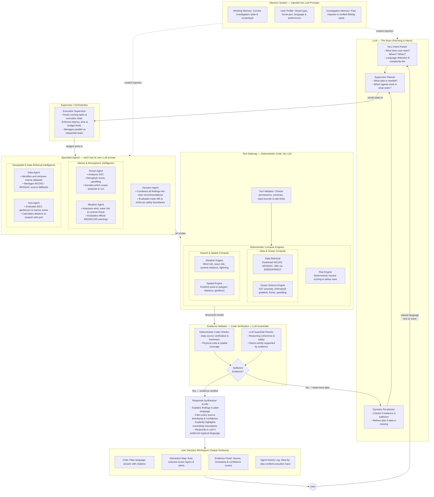
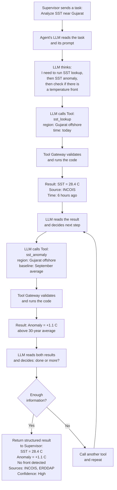
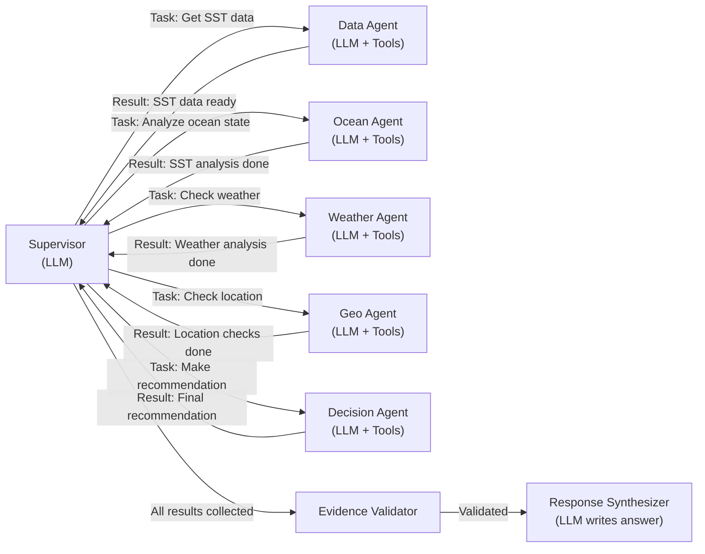

# ORCA — Core Agentic System Architecture

**How the AI brain actually works — where the LLM sits, what it controls, and what it does NOT control.**

---

## The Core Idea

```
LLM = thinks, plans, interprets, explains
Scientific Engines = calculates (no LLM involved)
Data Foundation = provides evidence (no LLM involved)
```

The LLM never does the math. It decides WHAT math to do, WHICH data to get, and EXPLAINS the result.

---

## Core Technical Architecture



---

## How an Agent Actually Works Internally

Each agent follows the same pattern. Here is what happens inside ONE agent:



---

## Where LLM is Used vs Where Code Runs

| Step | Who does it | Why |
|---|---|---|
| Understand the user's question | **LLM** | Only AI can understand natural language |
| Create a plan of what to investigate | **LLM** | Requires reasoning about what is needed |
| Pick which agent to use | **LLM** | Requires judgment about which domain matters |
| Pick which tool to call inside an agent | **LLM** | Agent decides what analysis is relevant |
| Actually download data from INCOIS | **Code** | Deterministic API call, no AI needed |
| Calculate SST anomaly | **Code** | Math formula, no AI needed |
| Run PostGIS distance query | **Code** | Database query, no AI needed |
| Calculate wind risk score | **Code** | Fixed rules, no AI needed |
| Check if evidence is fresh and complete | **Code** | Rule-based validation |
| Check if interpretation makes sense | **LLM** | Requires reasoning |
| Decide if more evidence is needed | **LLM** | Requires judgment |
| Write the final answer | **LLM** | Only AI can explain in natural language |
| Translate to regional language | **LLM** | Language generation |

---

## The Key Rule

```
LLM reasons about WHAT to do.
Code does the actual DOING.
LLM explains WHAT happened.
```

The LLM never calculates sea temperature.
The LLM never runs a database query.
The LLM never downloads a file.

The code never understands a question.
The code never writes an explanation.
The code never decides what to investigate next.

---

## Agent Communication — How They Talk

Agents do NOT talk to each other directly. Everything goes through the Supervisor.



**Why this design:**
- No agent can go rogue — Supervisor controls everything
- No infinite loops — agents cannot call other agents
- Clear responsibility — each agent has one job
- Easy to debug — every step is logged through Supervisor
