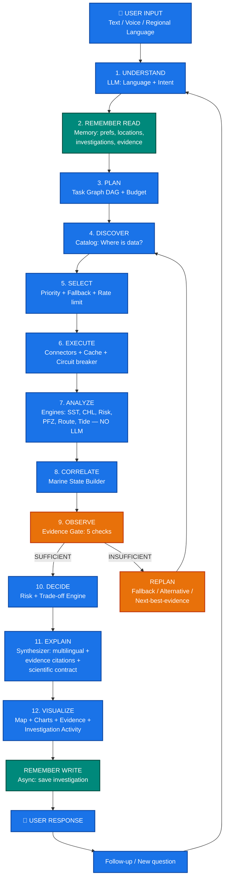
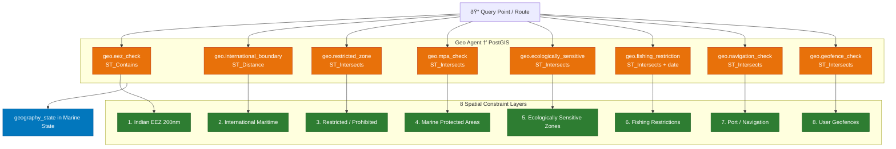

# ORCA — MASTER ARCHITECTURE
## The Complete End-to-End System Blueprint

**Project:** ORCA — Marine EcOsystem Reasoning with Collaborative Agents  
**Problem Statement ID:** 26176  
**Organization:** ISRO / Department of Space  
**Purpose:** Single unified architecture connecting EVERY component, API call, data flow, cache layer, rate limit, database table, engine, agent, tool, and service from user input to final output.  
**Status:** Final Architecture — All 6 Documents Unified  
**Date:** 26 September 2026  

---

# ═══════════════════════════════════════════════════════════════════
# SECTION 0: THE COMPLETE ORCA SYSTEM — ONE DIAGRAM
# ═══════════════════════════════════════════════════════════════════

```text
╔══════════════════════════════════════════════════════════════════════════════════════════════════════════════════════════╗
║                                                                                                                      ║
║                                              U S E R   L A Y E R                                                     ║
║                                                                                                                      ║
║   ┌──────────┐  ┌──────────┐  ┌───────────┐  ┌───────────┐  ┌──────────────┐  ┌──────────┐  ┌───────────────────┐    ║
║   │   CHAT   │  │   MAP    │  │  CHARTS   │  │  ALERTS   │  │  EVIDENCE    │  │ SCENARIO │  │  INVESTIGATION    │    ║
║   │  PANEL   │  │  (Leaflet│  │ (Chart.js)│  │  PANEL    │  │  PANEL       │  │ COMPARE  │  │  ACTIVITY STREAM  │    ║
║   │          │  │  /MapLibre│  │           │  │           │  │              │  │          │  │                   │    ║
║   │ Text     │  │          │  │ Time-series│  │ Push/SMS/ │  │ Source+      │  │ Side-by- │  │ Verified workflow │    ║
║   │ Voice    │  │ GeoJSON  │  │ Scatter   │  │ In-App/   │  │ Timestamp+   │  │ side     │  │ events, NOT raw   │    ║
║   │ Regional │  │ Raster   │  │ Histogram │  │ Voice     │  │ Confidence   │  │ trade-off│  │ chain-of-thought  │    ║
║   │ Language │  │ WMS/WMTS │  │ Wind Rose │  │           │  │ Evidence IDs │  │ Pareto   │  │                   │    ║
║   └────┬─────┘  └────┬─────┘  └─────┬─────┘  └─────┬─────┘  └──────┬───────┘  └────┬─────┘  └─────────┬─────────┘    ║
║        │             │              │              │               │               │                  │              ║
║        └─────────────┴──────────────┴──────────────┴───────────────┴───────────────┴──────────────────┘              ║
║                                                    │                                                                 ║
║                                          WEBSOCKET + REST API                                                        ║
║                                          (wss:// + https://)                                                         ║
║                                                    │                                                                 ║
╠══════════════════════════════════════════════════════════════════════════════════════════════════════════════════════════╣
║                                                                                                                      ║
║                                          A P I   G A T E W A Y                                                       ║
║                                                                                                                      ║
║   ┌───────────────────────────────────────────────────────────────────────────────────────────────────────────────┐    ║
║   │                                                                                                               │    ║
║   │  ┌─────────────┐  ┌──────────────┐  ┌──────────────┐  ┌────────────┐  ┌──────────────┐  ┌──────────────┐     │    ║
║   │  │   AUTH      │  │  RATE LIMIT  │  │  REQUEST     │  │  CORS /    │  │  REQUEST     │  │  RESPONSE    │     │    ║
║   │  │   JWT/      │  │              │  │  VALIDATION  │  │  SECURITY  │  │  LOGGING     │  │  COMPRESSION │     │    ║
║   │  │   Session   │  │  Per-user:   │  │              │  │  Headers   │  │              │  │              │     │    ║
║   │  │   Token     │  │   60 req/min │  │  Schema      │  │            │  │  Trace ID    │  │  gzip/br     │     │    ║
║   │  │             │  │  Per-IP:     │  │  validation  │  │  CSRF      │  │  generation  │  │              │     │    ║
║   │  │             │  │   120 req/min│  │  Size limits │  │  XSS       │  │              │  │              │     │    ║
║   │  └─────────────┘  └──────────────┘  └──────────────┘  └────────────┘  └──────────────┘  └──────────────┘     │    ║
║   │                                                                                                               │    ║
║   │  ENDPOINTS:                                                                                                   │    ║
║   │  POST /api/chat/message          ── Main conversation endpoint                                                │    ║
║   │  GET  /api/chat/stream           ── SSE streaming response                                                    │    ║
║   │  WS   /ws/chat/{session_id}      ── WebSocket for real-time chat                                              │    ║
║   │  GET  /api/data/layers           ── Map layer catalog                                                         │    ║
║   │  GET  /api/data/tiles/{z}/{x}/{y}── Raster tile serving                                                       │    ║
║   │  GET  /api/events/stream         ── SSE for investigation activity events                                      │    ║
║   │  POST /api/scenarios/compare     ── Scenario comparison                                                       │    ║
║   │  GET  /api/alerts/subscribe      ── Alert subscription                                                        │    ║
║   │  GET  /api/memory/profile        ── User memory profile                                                       │    ║
║   │  POST /api/memory/forget         ── Forget a memory                                                           │    ║
║   │  GET  /api/evidence/{id}         ── Evidence detail lookup                                                     │    ║
║   │  GET  /api/health                ── System health check                                                        │    ║
║   │                                                                                                               │    ║
║   └───────────────────────────────────────────────────────────────────────────────────────────────────────────────┘    ║
║                                                    │                                                                 ║
╠══════════════════════════════════════════════════════════════════════════════════════════════════════════════════════════╣
║                                                                                                                      ║
║                              S Y S T E M  1:  C O N V E R S A T I O N A L   L L M                                    ║
║                                                                                                                      ║
║   ┌───────────────────────────────────────────────────────────────────────────────────────────────────────────────┐    ║
║   │                                         CONVERSATIONAL LLM                                                    │    ║
║   │                                    (Gemini / GPT-4o / Claude)                                                 │    ║
║   │                                                                                                               │    ║
║   │   ┌────────────────┐   ┌────────────────┐   ┌────────────────┐   ┌────────────────┐   ┌────────────────┐     │    ║
║   │   │   LANGUAGE     │   │   INTENT       │   │   REFERENCE    │   │   CLARIFY /    │   │   MEMORY NEED  │     │    ║
║   │   │   DETECTION    │   │   EXTRACTION   │   │   RESOLUTION   │   │   FOLLOW-UP    │   │   DETECTION    │     │    ║
║   │   │                │   │                │   │                │   │                │   │                │     │    ║
║   │   │ en/hi/gu/ta/   │   │ WHAT/WHERE/    │   │ "there" →      │   │ Missing info   │   │ Need prefs?    │     │    ║
║   │   │ te/kn/ml/bn/   │   │ WHEN/WHY/      │   │ resolved loc   │   │ → ask user     │   │ Need history?  │     │    ║
║   │   │ or/mr          │   │ HOW/COMPARE    │   │ "tomorrow" →   │   │                │   │ Need scenario? │     │    ║
║   │   │                │   │                │   │ resolved time  │   │                │   │ Need evidence? │     │    ║
║   │   └───────┬────────┘   └───────┬────────┘   └───────┬────────┘   └───────┬────────┘   └───────┬────────┘     │    ║
║   │           │                    │                    │                    │                    │               │    ║
║   │           └────────────────────┴────────────────────┴────────────────────┴────────────────────┘               │    ║
║   │                                                    │                                                          │    ║
║   │                                       STRUCTURED INTENT OBJECT                                                │    ║
║   │                                                    │                                                          │    ║
║   │   ┌────────────────────────────────────────────────┴────────────────────────────────────────────────┐         │    ║
║   │   │  {                                                                                              │         │    ║
║   │   │    "intent": "safety_assessment",                                                               │         │    ║
║   │   │    "decision_type": "WHAT_SHOULD_I_DO",                                                        │         │    ║
║   │   │    "location": {"name": "Veraval", "lat": 20.9, "lon": 70.37, "resolved_by": "gazetteer"},     │         │    ║
║   │   │    "time": {"reference": "tomorrow_morning", "resolved": "2026-09-27T06:00:00+05:30"},         │         │    ║
║   │   │    "language": "gu",                                                                            │         │    ║
║   │   │    "complexity": "MODERATE",                                                                    │         │    ║
║   │   │    "stakeholder_type": "fisherman",                                                             │         │    ║
║   │   │    "variables_needed": ["sst", "wave_height", "wind", "pfz", "warnings"],                       │         │    ║
║   │   │    "constraints": {"avoid_geofences": true, "max_wave_m": 2.0}                                  │         │    ║
║   │   │  }                                                                                              │         │    ║
║   │   └─────────────────────────────────────────────────────────────────────────────────────────────────┘         │    ║
║   └───────────────────────────────────────────────────────────────────────────────────────────────────────────────┘    ║
║                                                    │                                                                 ║
║                                                    ▼                                                                 ║
╠══════════════════════════════════════════════════════════════════════════════════════════════════════════════════════════╣
║                                                                                                                      ║
║                            M E M O R Y   &   C O N T E X T   S E R V I C E                                           ║
║                                         (Service, NOT an Agent)                                                       ║
║                                                                                                                      ║
║   ┌───────────────────────────────────────────────────────────────────────────────────────────────────────────────┐    ║
║   │                                                                                                               │    ║
║   │   MEMORY READ PATH                                     MEMORY WRITE PATH                                      │    ║
║   │   ─────────────────                                     ──────────────────                                     │    ║
║   │                                                                                                               │    ║
║   │   Intent + Context                                      Turn / Event                                          │    ║
║   │        │                                                     │                                                │    ║
║   │        ▼                                                     ▼                                                │    ║
║   │   Memory Need Detection                                 Candidate Extraction                                  │    ║
║   │   ├── conversation continuity?                           ├── preference?                                       │    ║
║   │   ├── user preference?                                   ├── saved location?                                   │    ║
║   │   ├── saved location?                                    ├── investigation summary?                            │    ║
║   │   ├── prior investigation?                               ├── scenario?                                         │    ║
║   │   ├── scenario continuation?                             ├── evidence ref?                                     │    ║
║   │   ├── previous evidence reusable?                        └── transient / discard                               │    ║
║   │   └── current marine truth needed?                            │                                                │    ║
║   │        │                                                     ▼                                                │    ║
║   │        ▼                                                 Policy Gate                                          │    ║
║   │   Retrieval Plan                                         ├── worth remembering?                                │    ║
║   │   ├── exact SQL retrieval                                ├── permitted to persist?                             │    ║
║   │   ├── temporal retrieval                                 ├── provenance present?                               │    ║
║   │   ├── spatial retrieval (PostGIS)                        └── safe to store?                                    │    ║
║   │   ├── semantic retrieval (pgvector)                           │                                                │    ║
║   │   └── relationship retrieval                                 ▼                                                │    ║
║   │        │                                                 Dedupe + Conflict Resolution                         │    ║
║   │        ▼                                                     │                                                │    ║
║   │   Hard Filters                                               ▼                                                │    ║
║   │   ├── user scope                                         Create / Update / Supersede                          │    ║
║   │   ├── active status                                          │                                                │    ║
║   │   ├── time validity                                          ▼                                                │    ║
║   │   └── freshness                                          Index (SQL + PostGIS + pgvector)                     │    ║
║   │        │                                                     │                                                │    ║
║   │        ▼                                                     ▼                                                │    ║
║   │   Rerank + Dedupe                                        Audit Log (memory_events)                            │    ║
║   │        │                                                                                                      │    ║
║   │        ▼                                                                                                      │    ║
║   │   Context Compression                                                                                         │    ║
║   │        │                                                                                                      │    ║
║   │        ▼                                                                                                      │    ║
║   │   ┌─────────────────────────────────────────────────────────────┐                                              │    ║
║   │   │                    CONTEXT PACKET                           │                                              │    ║
║   │   │                                                             │                                              │    ║
║   │   │  user_context:                                              │                                              │    ║
║   │   │    preferred_language: "gu"                                  │                                              │    ║
║   │   │    vessel_type: "small_fishing_boat"                        │                                              │    ║
║   │   │    default_departure: "Veraval"                             │                                              │    ║
║   │   │                                                             │                                              │    ║
║   │   │  conversation_context:                                      │                                              │    ║
║   │   │    summary: "Comparing fishing conditions..."               │                                              │    ║
║   │   │    active_region: "Veraval coastal area"                    │                                              │    ║
║   │   │                                                             │                                              │    ║
║   │   │  prior_investigations: [...]                                │                                              │    ║
║   │   │  reusable_evidence: [...]                                   │                                              │    ║
║   │   │  active_scenario: {...}                                     │                                              │    ║
║   │   │  constraints: {avoid_geofences: true}                       │                                              │    ║
║   │   │                                                             │                                              │    ║
║   │   │  TOKEN BUDGET:                                              │                                              │    ║
║   │   │    conversation: 300-600 tokens                             │                                              │    ║
║   │   │    user_memory: 100-250 tokens                              │                                              │    ║
║   │   │    investigation: 100-400 tokens                            │                                              │    ║
║   │   │    evidence: 300-1000 tokens                                │                                              │    ║
║   │   └─────────────────────────────────────────────────────────────┘                                              │    ║
║   │                                                                                                               │    ║
║   │   7 MEMORY PLANES:                                                                                            │    ║
║   │   ┌──────────────┐ ┌──────────────┐ ┌──────────────┐ ┌──────────────┐                                         │    ║
║   │   │ A. WORKING   │ │ B. CONVER-   │ │ C. USER &    │ │ D. INVESTI-  │                                         │    ║
║   │   │    MEMORY    │ │    SATION    │ │    OPERATIONAL│ │    GATION    │                                         │    ║
║   │   │              │ │    MEMORY    │ │    MEMORY    │ │    MEMORY    │                                         │    ║
║   │   │ Redis        │ │ PostgreSQL   │ │ PostgreSQL   │ │ PostgreSQL   │                                         │    ║
║   │   │ minutes-hrs  │ │ + pgvector   │ │ + PostGIS    │ │ + pgvector   │                                         │    ║
║   │   └──────────────┘ └──────────────┘ └──────────────┘ └──────────────┘                                         │    ║
║   │   ┌──────────────┐ ┌──────────────┐ ┌──────────────┐                                                          │    ║
║   │   │ E. EVIDENCE  │ │ F. SCENARIO  │ │ G. RELATION- │                                                          │    ║
║   │   │    REFERENCE │ │    MEMORY    │ │    SHIP      │                                                          │    ║
║   │   │    MEMORY    │ │              │ │    MEMORY    │                                                          │    ║
║   │   │ PostgreSQL   │ │ PostgreSQL   │ │ memory_links │                                                          │    ║
║   │   │ freshness-   │ │ reusable     │ │ SQL joins    │                                                          │    ║
║   │   │ governed     │ │ state        │ │              │                                                          │    ║
║   │   └──────────────┘ └──────────────┘ └──────────────┘                                                          │    ║
║   │                                                                                                               │    ║
║   │   MEMORY TOOLS (via Tool Gateway):                                                                            │    ║
║   │   memory.get_session_state    memory.store_preference     memory.forget_memory                                │    ║
║   │   memory.get_user_profile     memory.store_saved_location memory.supersede_memory                             │    ║
║   │   memory.get_preferences      memory.store_investigation  memory.get_memory_sources                           │    ║
║   │   memory.get_saved_locations  memory.store_scenario       memory.retrieve_related_evidence                    │    ║
║   │   memory.search_investigations memory.update_memory                                                           │    ║
║   │   memory.get_scenario         memory.search_evidence_refs                                                     │    ║
║   │                                                                                                               │    ║
║   └───────────────────────────────────────────────────────────────────────────────────────────────────────────────┘    ║
║                                                    │                                                                 ║
║                                     INTENT + CONTEXT PACKET                                                          ║
║                                                    │                                                                 ║
║                                                    ▼                                                                 ║
╠══════════════════════════════════════════════════════════════════════════════════════════════════════════════════════════╣
║                                                                                                                      ║
║                     S Y S T E M  3:  O R C A   P L A N N E R  /  S U P E R V I S O R                                  ║
║                                                                                                                      ║
║   ┌───────────────────────────────────────────────────────────────────────────────────────────────────────────────┐    ║
║   │                                                                                                               │    ║
║   │                                    SUPERVISOR / PLANNER                                                        │    ║
║   │                                                                                                               │    ║
║   │   INPUT: Intent + Context Packet + Available Tools + Agent Registry                                           │    ║
║   │                                                                                                               │    ║
║   │   ┌────────────────────────────────────────────────────────────────────────────┐                               │    ║
║   │   │                           TASK GRAPH BUILDER                               │                               │    ║
║   │   │                                                                            │                               │    ║
║   │   │   Complexity Classification:                                               │                               │    ║
║   │   │   SIMPLE     → 1-3 tool calls    (e.g., "Current SST near Veraval")       │                               │    ║
║   │   │   MODERATE   → 3-5 tool calls    (e.g., "Is it safe tomorrow?")           │                               │    ║
║   │   │   COMPLEX    → 5-8 tool calls    (e.g., "Best route to PFZ")              │                               │    ║
║   │   │   DEEP       → 8-15+ tool calls  (e.g., "Why did productivity decline?")  │                               │    ║
║   │   │                                                                            │                               │    ║
║   │   │   Creates DAG of tasks with dependencies:                                  │                               │    ║
║   │   │                                                                            │                               │    ║
║   │   │   T1: data.discover          ─┐                                            │                               │    ║
║   │   │   T2: data.check_availability ─┤──→ PARALLEL                               │                               │    ║
║   │   │   T3: ocean.sst_lookup       ─┘                                            │                               │    ║
║   │   │                                  │                                         │                               │    ║
║   │   │   T4: weather.marine_forecast ───┤──→ PARALLEL (depends on T1)             │                               │    ║
║   │   │   T5: ocean.chlorophyll      ───┘                                          │                               │    ║
║   │   │                                  │                                         │                               │    ║
║   │   │   T6: geo.boundary_check    ─────┤──→ DEPENDS ON T3-T5                     │                               │    ║
║   │   │   T7: risk.assess           ─────┘                                         │                               │    ║
║   │   │                                  │                                         │                               │    ║
║   │   │   T8: evidence.validate     ─────┤──→ EVIDENCE GATE                        │                               │    ║
║   │   │   T9: synthesize.response   ─────┘                                         │                               │    ║
║   │   │                                                                            │                               │    ║
║   │   └────────────────────────────────────────────────────────────────────────────┘                               │    ║
║   │                                                                                                               │    ║
║   │   BUDGET ENFORCEMENT:                                                                                         │    ║
║   │   ┌─────────────────────────────────────────────────────────┐                                                  │    ║
║   │   │  max_tools:       15 per workflow                       │                                                  │    ║
║   │   │  max_time:        120 seconds per workflow              │                                                  │    ║
║   │   │  max_replan:      3 replanning cycles                   │                                                  │    ║
║   │   │  max_llm_calls:   8 per workflow                        │                                                  │    ║
║   │   │  max_cost:        configurable per complexity tier      │                                                  │    ║
║   │   └─────────────────────────────────────────────────────────┘                                                  │    ║
║   │                                                                                                               │    ║
║   │   REPLANNING LOOP:                                                                                            │    ║
║   │   ┌─────────────────────────────────────────────────────────┐                                                  │    ║
║   │   │  Task fails / times out / returns insufficient data     │                                                  │    ║
║   │   │       │                                                 │                                                  │    ║
║   │   │       ▼                                                 │                                                  │    ║
║   │   │  replan_count < max_replan?                             │                                                  │    ║
║   │   │       │YES              │NO                             │                                                  │    ║
║   │   │       ▼                 ▼                               │                                                  │    ║
║   │   │  Try fallback source   Proceed with limitations        │                                                  │    ║
║   │   │  OR alternative tool   Report what IS available         │                                                  │    ║
║   │   │  OR skip variable      Never fabricate data             │                                                  │    ║
║   │   └─────────────────────────────────────────────────────────┘                                                  │    ║
║   │                                                                                                               │    ║
║   │   WORKFLOW STATES:                                                                                            │    ║
║   │   PLANNING → EXECUTING → REPLANNING → VALIDATING → SYNTHESIZING → COMPLETED                                  │    ║
║   │                                                       └→ FAILED / CANCELLED / TIMEOUT                         │    ║
║   │                                                                                                               │    ║
║   └───────────────────────────────────────────────────────────────────────────────────────────────────────────────┘    ║
║                                                    │                                                                 ║
║                                          TASK GRAPH (DAG)                                                            ║
║                                                    │                                                                 ║
║                                                    ▼                                                                 ║
╠══════════════════════════════════════════════════════════════════════════════════════════════════════════════════════════╣
║                                                                                                                      ║
║                               A G E N T   L A Y E R   +   T O O L   G A T E W A Y                                    ║
║                                                                                                                      ║
║   ┌───────────────────────────────────────────────────────────────────────────────────────────────────────────────┐    ║
║   │                                                                                                               │    ║
║   │                                     TOOL GATEWAY (Central Hub)                                                │    ║
║   │                                                                                                               │    ║
║   │   Every tool call flows through this gateway:                                                                 │    ║
║   │                                                                                                               │    ║
║   │   Agent → Tool Gateway → Permission Check → Rate Limit → Cache Check → Execute → Log → Return                │    ║
║   │                                                                                                               │    ║
║   │   ┌─────────────────┐  ┌────────────────┐  ┌────────────────┐  ┌────────────────┐  ┌────────────────┐        │    ║
║   │   │  PERMISSION     │  │  RATE LIMITER  │  │  CACHE CHECK   │  │  CIRCUIT       │  │  OBSERVABILITY │        │    ║
║   │   │  CHECK          │  │                │  │                │  │  BREAKER       │  │                │        │    ║
║   │   │                 │  │  INCOIS: 1/sec │  │  Redis TTL-    │  │                │  │  trace_id      │        │    ║
║   │   │  READ_ONLY      │  │  IMD: 2/sec    │  │  based check   │  │  CLOSED → OPEN │  │  latency_ms    │        │    ║
║   │   │  ANALYSIS       │  │  MOSDAC: 1/sec │  │                │  │  after 3 fails │  │  tool_id       │        │    ║
║   │   │  STATE_CHANGING │  │  Copernicus:   │  │  Cache HIT →   │  │                │  │  agent_id      │        │    ║
║   │   │  SIDE_EFFECT    │  │    5/min       │  │    return      │  │  OPEN → reject │  │  source_id     │        │    ║
║   │   │                 │  │  OpenMeteo:    │  │  Cache MISS →  │  │  HALF_OPEN →   │  │  cache_hit     │        │    ║
║   │   │  Agent-specific │  │    10/sec      │  │    execute     │  │    test call   │  │  error_code    │        │    ║
║   │   │  access matrix  │  │  GEBCO: N/A    │  │                │  │                │  │                │        │    ║
║   │   │                 │  │  (static)      │  │  Cache TTLs:   │  │  Reset after   │  │  Prometheus    │        │    ║
║   │   │                 │  │                │  │  SST: 6hr      │  │  success count │  │  metrics       │        │    ║
║   │   │                 │  │  Token bucket  │  │  Forecast: 3hr │  │                │  │                │        │    ║
║   │   │                 │  │  per provider  │  │  Static: 24hr  │  │                │  │                │        │    ║
║   │   │                 │  │                │  │  Boundary:30d  │  │                │  │                │        │    ║
║   │   └─────────────────┘  └────────────────┘  └────────────────┘  └────────────────┘  └────────────────┘        │    ║
║   │                                                                                                               │    ║
║   └───────────────────────────────────────────────────────────────────────────────────────────────────────────────┘    ║
║                                                    │                                                                 ║
║        ┌───────────────────────────────────────────┼───────────────────────────────────────────┐                      ║
║        │                       │                   │                   │                       │                      ║
║        ▼                       ▼                   ▼                   ▼                       ▼                      ║
║   ┌─────────────┐   ┌──────────────┐   ┌──────────────┐   ┌──────────────┐   ┌──────────────────────┐               ║
║   │ DATA        │   │ OCEAN &      │   │ WEATHER &    │   │ GEOSPATIAL   │   │ DECISION / RISK /    │               ║
║   │ ACQUISITION │   │ ECOSYSTEM    │   │ HAZARD       │   │ AGENT        │   │ OPERATIONS AGENT     │               ║
║   │ AGENT       │   │ AGENT        │   │ AGENT        │   │              │   │                      │               ║
║   │             │   │              │   │              │   │              │   │                      │               ║
║   │ TOOLS:      │   │ TOOLS:       │   │ TOOLS:       │   │ TOOLS:       │   │ TOOLS:               │               ║
║   │ data.       │   │ ocean.       │   │ weather.     │   │ geo.         │   │ risk.                │               ║
║   │  discover   │   │  sst_lookup  │   │  marine_     │   │  point_in_   │   │  operational_        │               ║
║   │  catalog    │   │  sst_anomaly │   │   forecast   │   │   polygon    │   │   assessment         │               ║
║   │  retrieve   │   │  chlorophyll │   │  wave_       │   │  geofence_   │   │  generate_score      │               ║
║   │  check_     │   │  chl_anomaly │   │   analysis   │   │   check      │   │  classify            │               ║
║   │   avail     │   │  current     │   │  wind_       │   │  mpa_check   │   │  combine_factors     │               ║
║   │  compare_   │   │  argo_       │   │   analysis   │   │  eez_check   │   │  geofence_           │               ║
║   │   cand      │   │   profile    │   │  marine_     │   │  restricted_ │   │   constraint         │               ║
║   │  validate   │   │  front_      │   │   warning    │   │   zone_check │   │                      │               ║
║   │  historical │   │   detect     │   │  cyclone_    │   │  ecologically│   │ route.               │               ║
║   │             │   │  hab_        │   │   track      │   │   _sensitive │   │  optimize            │               ║
║   │             │   │   screen     │   │  lightning   │   │   _check     │   │  waypoint_           │               ║
║   │             │   │  ecosystem.  │   │  historical_ │   │  fishing_    │   │   generation         │               ║
║   │             │   │   prod_index │   │   compare    │   │   restriction│   │  remove_forbidden    │               ║
║   │             │   │   historical │   │  forecast_   │   │   _check     │   │  compare             │               ║
║   │             │   │   _compare   │   │   compare    │   │  buffer      │   │  hazard_exposure     │               ║
║   │             │   │              │   │              │   │  intersect   │   │  eta_compute         │               ║
║   │             │   │              │   │              │   │  distance    │   │  fuel_estimate       │               ║
║   │             │   │              │   │              │   │  nearest     │   │                      │               ║
║   │             │   │              │   │              │   │  bathymetry  │   │ ecosystem.           │               ║
║   │             │   │              │   │              │   │              │   │  pfz_nearest         │               ║
║   │             │   │              │   │              │   │              │   │  pfz_suitability     │               ║
║   │             │   │              │   │              │   │              │   │                      │               ║
║   └──────┬──────┘   └──────┬───────┘   └──────┬───────┘   └──────┬───────┘   └──────────┬───────────┘               ║
║          │                 │                  │                  │                       │                           ║
║          └─────────────────┴──────────────────┴──────────────────┴───────────────────────┘                           ║
║                                                    │                                                                 ║
║                                        TOOL RESULTS + EVIDENCE                                                       ║
║                                                    │                                                                 ║
║                                                    ▼                                                                 ║
╠══════════════════════════════════════════════════════════════════════════════════════════════════════════════════════════╣
║                                                                                                                      ║
║                    S Y S T E M  2:  D A T A   F O U N D A T I O N   &   C O N N E C T O R S                           ║
║                                                                                                                      ║
║   ┌───────────────────────────────────────────────────────────────────────────────────────────────────────────────┐    ║
║   │                                                                                                               │    ║
║   │   DATA CATALOG & DISCOVERY                                DATA AVAILABILITY SERVICE                           │    ║
║   │   ────────────────────────                                ──────────────────────────                           │    ║
║   │   ┌───────────────────────────────┐                       ┌───────────────────────────┐                        │    ║
║   │   │  30+ registered datasets      │                       │  Pre-check before retrieve│                        │    ║
║   │   │  Variable → Source mapping     │                       │  HTTP HEAD / status check │                        │    ║
║   │   │  Source priority & fallbacks   │                       │  Last-known availability  │                        │    ║
║   │   │  Access requirements           │                       │  Degradation detection    │                        │    ║
║   │   │  Freshness requirements        │                       │  Mock mode fallback       │                        │    ║
║   │   └───────────────────────────────┘                       └───────────────────────────┘                        │    ║
║   │                                                                                                               │    ║
║   │   SOURCE CONFLICT ENGINE                                  FALLBACK MATRIX                                     │    ║
║   │   ──────────────────────                                  ───────────────                                     │    ║
║   │   ┌───────────────────────────────┐                       ┌───────────────────────────┐                        │    ║
║   │   │  Cross-source agreement check │                       │  SST: INCOIS→NOAA→Coper.  │                        │    ║
║   │   │  Disagreement flag + ranges   │                       │  CHL: INCOIS→MOSDAC→Coper.│                        │    ║
║   │   │  "Sources agree" / "Sources   │                       │  Wave: INCOIS→OpenMeteo    │                        │    ║
║   │   │  show range 27.8-28.4°C"      │                       │  Wind: MOSDAC→OpenMeteo    │                        │    ║
║   │   │  Coverage: FULL/PARTIAL/LOW   │                       │  PFZ: INCOIS only          │                        │    ║
║   │   └───────────────────────────────┘                       │  Bathy: GEBCO (static)     │                        │    ║
║   │                                                           └───────────────────────────┘                        │    ║
║   │                                                                                                               │    ║
║   │   ═══════════════════════════════════════════════════════════════════════                                      │    ║
║   │                              D A T A   C O N N E C T O R S                                                    │    ║
║   │   ═══════════════════════════════════════════════════════════════════════                                      │    ║
║   │                                                                                                               │    ║
║   │   ┌─────────────────────────────────────────────────────────────────────────────────┐                          │    ║
║   │   │                        GENERIC ERDDAP CLIENT (reusable)                         │                          │    ║
║   │   │   ┌──────────────┐  ┌──────────────┐  ┌──────────────┐  ┌──────────────┐        │                          │    ║
║   │   │   │  client.py   │  │  catalog.py  │  │  query.py    │  │  parser.py   │        │                          │    ║
║   │   │   │              │  │              │  │              │  │              │        │                          │    ║
║   │   │   │ HTTP session │  │ allDatasets  │  │ tabledap    │  │ CSV→DataFrame│        │                          │    ║
║   │   │   │ retry logic  │  │ griddap     │  │ griddap     │  │ NetCDF parse │        │                          │    ║
║   │   │   │ auth headers │  │ search      │  │ bbox+time   │  │ JSON parse   │        │                          │    ║
║   │   │   │ timeout      │  │ metadata    │  │ constraints │  │ unit convert │        │                          │    ║
║   │   │   └──────────────┘  └──────────────┘  └──────────────┘  └──────────────┘        │                          │    ║
║   │   └─────────────────────────────────────────────────────────────────────────────────┘                          │    ║
║   │                                          │                                                                    │    ║
║   │        ┌─────────────────────────────────┼─────────────────────────────────┐                                   │    ║
║   │        │                                 │                                 │                                   │    ║
║   │   ┌────┴──────────┐              ┌───────┴───────┐              ┌──────────┴────┐                              │    ║
║   │   │  INCOIS       │              │  NOAA         │              │  OTHER        │                              │    ║
║   │   │  (uses ERDDAP)│              │  (uses ERDDAP)│              │  CONNECTORS   │                              │    ║
║   │   │               │              │               │              │               │                              │    ║
║   │   │ SST daily     │              │ OISST v2.1    │              │ ┌───────────┐ │                              │    ║
║   │   │ CHL daily     │              │ VIIRS CHL     │              │ │ OpenMeteo │ │                              │    ║
║   │   │ Currents      │              │ GOES SST      │              │ │ REST API  │ │                              │    ║
║   │   │ OSF (forecast)│              │ Pathfinder    │              │ │ Weather+  │ │                              │    ║
║   │   │ PFZ advisories│              │               │              │ │ Wave+Wind │ │                              │    ║
║   │   │ Argo profiles │              │               │              │ └───────────┘ │                              │    ║
║   │   │ Buoy data     │              │               │              │ ┌───────────┐ │                              │    ║
║   │   │               │              │               │              │ │ IMD       │ │                              │    ║
║   │   │ Rate: 1 req/s │              │ Rate: 5 req/s │              │ │ Bulletins │ │                              │    ║
║   │   │ Auth: none/reg│              │ Auth: none    │              │ │ Cyclone   │ │                              │    ║
║   │   └───────────────┘              └───────────────┘              │ │ Lightning │ │                              │    ║
║   │                                                                 │ │ Scraper   │ │                              │    ║
║   │   ┌───────────────┐              ┌───────────────┐              │ └───────────┘ │                              │    ║
║   │   │  MOSDAC       │              │  COPERNICUS   │              │ ┌───────────┐ │                              │    ║
║   │   │               │              │  CMEMS        │              │ │ GEBCO     │ │                              │    ║
║   │   │ OCM-3 CHL     │              │               │              │ │ Static    │ │                              │    ║
║   │   │ SCAT-3 Wind   │              │ Physics rean. │              │ │ Bathym.   │ │                              │    ║
║   │   │ INSAT Weather │              │ Wave reanalysis│             │ │ GeoTIFF   │ │                              │    ║
║   │   │               │              │ Bio-geo-chem  │              │ └───────────┘ │                              │    ║
║   │   │ NOTE: SSTM    │              │               │              │ ┌───────────┐ │                              │    ║
║   │   │ NOT available │              │ Rate: 5/min   │              │ │ GIS/      │ │                              │    ║
║   │   │ (scan failure)│              │ Auth: CDS API │              │ │ Boundaries│ │                              │    ║
║   │   │               │              │ key required  │              │ │ EEZ, MPA  │ │                              │    ║
║   │   │ Rate: 1 req/s │              │               │              │ │ ESZ, etc  │ │                              │    ║
║   │   │ Auth: register│              │               │              │ │ Static    │ │                              │    ║
║   │   └───────────────┘              └───────────────┘              │ └───────────┘ │                              │    ║
║   │                                                                 └───────────────┘                              │    ║
║   │                                                                                                               │    ║
║   │   ═══════════════════════════════════════════════════════════════════════                                      │    ║
║   │                     I N G E S T I O N   P I P E L I N E                                                       │    ║
║   │   ═══════════════════════════════════════════════════════════════════════                                      │    ║
║   │                                                                                                               │    ║
║   │   RAW DATA                                                                                                    │    ║
║   │   (NetCDF, CSV, GeoTIFF, HDF, GRIB, JSON, XML, HTML)                                                         │    ║
║   │        │                                                                                                      │    ║
║   │        ▼                                                                                                      │    ║
║   │   ┌────────────────────────────────────────────────────────────────────────────────┐                           │    ║
║   │   │                        INGESTION PIPELINE                                      │                           │    ║
║   │   │                                                                                │                           │    ║
║   │   │   1. RECEIVE          Raw file/API response arrives                            │                           │    ║
║   │   │        │                                                                       │                           │    ║
║   │   │        ▼                                                                       │                           │    ║
║   │   │   2. VALIDATE         Schema check, format verification, size limits           │                           │    ║
║   │   │        │              Missing fields → REJECT                                  │                           │    ║
║   │   │        ▼              Corrupt file → REJECT                                    │                           │    ║
║   │   │                                                                                │                           │    ║
║   │   │   3. QUALITY CHECK    Range validation (SST: -2 to 40°C)                       │                           │    ║
║   │   │        │              Spatial bounds (Indian Ocean region)                      │                           │    ║
║   │   │        ▼              Temporal sanity (not future observation)                  │                           │    ║
║   │   │                       NaN/fill-value detection                                 │                           │    ║
║   │   │   4. NORMALIZE        Variable name → canonical_variable mapping               │                           │    ║
║   │   │        │              Unit conversion (°F→°C, knots→m/s)                        │                           │    ║
║   │   │        ▼              CRS reprojection → EPSG:4326                              │                           │    ║
║   │   │                       Grid alignment / regridding                               │                           │    ║
║   │   │   5. STORE            Raw → S3 orca-raw/ (IMMUTABLE)                           │                           │    ║
║   │   │        │              Normalized → S3 orca-normalized/ (Zarr/COG)               │                           │    ║
║   │   │        ▼              Metadata → PostgreSQL                                    │                           │    ║
║   │   │                       Time-series → Parquet                                    │                           │    ║
║   │   │   6. INDEX            PostGIS spatial index                                    │                           │    ║
║   │   │        │              Temporal index                                           │                           │    ║
║   │   │        ▼              Variable index                                           │                           │    ║
║   │   │                                                                                │                           │    ║
║   │   │   7. REGISTER         ingestion_records → created                              │                           │    ║
║   │   │                       validation_records → created                             │                           │    ║
║   │   │                       quality_records → created                                │                           │    ║
║   │   │                                                                                │                           │    ║
║   │   │   IDEMPOTENCY:  SHA-256 fingerprint prevents duplicate ingestion               │                           │    ║
║   │   │   DEDUP KEY:    source + dataset + timestamp + bbox                            │                           │    ║
║   │   │                                                                                │                           │    ║
║   │   └────────────────────────────────────────────────────────────────────────────────┘                           │    ║
║   │                                                                                                               │    ║
║   │   MOCK MODE:                                                                                                  │    ║
║   │   ┌───────────────────────────────────────────────────────────┐                                                │    ║
║   │   │  ORCA_DATA_MODE=live  → real API calls                    │                                                │    ║
║   │   │  ORCA_DATA_MODE=mock  → golden dataset responses          │                                                │    ║
║   │   │                                                           │                                                │    ║
║   │   │  golden/                                                  │                                                │    ║
║   │   │  ├── argo/       5 real Argo profiles                     │                                                │    ║
║   │   │  ├── osf/        1 INCOIS Ocean State Forecast            │                                                │    ║
║   │   │  ├── pfz/        2 PFZ advisories with geometries         │                                                │    ║
║   │   │  ├── imd/        1 marine bulletin + 1 cyclone track      │                                                │    ║
║   │   │  ├── mosdac/     1 OCM-3 chlorophyll product              │                                                │    ║
║   │   │  ├── gebco/      Gujarat/Arabian Sea bathymetry subset    │                                                │    ║
║   │   │  ├── copernicus/ 1 physics + 1 wave subset                │                                                │    ║
║   │   │  └── noaa/       1 SST + 1 ocean colour product           │                                                │    ║
║   │   └───────────────────────────────────────────────────────────┘                                                │    ║
║   │                                                                                                               │    ║
║   └───────────────────────────────────────────────────────────────────────────────────────────────────────────────┘    ║
║                                                    │                                                                 ║
║                                        VALIDATED + NORMALIZED DATA                                                   ║
║                                                    │                                                                 ║
║                                                    ▼                                                                 ║
╠══════════════════════════════════════════════════════════════════════════════════════════════════════════════════════════╣
║                                                                                                                      ║
║               S Y S T E M  7:  S C I E N T I F I C   E N G I N E S   &   I N T E L L I G E N C E                      ║
║                                        (ALL DETERMINISTIC — NO LLM)                                                  ║
║                                                                                                                      ║
║   ┌───────────────────────────────────────────────────────────────────────────────────────────────────────────────┐    ║
║   │                                                                                                               │    ║
║   │   CORE SCIENTIFIC ENGINES                                                                                     │    ║
║   │   ───────────────────────                                                                                     │    ║
║   │                                                                                                               │    ║
║   │   ┌──────────────┐  ┌──────────────┐  ┌──────────────┐  ┌──────────────┐  ┌──────────────┐                    │    ║
║   │   │  SST ENGINE  │  │  CHL ENGINE  │  │  RISK ENGINE │  │  PFZ ENGINE  │  │  ROUTE       │                    │    ║
║   │   │              │  │              │  │ (Operational │  │              │  │  ENGINE      │                    │    ║
║   │   │ Regional     │  │ Regional     │  │  Risk /      │  │ Suitability  │  │              │                    │    ║
║   │   │ mean/anomaly │  │ mean/anomaly │  │  Suitability)│  │ scoring      │  │ A* / Dijkstra│                    │    ║
║   │   │ vs 30yr      │  │ vs 20yr      │  │              │  │ Distance     │  │ Weighted     │                    │    ║
║   │   │ baseline     │  │ baseline     │  │ Multi-factor │  │ Freshness    │  │ graph search │                    │    ║
║   │   │              │  │              │  │ scoring      │  │ Ocean state  │  │ Hazard avoid │                    │    ║
║   │   │ Climatology: │  │ Climatology: │  │ Wave+Wind+   │  │ matching     │  │ ETA compute  │                    │    ║
║   │   │ Zarr monthly │  │ Zarr monthly │  │ Warning+     │  │              │  │ Fuel estimate│                    │    ║
║   │   │ means        │  │ means        │  │ Cyclone+     │  │              │  │ Multi-obj    │                    │    ║
║   │   │              │  │              │  │ Lightning    │  │              │  │ optimization │                    │    ║
║   │   │ Output:      │  │ Output:      │  │              │  │ Output:      │  │              │                    │    ║
║   │   │ EV record    │  │ EV record    │  │ Levels:      │  │ PFZ IDs +   │  │ Output:      │                    │    ║
║   │   │ with anomaly │  │ with anomaly │  │ LOW          │  │ scores +    │  │ Route geom + │                    │    ║
║   │   │ + baseline   │  │ + baseline   │  │ MODERATE     │  │ distance    │  │ waypoints +  │                    │    ║
║   │   │ + confidence │  │ + confidence │  │ HIGH         │  │ + EV record │  │ hazard exp.  │                    │    ║
║   │   │              │  │              │  │ CRITICAL     │  │              │  │ + EV record  │                    │    ║
║   │   └──────────────┘  └──────────────┘  └──────────────┘  └──────────────┘  └──────────────┘                    │    ║
║   │                                                                                                               │    ║
║   │   ADVANCED INTELLIGENCE ENGINES                                                                               │    ║
║   │   ─────────────────────────────                                                                               │    ║
║   │                                                                                                               │    ║
║   │   ┌──────────────────────┐  ┌──────────────────────┐  ┌──────────────────────┐                                │    ║
║   │   │  EVENT & CHANGE      │  │  SCENARIO ENGINE     │  │  DECISION TRADE-OFF  │                                │    ║
║   │   │  ENGINE              │  │                      │  │  ENGINE              │                                │    ║
║   │   │                      │  │ Temporal/spatial     │  │                      │                                │    ║
║   │   │ Lifecycle:           │  │ shift comparisons    │  │ Hard constraints     │                                │    ║
║   │   │ CANDIDATE → ACTIVE  │  │                      │  │ (warnings, zones)    │                                │    ║
║   │   │ → ENDED             │  │ State reuse:         │  │                      │                                │    ║
║   │   │                      │  │ "What if 9 AM?"     │  │ Soft objectives      │                                │    ║
║   │   │ Detection:           │  │ recomputes only     │  │ (time, fuel, risk)   │                                │    ║
║   │   │ Threshold breach     │  │ affected pieces     │  │                      │                                │    ║
║   │   │ Persistence check    │  │                      │  │ Pareto ranking       │                                │    ║
║   │   │ Spatial extent       │  │ Comparison:          │  │ MCDA scoring         │                                │    ║
║   │   │ Multi-source         │  │ Side-by-side delta  │  │ Sensitivity analysis │                                │    ║
║   │   │ corroboration        │  │ of marine states    │  │                      │                                │    ║
║   │   │                      │  │                      │  │ Output:              │                                │    ║
║   │   │ V2: CUSUM, EWMA,    │  │ Output:              │  │ Ranked options +     │                                │    ║
║   │   │ PELT, Bayesian      │  │ Scenario results +  │  │ trade-off explain +  │                                │    ║
║   │   │ change points       │  │ comparison table    │  │ sensitivity report   │                                │    ║
║   │   └──────────────────────┘  └──────────────────────┘  └──────────────────────┘                                │    ║
║   │                                                                                                               │    ║
║   │   ┌──────────────────────┐  ┌──────────────────────┐  ┌──────────────────────┐                                │    ║
║   │   │  UNCERTAINTY         │  │  NEXT-BEST-EVIDENCE  │  │  EO INTELLIGENCE     │                                │    ║
║   │   │  ENGINE              │  │  SELECTOR            │  │  SERVICE             │                                │    ║
║   │   │                      │  │                      │  │                      │                                │    ║
║   │   │ Source confidence:   │  │ Information value    │  │ Satellite product    │                                │    ║
║   │   │  observation > fore  │  │ scoring:             │  │ discovery            │                                │    ║
║   │   │  cast > reanalysis   │  │                      │  │                      │                                │    ║
║   │   │                      │  │ "Which evidence      │  │ Scene quality        │                                │    ║
║   │   │ Spatial confidence:  │  │ should I get NEXT    │  │ assessment           │                                │    ║
║   │   │  in-situ > gridded   │  │ to most improve      │  │                      │                                │    ║
║   │   │                      │  │ the decision?"       │  │ Raster analysis      │                                │    ║
║   │   │ Temporal confidence: │  │                      │  │                      │                                │    ║
║   │   │  fresh > aged        │  │ Drives replanning    │  │ V2: Raw scene        │                                │    ║
║   │   │                      │  │ decisions            │  │ processing, spectral │                                │    ║
║   │   │ Propagation through  │  │                      │  │ index computation    │                                │    ║
║   │   │ decision chain       │  │                      │  │                      │                                │    ║
║   │   └──────────────────────┘  └──────────────────────┘  └──────────────────────┘                                │    ║
║   │                                                                                                               │    ║
║   │   GEOFLOW — SPATIAL REASONING GRAPHS                                                                         │    ║
║   │   ──────────────────────────────────                                                                         │    ║
║   │   ┌──────────────────────────────────────────────────────────────────────────┐                                 │    ║
║   │   │                                                                          │                                 │    ║
║   │   │   graph.py         → Build spatial workflow DAG                           │                                 │    ║
║   │   │   operations.py    → buffer, intersect, difference, union, rank, nearest │                                 │    ║
║   │   │   executor.py      → Generate + execute PostGIS SQL                      │                                 │    ║
║   │   │                                                                          │                                 │    ║
║   │   │   Example:                                                               │                                 │    ║
║   │   │   "Nearest PFZ avoiding restricted zones within 50km of Veraval"         │                                 │    ║
║   │   │        │                                                                 │                                 │    ║
║   │   │        ▼                                                                 │                                 │    ║
║   │   │   BUFFER(Veraval, 50km) → INTERSECT(PFZ_zones) → DIFFERENCE(restricted) │                                 │    ║
║   │   │        → DIFFERENCE(ESZ) → RANK(distance) → RESULT                      │                                 │    ║
║   │   │                                                                          │                                 │    ║
║   │   └──────────────────────────────────────────────────────────────────────────┘                                 │    ║
║   │                                                                                                               │    ║
║   └───────────────────────────────────────────────────────────────────────────────────────────────────────────────┘    ║
║                                                    │                                                                 ║
║                                         ALL ENGINE OUTPUTS                                                           ║
║                                                    │                                                                 ║
║                                                    ▼                                                                 ║
╠══════════════════════════════════════════════════════════════════════════════════════════════════════════════════════════╣
║                                                                                                                      ║
║                        M A R I N E   S T A T E   +   E V I D E N C E   G A T E                                        ║
║                                                                                                                      ║
║   ┌───────────────────────────────────────────────────────────────────────────────────────────────────────────────┐    ║
║   │                                                                                                               │    ║
║   │                               MARINE STATE BUILDER                                                            │    ║
║   │                                                                                                               │    ║
║   │   Assembles all engine results into ONE structured intermediate representation:                               │    ║
║   │                                                                                                               │    ║
║   │   ┌─────────────────────────────────────────────────────────────────────────────┐                              │    ║
║   │   │                         MARINE STATE (JSONB)                                │                              │    ║
║   │   │                                                                             │                              │    ║
║   │   │   ocean_state:                                                              │                              │    ║
║   │   │     sst: {value: 28.2, anomaly: 1.1, unit: "degC", evidence_id: "EV-91"}   │                              │    ║
║   │   │     chlorophyll: {value: 0.8, anomaly: -0.31, evidence_id: "EV-94"}         │                              │    ║
║   │   │     current_speed: null  ← honest gap                                      │                              │    ║
║   │   │                                                                             │                              │    ║
║   │   │   atmosphere_state:                                                         │                              │    ║
║   │   │     wind_speed: {value: 8.2, unit: "m/s", evidence_id: "EV-96"}             │                              │    ║
║   │   │     wave_height: {value: 2.1, unit: "m", evidence_id: "EV-97"}              │                              │    ║
║   │   │     marine_warning: {active: true, severity: "MODERATE", source: "IMD"}     │                              │    ║
║   │   │     cyclone_active: false                                                   │                              │    ║
║   │   │                                                                             │                              │    ║
║   │   │   ecosystem_state:                                                          │                              │    ║
║   │   │     productivity_state: "BELOW_BASELINE"                                    │                              │    ║
║   │   │     pfz_available: true, pfz_count: 2                                       │                              │    ║
║   │   │                                                                             │                              │    ║
║   │   │   geography_state:                                                          │                              │    ║
║   │   │     eez_status: "WITHIN_INDIA"                                              │                              │    ║
║   │   │     mpa_nearby: false                                                       │                              │    ║
║   │   │     esz_nearby: false                  ← Ecologically Sensitive Zones       │                              │    ║
║   │   │     restricted_zones_nearby: true                                           │                              │    ║
║   │   │     nearest_port: {name: "Veraval", distance_km: 42}                        │                              │    ║
║   │   │                                                                             │                              │    ║
║   │   │   temporal_state:                                                           │                              │    ║
║   │   │     query_refers_to: "future"                                               │                              │    ║
║   │   │     data_freshness: {ocean: "ACCEPTABLE", weather: "FRESH"}                 │                              │    ║
║   │   │                                                                             │                              │    ║
║   │   │   uncertainty_state:                   ← NEW                                │                              │    ║
║   │   │     overall_confidence: "MODERATE"                                          │                              │    ║
║   │   │     source_agreement: "PARTIAL"                                             │                              │    ║
║   │   │     variable_confidences: {...}                                              │                              │    ║
║   │   │                                                                             │                              │    ║
║   │   │   evidence_ids: ["EV-91", "EV-93", "EV-94", "EV-96", "EV-97"]              │                              │    ║
║   │   │   coverage_fraction: 0.89                                                   │                              │    ║
║   │   │   limitations: ["No current observation", "No nearby buoy"]                 │                              │    ║
║   │   │                                                                             │                              │    ║
║   │   └─────────────────────────────────────────────────────────────────────────────┘                              │    ║
║   │                                                                                                               │    ║
║   │   STATE VERSIONING:                                                                                           │    ║
║   │   marine_state_versions → snapshot with parent chain                                                          │    ║
║   │   marine_state_deltas   → what changed between versions                                                       │    ║
║   │                                                                                                               │    ║
║   │   4D STATE QUERIES:                                                                                           │    ║
║   │   STATE_AT(region, time)          → retrieve/reconstruct state                                                │    ║
║   │   STATE_DIFF(state_A, state_B)    → what changed                                                              │    ║
║   │   STATE_ALONG_ROUTE(route, time)  → conditions at each waypoint                                               │    ║
║   │                                                                                                               │    ║
║   │   ═══════════════════════════════════════════════════════════════════                                          │    ║
║   │                                                                                                               │    ║
║   │                                EVIDENCE GATE                                                                  │    ║
║   │                                                                                                               │    ║
║   │   ┌─────────────────────────────────────────────────────────────┐                                              │    ║
║   │   │                                                             │                                              │    ║
║   │   │  CHECK 1: Coverage — Are critical variables present?        │                                              │    ║
║   │   │  CHECK 2: Freshness — Is evidence current enough?           │                                              │    ║
║   │   │  CHECK 3: Quality — Did QC pass?                            │                                              │    ║
║   │   │  CHECK 4: Agreement — Do sources agree?                     │                                              │    ║
║   │   │  CHECK 5: Authority — Are official sources included?        │                                              │    ║
║   │   │                                                             │                                              │    ║
║   │   │  RESULT:                                                    │                                              │    ║
║   │   │    SUFFICIENT                → proceed to decision          │                                              │    ║
║   │   │    SUFFICIENT_WITH_LIMITATIONS → proceed + disclose gaps    │                                              │    ║
║   │   │    INSUFFICIENT              → REPLAN or report honestly    │                                              │    ║
║   │   │                                                             │                                              │    ║
║   │   │  INSUFFICIENT triggers:                                     │                                              │    ║
║   │   │    Next-Best-Evidence Selector → which evidence to get next │                                              │    ║
║   │   │    Replanning loop → try fallback source or alternative     │                                              │    ║
║   │   │                                                             │                                              │    ║
║   │   └─────────────────────────────────────────────────────────────┘                                              │    ║
║   │                                                                                                               │    ║
║   └───────────────────────────────────────────────────────────────────────────────────────────────────────────────┘    ║
║                                                    │                                                                 ║
║                                     VALIDATED MARINE STATE                                                           ║
║                                     + EVIDENCE + DECISION                                                            ║
║                                                    │                                                                 ║
║                                                    ▼                                                                 ║
╠══════════════════════════════════════════════════════════════════════════════════════════════════════════════════════════╣
║                                                                                                                      ║
║                        R E S P O N S E   S Y N T H E S I S   +   V I S U A L I Z A T I O N                            ║
║                                                                                                                      ║
║   ┌───────────────────────────────────────────────────────────────────────────────────────────────────────────────┐    ║
║   │                                                                                                               │    ║
║   │   RESPONSE SYNTHESIZER (LLM-powered)                                                                         │    ║
║   │   ──────────────────────────────────                                                                         │    ║
║   │                                                                                                               │    ║
║   │   INPUT: Marine State + Evidence + Decision + User Context + Language                                         │    ║
║   │                                                                                                               │    ║
║   │   ┌────────────────────────────────────────────────────────────────────────┐                                   │    ║
║   │   │  SCIENTIFIC LANGUAGE CONTRACT                                          │                                   │    ║
║   │   │                                                                        │                                   │    ║
║   │   │  FORBIDDEN                          REQUIRED                           │                                   │    ║
║   │   │  ─────────                          ────────                           │                                   │    ║
║   │   │  "It is safe"                       "LOW operational risk"             │                                   │    ║
║   │   │  "SST caused decline"               "SST associated with decline"     │                                   │    ║
║   │   │  "Fish will be here"                "PFZ indicates favorable..."      │                                   │    ║
║   │   │  "This will happen"                 "The forecast indicates..."       │                                   │    ║
║   │   │  "Safest route"                     "Lowest assessed risk route"      │                                   │    ║
║   │   │  high CHL = HAB                     high CHL ≠ confirmed HAB         │                                   │    ║
║   │   │                                                                        │                                   │    ║
║   │   │  CAUSAL STRENGTH LEVELS (L0-L4):                                       │                                   │    ║
║   │   │  L0: Co-occurrence noted                                               │                                   │    ║
║   │   │  L1: Temporal/spatial correlation                                      │                                   │    ║
║   │   │  L2: Consistent with known mechanisms                                  │                                   │    ║
║   │   │  L3: Multiple independent lines of evidence                            │                                   │    ║
║   │   │  L4: Controlled comparison available                                   │                                   │    ║
║   │   └────────────────────────────────────────────────────────────────────────┘                                   │    ║
║   │                                                                                                               │    ║
║   │   OUTPUT:                                                                                                     │    ║
║   │   ┌──────────────┐  ┌──────────────┐  ┌──────────────┐  ┌──────────────┐  ┌──────────────┐                    │    ║
║   │   │  CHAT TEXT   │  │  MAP         │  │  CHART       │  │  EVIDENCE    │  │  INVESTI-    │                    │    ║
║   │   │              │  │  COMMANDS    │  │  COMMANDS    │  │  CITATIONS   │  │  GATION      │                    │    ║
║   │   │  Multilingual│  │              │  │              │  │              │  │  ACTIVITY    │                    │    ║
║   │   │  response in │  │  addLayer()  │  │  timeSeries()│  │  [EV-91]     │  │  EVENTS      │                    │    ║
║   │   │  user's lang │  │  setView()   │  │  scatter()   │  │  [EV-93]     │  │              │                    │    ║
║   │   │  + evidence  │  │  addMarker() │  │  bar()       │  │  Source +    │  │  PLAN_CREATED│                    │    ║
║   │   │  + limitations│ │  addRoute()  │  │  windRose()  │  │  Time +      │  │  DATA_FOUND  │                    │    ║
║   │   │  + follow-ups│  │  highlight() │  │  histogram() │  │  Confidence  │  │  ANALYZED    │                    │    ║
║   │   │              │  │  fitBounds() │  │              │  │              │  │  VALIDATED   │                    │    ║
║   │   │              │  │              │  │              │  │              │  │  DECIDED     │                    │    ║
║   │   └──────────────┘  └──────────────┘  └──────────────┘  └──────────────┘  └──────────────┘                    │    ║
║   │                                                                                                               │    ║
║   │   VISUALIZATION SERVICE:                                                                                      │    ║
║   │   ┌────────────────────────────────────────────────────────────────────────┐                                   │    ║
║   │   │  viz.sst_map           SST heatmap layer (raster tiles)               │                                   │    ║
║   │   │  viz.chlorophyll_map   CHL concentration layer                        │                                   │    ║
║   │   │  viz.wave_overlay      Wave height contours                           │                                   │    ║
║   │   │  viz.wind_overlay      Wind barbs                                     │                                   │    ║
║   │   │  viz.pfz_markers       PFZ advisory markers                          │                                   │    ║
║   │   │  viz.route_layer       Route polyline + waypoints                     │                                   │    ║
║   │   │  viz.boundary_layer    EEZ + MPA + ESZ + restricted zones             │                                   │    ║
║   │   │  viz.alert_markers     Active warnings/alerts                         │                                   │    ║
║   │   │  viz.cyclone_track     Cyclone path + cone of uncertainty             │                                   │    ║
║   │   │  viz.risk_heatmap      Operational risk overlay                       │                                   │    ║
║   │   │  viz.time_series       Time-series chart                              │                                   │    ║
║   │   │  viz.comparison_chart  Side-by-side scenario comparison               │                                   │    ║
║   │   │  viz.compare_series    Multi-variable comparison                      │                                   │    ║
║   │   └────────────────────────────────────────────────────────────────────────┘                                   │    ║
║   │                                                                                                               │    ║
║   └───────────────────────────────────────────────────────────────────────────────────────────────────────────────┘    ║
║                                                                                                                      ║
╠══════════════════════════════════════════════════════════════════════════════════════════════════════════════════════════╣
║                                                                                                                      ║
║                   S Y S T E M  9:  M O N I T O R I N G   &   P R O A C T I V E   A L E R T S                          ║
║                                                                                                                      ║
║   ┌───────────────────────────────────────────────────────────────────────────────────────────────────────────────┐    ║
║   │                                                                                                               │    ║
║   │   ┌──────────────────┐   ┌──────────────────┐   ┌──────────────────┐   ┌──────────────────┐                   │    ║
║   │   │  ALERT ENGINE    │   │  GEOFENCE        │   │  EVENT MONITOR   │   │  SCHEDULED       │                   │    ║
║   │   │                  │   │  MONITOR          │   │                  │   │  CHECKS          │                   │    ║
║   │   │  IMD warnings    │   │                  │   │  Event lifecycle │   │                  │                   │    ║
║   │   │  Cyclone track   │   │  Vessel position │   │  monitoring     │   │  Periodic data   │                   │    ║
║   │   │  changes         │   │  vs boundaries   │   │                  │   │  freshness check │                   │    ║
║   │   │  PFZ updates     │   │                  │   │  CANDIDATE →    │   │                  │                   │    ║
║   │   │  Weather changes │   │  EEZ check       │   │  ACTIVE →       │   │  Source health   │                   │    ║
║   │   │                  │   │  MPA check        │   │  ENDED          │   │  monitoring      │                   │    ║
║   │   │  Dedup:          │   │  ESZ check        │   │                  │   │                  │                   │    ║
║   │   │  SHA-256 finger- │   │  Restricted check│   │  Drives alerts  │   │  Auto-refresh    │                   │    ║
║   │   │  print prevents  │   │                  │   │  when events    │   │  stale evidence  │                   │    ║
║   │   │  duplicate alerts│   │  Custom geofence │   │  change state   │   │                  │                   │    ║
║   │   │                  │   │  violations      │   │                  │   │                  │                   │    ║
║   │   └──────────────────┘   └──────────────────┘   └──────────────────┘   └──────────────────┘                   │    ║
║   │                                                                                                               │    ║
║   │   DELIVERY CHANNELS:  Push Notification │ SMS │ In-App │ Voice │ Email                                        │    ║
║   │   DELIVERY STATES:    PENDING → SENT → DELIVERED → ACKNOWLEDGED / DISMISSED                                   │    ║
║   │                                                                                                               │    ║
║   └───────────────────────────────────────────────────────────────────────────────────────────────────────────────┘    ║
║                                                                                                                      ║
╠══════════════════════════════════════════════════════════════════════════════════════════════════════════════════════════╣
║                                                                                                                      ║
║                                S T O R A G E   L A Y E R                                                             ║
║                                                                                                                      ║
║   ┌──────────────────────────┐ ┌──────────────────────┐ ┌───────────────────┐ ┌──────────────────┐                    ║
║   │   POSTGRESQL + POSTGIS   │ │   S3 / MinIO         │ │   PARQUET         │ │   REDIS          │                    ║
║   │   + PGVECTOR             │ │   Object Storage     │ │   Analytics       │ │   Cache + State  │                    ║
║   │                          │ │                      │ │                   │ │                  │                    ║
║   │   44+ TABLES:            │ │   BUCKETS:           │ │   DATASETS:       │ │   KEY PATTERNS:  │                    ║
║   │                          │ │                      │ │                   │ │                  │                    ║
║   │   DATA PIPELINE:         │ │   orca-raw/          │ │   observations/   │ │   wf:{id}:state  │                    ║
║   │    data_sources          │ │    (IMMUTABLE)       │ │    sst_ts.parquet │ │   wf:{id}:tasks  │                    ║
║   │    datasets              │ │    NetCDF, Zarr      │ │    chl_ts.parquet │ │   cache:{tool}:  │                    ║
║   │    canonical_variables   │ │    GeoTIFF, HDF      │ │    wave_ts.parquet│ │     {hash}       │                    ║
║   │    variable_mappings     │ │    GRIB, CSV, JSON   │ │                   │ │   session:{id}   │                    ║
║   │    ingestion_records     │ │                      │ │   climatology/    │ │   rate:{source}: │                    ║
║   │    validation_records    │ │   orca-normalized/   │ │    sst_monthly    │ │     {window}     │                    ║
║   │    quality_records       │ │    Zarr chunks       │ │    chl_monthly    │ │   dedup:{fp}     │                    ║
║   │                          │ │    COG tiles         │ │                   │ │   lock:{resource} │                    ║
║   │   EVIDENCE:              │ │                      │ │   events/         │ │   idempotent:    │                    ║
║   │    evidence_records      │ │   orca-derived/      │ │    cyclone_tracks │ │     {key}        │                    ║
║   │    claims                │ │    Anomaly Zarr      │ │    warnings_hist  │ │                  │                    ║
║   │                          │ │    Fronts            │ │                   │ │   TTLs:          │                    ║
║   │   MARINE STATE:          │ │    Risk maps         │ │   fisheries/      │ │    workflow: 2h  │                    ║
║   │    marine_states         │ │    Routes            │ │    pfz_history    │ │    cache: varies │                    ║
║   │    marine_state_versions │ │    Marine states     │ │                   │ │    session: 24h  │                    ║
║   │    marine_state_deltas   │ │                      │ │   analytics/      │ │    rate: 1s-60s  │                    ║
║   │                          │ │   orca-tiles/        │ │    workflow_      │ │    dedup: 1h     │                    ║
║   │   EVENTS & DECISIONS:    │ │    {var}/{date}/     │ │     metrics       │ │    lock: 30s     │                    ║
║   │    marine_events         │ │    {z}/{x}/{y}.png   │ │                   │ │                  │                    ║
║   │    event_evidence        │ │                      │ │                   │ │                  │                    ║
║   │    event_relationships   │ │   orca-climatology/  │ │                   │ │                  │                    ║
║   │    decision_options      │ │    30yr SST means    │ │                   │ │                  │                    ║
║   │    decision_criteria     │ │    20yr CHL means    │ │                   │ │                  │                    ║
║   │    decision_constraints  │ │    Current means     │ │                   │ │                  │                    ║
║   │    decision_preferences  │ │                      │ │                   │ │                  │                    ║
║   │    decision_scores       │ │   golden/            │ │                   │ │                  │                    ║
║   │    decision_tradeoffs    │ │    (mock mode data)  │ │                   │ │                  │                    ║
║   │                          │ │                      │ │                   │ │                  │                    ║
║   │   SCENARIOS:             │ │                      │ │                   │ │                  │                    ║
║   │    scenario_runs         │ │                      │ │                   │ │                  │                    ║
║   │    scenario_parameters   │ │                      │ │                   │ │                  │                    ║
║   │    scenario_results      │ │                      │ │                   │ │                  │                    ║
║   │                          │ │                      │ │                   │ │                  │                    ║
║   │   UNCERTAINTY:           │ │                      │ │                   │ │                  │                    ║
║   │    uncertainty_records   │ │                      │ │                   │ │                  │                    ║
║   │    uncertainty_prop_runs │ │                      │ │                   │ │                  │                    ║
║   │                          │ │                      │ │                   │ │                  │                    ║
║   │   WORKFLOWS:             │ │                      │ │                   │ │                  │                    ║
║   │    workflows             │ │                      │ │                   │ │                  │                    ║
║   │    tasks                 │ │                      │ │                   │ │                  │                    ║
║   │    tool_executions       │ │                      │ │                   │ │                  │                    ║
║   │    investigation_events  │ │                      │ │                   │ │                  │                    ║
║   │                          │ │                      │ │                   │ │                  │                    ║
║   │   USERS & SESSIONS:      │ │                      │ │                   │ │                  │                    ║
║   │    users                 │ │                      │ │                   │ │                  │                    ║
║   │    sessions              │ │                      │ │                   │ │                  │                    ║
║   │    conversations         │ │                      │ │                   │ │                  │                    ║
║   │    conversation_turns    │ │                      │ │                   │ │                  │                    ║
║   │                          │ │                      │ │                   │ │                  │                    ║
║   │   ALERTS:                │ │                      │ │                   │ │                  │                    ║
║   │    alert_subscriptions   │ │                      │ │                   │ │                  │                    ║
║   │    alerts                │ │                      │ │                   │ │                  │                    ║
║   │                          │ │                      │ │                   │ │                  │                    ║
║   │   GIS:                   │ │                      │ │                   │ │                  │                    ║
║   │    marine_boundaries     │ │                      │ │                   │ │                  │                    ║
║   │    geofences             │ │                      │ │                   │ │                  │                    ║
║   │    coastal_gazetteer     │ │                      │ │                   │ │                  │                    ║
║   │    ports_harbours        │ │                      │ │                   │ │                  │                    ║
║   │                          │ │                      │ │                   │ │                  │                    ║
║   │   MEMORY (from Doc 6):   │ │                      │ │                   │ │                  │                    ║
║   │    memory_items          │ │                      │ │                   │ │                  │                    ║
║   │    memory_embeddings     │ │                      │ │                   │ │                  │                    ║
║   │    memory_links          │ │                      │ │                   │ │                  │                    ║
║   │    memory_events         │ │                      │ │                   │ │                  │                    ║
║   │                          │ │                      │ │                   │ │                  │                    ║
║   │   SYSTEM:                │ │                      │ │                   │ │                  │                    ║
║   │    system_config         │ │                      │ │                   │ │                  │                    ║
║   │                          │ │                      │ │                   │ │                  │                    ║
║   │   EXTENSIONS:            │ │                      │ │                   │ │                  │                    ║
║   │    postgis               │ │                      │ │                   │ │                  │                    ║
║   │    postgis_topology      │ │                      │ │                   │ │                  │                    ║
║   │    pg_trgm               │ │                      │ │                   │ │                  │                    ║
║   │    btree_gist            │ │                      │ │                   │ │                  │                    ║
║   │    uuid-ossp             │ │                      │ │                   │ │                  │                    ║
║   │    vector (pgvector)     │ │                      │ │                   │ │                  │                    ║
║   │                          │ │                      │ │                   │ │                  │                    ║
║   └──────────────────────────┘ └──────────────────────┘ └───────────────────┘ └──────────────────┘                    ║
║                                                                                                                      ║
╚══════════════════════════════════════════════════════════════════════════════════════════════════════════════════════════╝
```

---

# ═══════════════════════════════════════════════════════════════════
# SECTION 1: COMPLETE DATA FLOW — ONE USER QUERY END-TO-END
# ═══════════════════════════════════════════════════════════════════

```text
USER: "કાલે સવારે વેરાવળ પાસે માછીમારી કરવી સુરક્ષિત છે?"
       (Is it safe to fish near Veraval tomorrow morning? — Gujarati)

       │
       │  WebSocket / POST /api/chat/message
       │  Headers: Authorization: Bearer <JWT>, X-Request-ID: <uuid>
       │
       ▼
 ┌─────────────────────────────────────────────────────────────────────────┐
 │  API GATEWAY                                                           │
 │                                                                         │
 │  1. AUTH: JWT validated → user_id extracted                             │
 │  2. RATE LIMIT: Redis INCR rate:user:{id}:60s → 47/60 → PASS           │
 │  3. VALIDATION: JSON schema check → PASS                                │
 │  4. TRACE: trace_id = "tr-9a2f..." generated                            │
 │  5. LOG: request logged with trace_id                                   │
 │                                                                         │
 └────────────────────────┬────────────────────────────────────────────────┘
                          │
                          ▼
 ┌─────────────────────────────────────────────────────────────────────────┐
 │  SYSTEM 1: CONVERSATIONAL LLM                                          │
 │                                                                         │
 │  1. LANGUAGE DETECTION: "gu" (Gujarati)                                 │
 │  2. INTENT: safety_assessment                                           │
 │  3. DECISION TYPE: WHAT_SHOULD_I_DO                                     │
 │  4. LOCATION: "વેરાવળ" → gazetteer lookup → "Veraval" (20.9°N, 70.4°E)│
 │  5. TIME: "કાલે સવારે" → "tomorrow_morning" → 2026-09-27T06:00+05:30  │
 │  6. VARIABLES NEEDED: [sst, wave, wind, warning, pfz, geofence]         │
 │  7. COMPLEXITY: MODERATE (5 tools estimated)                             │
 │                                                                         │
 │  → Memory need detected: user preferences, saved location               │
 │                                                                         │
 └────────────────────────┬────────────────────────────────────────────────┘
                          │
                          ▼
 ┌─────────────────────────────────────────────────────────────────────────┐
 │  MEMORY & CONTEXT SERVICE                                               │
 │                                                                         │
 │  READ PATH:                                                             │
 │  1. Exact SQL: SELECT * FROM memory_items                               │
 │     WHERE user_id = 'usr-123' AND status = 'ACTIVE'                     │
 │     AND memory_type IN ('USER_PREFERENCE', 'SAVED_LOCATION')            │
 │     → preferred_language: "gu", vessel_type: "small_fishing_boat"       │
 │     → default_departure: "Veraval"                                      │
 │                                                                         │
 │  2. Semantic (pgvector): No prior investigation match needed             │
 │                                                                         │
 │  3. Evidence freshness: Check memory_items WHERE memory_type =           │
 │     'EVIDENCE_REFERENCE' AND region intersects Veraval 50km buffer      │
 │     → 1 stale SST evidence (yesterday's cycle) → mark REFRESH           │
 │                                                                         │
 │  4. CONTEXT PACKET assembled (est. 450 tokens)                          │
 │                                                                         │
 └────────────────────────┬────────────────────────────────────────────────┘
                          │
                          ▼
 ┌─────────────────────────────────────────────────────────────────────────┐
 │  SYSTEM 3: PLANNER / SUPERVISOR                                        │
 │                                                                         │
 │  TASK GRAPH CREATED:                                                    │
 │                                                                         │
 │  T1: data.check_availability [INCOIS, OpenMeteo, IMD]    ─┐             │
 │  T2: data.discover [sst, wave, wind for Veraval+tomorrow] ─┤ PARALLEL   │
 │  T3: weather.marine_warning [IMD bulletins]               ─┘             │
 │       │                                                                  │
 │       ▼                                                                  │
 │  T4: ocean.sst_lookup [INCOIS → NOAA fallback]           ─┐             │
 │  T5: weather.wave_analysis [OpenMeteo forecast]           ─┤ PARALLEL   │
 │  T6: weather.wind_analysis [OpenMeteo forecast]           ─┘             │
 │       │                                                                  │
 │       ▼                                                                  │
 │  T7: geo.eez_check                                        ─┐            │
 │  T8: geo.mpa_check                                        ─┤ PARALLEL   │
 │  T9: geo.ecologically_sensitive_check                     ─┤            │
 │  T10: geo.restricted_zone_check                           ─┘            │
 │       │                                                                  │
 │       ▼                                                                  │
 │  T11: risk.operational_assessment [combine all factors]                  │
 │       │                                                                  │
 │       ▼                                                                  │
 │  T12: evidence.validate [Evidence Gate]                                  │
 │       │                                                                  │
 │       ▼                                                                  │
 │  T13: synthesize.response [Gujarati output]                              │
 │                                                                         │
 │  BUDGET: 13 tools / 15 max, estimated 8s / 120s max                     │
 │                                                                         │
 └────────────────────────┬────────────────────────────────────────────────┘
                          │
                          ▼
 ┌─────────────────────────────────────────────────────────────────────────┐
 │  TOOL GATEWAY — EXECUTION PHASE                                         │
 │                                                                         │
 │  T1: data.check_availability                                            │
 │      Redis: rate:incois:{window} → 3/60 → PASS                         │
 │      HTTP HEAD https://erddap.incois.gov.in/erddap/ → 200 OK           │
 │      Redis: rate:openmeteo:{window} → 1/600 → PASS                     │
 │      HTTP HEAD https://api.open-meteo.com/ → 200 OK                    │
 │      → {incois: AVAILABLE, openmeteo: AVAILABLE, imd: AVAILABLE}        │
 │                                                                         │
 │  T4: ocean.sst_lookup                                                   │
 │      Cache check: Redis GET cache:ocean.sst_lookup:{hash} → MISS        │
 │      Rate limit: Redis INCR rate:incois:1s → 1/1 → PASS                │
 │      ERDDAP client → GET https://erddap.incois.gov.in/erddap/          │
 │        griddap/sst_daily_ard.csv?                                       │
 │        sst[(2026-09-27)][(19.9):(21.9)][(69.4):(71.4)]                 │
 │      → Response: 200 OK, 4.2KB CSV                                      │
 │      Parse → DataFrame → regional mean: 28.2°C                          │
 │      Climatology: Zarr monthly mean Sept → 27.1°C                       │
 │      Anomaly: +1.1°C                                                    │
 │      → Evidence record EV-91 created                                    │
 │      Cache write: Redis SET cache:ocean.sst_lookup:{hash} TTL=6h        │
 │      Tool execution logged: tool_executions table                       │
 │                                                                         │
 │  T5: weather.wave_analysis                                              │
 │      Rate limit: Redis INCR rate:openmeteo:1s → 2/10 → PASS            │
 │      HTTP GET https://marine-api.open-meteo.com/v1/marine?              │
 │        latitude=20.9&longitude=70.37&hourly=wave_height,wave_period      │
 │        &forecast_days=2                                                  │
 │      → Response: 200 OK, 2.1KB JSON                                     │
 │      Parse → tomorrow 06:00 UTC+5:30: wave_height = 2.1m               │
 │      → Evidence record EV-97 created                                    │
 │                                                                         │
 │  T6: weather.wind_analysis                                              │
 │      HTTP GET https://api.open-meteo.com/v1/forecast?                    │
 │        latitude=20.9&longitude=70.37&hourly=wind_speed_10m               │
 │      → wind_speed = 8.2 m/s                                             │
 │      → Evidence record EV-96 created                                    │
 │                                                                         │
 │  T3: weather.marine_warning                                             │
 │      IMD bulletin scraper → active MODERATE warning for Gujarat coast   │
 │      → Evidence record EV-98 created                                    │
 │                                                                         │
 │  T7-T10: Geospatial checks                                             │
 │      PostGIS: ST_Contains(eez_india, ST_Point(70.37, 20.9))            │
 │      → WITHIN_INDIA                                                     │
 │      PostGIS: ST_Intersects(mpa_geom, ST_Buffer(point, 50km))           │
 │      → No MPA within 50km                                               │
 │      PostGIS: ST_Intersects(esz_geom, ST_Buffer(point, 50km))           │
 │      → No ESZ within 50km                                               │
 │      PostGIS: ST_Intersects(restricted_geom, ...)                       │
 │      → 1 restricted zone 35km east                                      │
 │                                                                         │
 │  T11: risk.operational_assessment                                       │
 │      Input: SST(28.2°C), Wave(2.1m), Wind(8.2m/s), Warning(MODERATE)    │
 │      Factor scoring: wave=MODERATE, wind=LOW, warning=MODERATE           │
 │      Combined: MODERATE OPERATIONAL RISK                                │
 │      → Evidence record EV-99 created                                    │
 │                                                                         │
 └────────────────────────┬────────────────────────────────────────────────┘
                          │
                          ▼
 ┌─────────────────────────────────────────────────────────────────────────┐
 │  MARINE STATE CONSTRUCTION                                              │
 │                                                                         │
 │  marine_states INSERT:                                                  │
 │    marine_state_id: MS-1201                                             │
 │    ocean_state: {sst: 28.2, anomaly: +1.1, chl: null}                   │
 │    atmosphere_state: {wave: 2.1, wind: 8.2, warning: MODERATE}          │
 │    geography_state: {eez: WITHIN_INDIA, mpa: false, esz: false}         │
 │    evidence_ids: [EV-91, EV-96, EV-97, EV-98, EV-99]                   │
 │    confidence: SUFFICIENT_WITH_LIMITATIONS                              │
 │    limitations: ["No chlorophyll data for forecast period"]             │
 │                                                                         │
 └────────────────────────┬────────────────────────────────────────────────┘
                          │
                          ▼
 ┌─────────────────────────────────────────────────────────────────────────┐
 │  EVIDENCE GATE                                                          │
 │                                                                         │
 │  Coverage:  5/6 variables present (83%) → PASS                          │
 │  Freshness: All forecast data from latest cycle → PASS                  │
 │  Quality:   All QC passed → PASS                                        │
 │  Authority: IMD warning included → PASS                                 │
 │  Agreement: SST from single source → N/A                                │
 │                                                                         │
 │  RESULT: SUFFICIENT_WITH_LIMITATIONS                                    │
 │  Limitation: "No chlorophyll forecast available for tomorrow"            │
 │                                                                         │
 └────────────────────────┬────────────────────────────────────────────────┘
                          │
                          ▼
 ┌─────────────────────────────────────────────────────────────────────────┐
 │  RESPONSE SYNTHESIZER                                                   │
 │                                                                         │
 │  Language: Gujarati (from context packet)                                │
 │  Scientific contract: No absolute safety claims                         │
 │  Evidence citations: [EV-91, EV-96, EV-97, EV-98, EV-99]               │
 │                                                                         │
 │  OUTPUT:                                                                │
 │                                                                         │
 │  CHAT: "ઉપલબ્ધ પૂર્વાનુમાન મુજબ, કાલે સવારે વેરાવળ વિસ્તારમાં        │
 │         ઓપરેશનલ જોખમ મધ્યમ (MODERATE) આંકવામાં આવ્યું છે.               │
 │                                                                         │
 │         • SST: 28.2°C (ઋતુ કરતાં +1.1°C) [EV-91]                       │
 │         • તરંગ: 2.1m [EV-97]                                             │
 │         • પવન: 8.2 m/s [EV-96]                                          │
 │         • IMD ચેતવણી: MODERATE, ગુજરાત દરિયાકાંઠો [EV-98]              │
 │                                                                         │
 │         ⚠ મર્યાદા: કાલ માટે ક્લોરોફિલ પૂર્વાનુમાન ઉપલબ્ધ નથી.         │
 │                                                                         │
 │         [નકશા પર જુઓ] [PFZ તપાસો] [રૂટ પ્લાન કરો]"                     │
 │                                                                         │
 │  MAP COMMANDS:                                                          │
 │    addLayer("sst_heatmap", region=Veraval_50km)                          │
 │    addLayer("wave_overlay", region=Veraval_50km)                         │
 │    addLayer("wind_barbs", region=Veraval_50km)                           │
 │    addLayer("warning_overlay", source="IMD")                             │
 │    addLayer("boundary_layer", types=["eez","restricted"])                │
 │    setView(center=[20.9, 70.37], zoom=9)                                 │
 │                                                                         │
 │  INVESTIGATION ACTIVITY EVENTS:                                         │
 │    {type: "PLAN_CREATED", details: "13 tasks planned"}                   │
 │    {type: "DATA_DISCOVERED", details: "SST, wave, wind sources found"}  │
 │    {type: "DATA_RETRIEVED", details: "5 datasets retrieved"}            │
 │    {type: "BOUNDARY_CHECKED", details: "EEZ, MPA, ESZ, restricted"}    │
 │    {type: "RISK_ASSESSED", details: "MODERATE operational risk"}        │
 │    {type: "EVIDENCE_VALIDATED", details: "5/6 vars, SUFFICIENT"}        │
 │    {type: "RESPONSE_GENERATED", details: "Gujarati, 5 citations"}       │
 │                                                                         │
 └────────────────────────┬────────────────────────────────────────────────┘
                          │
                          ▼
 ┌─────────────────────────────────────────────────────────────────────────┐
 │  ASYNC POST-RESPONSE OPERATIONS                                         │
 │                                                                         │
 │  MEMORY WRITE (async):                                                  │
 │    memory_items INSERT: conversation_summary for this turn              │
 │    memory_items UPDATE: last_active_region = "Veraval"                  │
 │    memory_events INSERT: CREATED event for new memory                   │
 │                                                                         │
 │  WORKFLOW LOGGING:                                                      │
 │    workflows UPDATE: status=COMPLETED, total_latency_ms=4200            │
 │    PostgreSQL: All task records finalized                                │
 │                                                                         │
 │  MONITORING:                                                            │
 │    Check if user has active alert subscriptions for this region         │
 │    → Yes: cyclone subscription active → no current cyclone → no alert   │
 │                                                                         │
 │  OBSERVABILITY:                                                         │
 │    Prometheus metrics emitted:                                          │
 │      orca_workflow_duration_seconds{complexity="MODERATE"} = 4.2        │
 │      orca_tool_calls_total{agent="ocean"} += 1                          │
 │      orca_evidence_count{confidence="SUFFICIENT_WITH_LIMITATIONS"} += 1 │
 │      orca_cache_hit_ratio{source="incois"} = 0.0                        │
 │      orca_response_language{lang="gu"} += 1                             │
 │                                                                         │
 └─────────────────────────────────────────────────────────────────────────┘
```

---

# ═══════════════════════════════════════════════════════════════════
# SECTION 2: CROSS-CUTTING CONCERNS — FULL DETAIL
# ═══════════════════════════════════════════════════════════════════

## 2.1 Rate Limiting Architecture

```text
                    INCOMING REQUEST
                         │
                         ▼
              ┌──────────────────────┐
              │   API GATEWAY LEVEL  │
              │                      │
              │   Per-user:  60/min  │
              │   Per-IP:   120/min  │
              │   Global:  1000/min  │
              │                      │
              │   Redis: INCR + TTL  │
              │   429 Too Many Req   │
              └──────────┬───────────┘
                         │
                         ▼
              ┌──────────────────────┐
              │  TOOL GATEWAY LEVEL  │
              │  (per external source│
              │                      │
              │  INCOIS ERDDAP:      │
              │    1 req/sec         │
              │    Token bucket      │
              │    Redis key:        │
              │    rate:incois:1s    │
              │                      │
              │  IMD:                │
              │    2 req/sec         │
              │                      │
              │  MOSDAC:             │
              │    1 req/sec         │
              │    Registration reqd │
              │                      │
              │  Copernicus CMEMS:   │
              │    5 req/min         │
              │    CDS API key reqd  │
              │                      │
              │  OpenMeteo:          │
              │    10 req/sec (free) │
              │                      │
              │  NOAA ERDDAP:        │
              │    5 req/sec         │
              │                      │
              │  GEBCO:              │
              │    Static, no limit  │
              │                      │
              │  IMPLEMENTATION:     │
              │  Token bucket with   │
              │  sliding window in   │
              │  Redis               │
              └──────────────────────┘
```

## 2.2 Caching Strategy

```text
              ┌──────────────────────────────────────────────────────┐
              │                    CACHE HIERARCHY                    │
              │                                                      │
              │  LEVEL 1: Redis In-Memory Cache                      │
              │  ─────────────────────────────                       │
              │  Key: cache:{tool_id}:{sha256(params)}               │
              │                                                      │
              │  SST observation:      TTL = 6 hours                 │
              │  SST forecast:         TTL = 3 hours                 │
              │  Wave forecast:        TTL = 3 hours                 │
              │  Wind forecast:        TTL = 3 hours                 │
              │  Marine warning:       TTL = 1 hour                  │
              │  Cyclone track:        TTL = 30 minutes              │
              │  PFZ advisory:         TTL = 6 hours                 │
              │  Boundary data:        TTL = 30 days                 │
              │  Bathymetry:           TTL = 30 days                 │
              │  Climatology:          TTL = 24 hours                │
              │  Gazetteer lookup:     TTL = 7 days                  │
              │                                                      │
              │  LEVEL 2: PostgreSQL Query Cache                     │
              │  ──────────────────────────────                      │
              │  Recently computed evidence records                  │
              │  Marine state snapshots                              │
              │  Investigation results                               │
              │                                                      │
              │  LEVEL 3: Object Storage (S3)                        │
              │  ────────────────────────────                        │
              │  orca-normalized/ (Zarr chunks)                      │
              │  orca-derived/ (computed products)                   │
              │  orca-tiles/ (rendered map tiles)                    │
              │                                                      │
              │  INVALIDATION:                                       │
              │  ─────────────                                       │
              │  1. TTL-based automatic expiry (primary)             │
              │  2. New ingestion invalidates related cache keys     │
              │  3. Manual flush via admin API                       │
              │  4. Memory freshness check overrides cache           │
              │                                                      │
              └──────────────────────────────────────────────────────┘
```

## 2.3 Error Handling & Resilience

```text
              ┌──────────────────────────────────────────────────────┐
              │                  ERROR HANDLING                       │
              │                                                      │
              │  CONNECTOR LEVEL:                                    │
              │  ┌───────────────────────────────────────────┐       │
              │  │  Retry: exponential backoff, max 3        │       │
              │  │  Timeout: 30s per request                 │       │
              │  │  Fallback: next source in priority chain  │       │
              │  │                                           │       │
              │  │  INCOIS down → try NOAA → try Copernicus  │       │
              │  │  OpenMeteo down → degrade (report gap)    │       │
              │  │  IMD down → report "no official warning"  │       │
              │  └───────────────────────────────────────────┘       │
              │                                                      │
              │  CIRCUIT BREAKER:                                    │
              │  ┌───────────────────────────────────────────┐       │
              │  │  States: CLOSED → OPEN → HALF_OPEN        │       │
              │  │                                           │       │
              │  │  CLOSED:    normal operation              │       │
              │  │  OPEN:      3 consecutive failures        │       │
              │  │             → reject all calls for 60s    │       │
              │  │  HALF_OPEN: after 60s, allow 1 test call  │       │
              │  │             success → CLOSED              │       │
              │  │             failure → OPEN again          │       │
              │  │                                           │       │
              │  │  Per-source circuit breakers:             │       │
              │  │  cb:incois, cb:imd, cb:mosdac, etc.       │       │
              │  └───────────────────────────────────────────┘       │
              │                                                      │
              │  WORKFLOW LEVEL:                                     │
              │  ┌───────────────────────────────────────────┐       │
              │  │  Task failure → replan (up to 3x)         │       │
              │  │  All sources fail → INSUFFICIENT evidence │       │
              │  │  → Report honestly, never fabricate data  │       │
              │  │  Timeout → partial result with limitations│       │
              │  └───────────────────────────────────────────┘       │
              │                                                      │
              │  IDEMPOTENCY:                                        │
              │  ┌───────────────────────────────────────────┐       │
              │  │  Request dedup: X-Idempotency-Key header  │       │
              │  │  Redis: SET idempotent:{key} NX EX 3600   │       │
              │  │  Ingestion dedup: SHA-256 fingerprint     │       │
              │  │  Alert dedup: event fingerprint unique idx│       │
              │  └───────────────────────────────────────────┘       │
              │                                                      │
              └──────────────────────────────────────────────────────┘
```

## 2.4 Observability & Tracing

```text
              ┌──────────────────────────────────────────────────────┐
              │                   OBSERVABILITY                       │
              │                                                      │
              │  DISTRIBUTED TRACING:                                │
              │  ────────────────────                                │
              │  trace_id generated at API Gateway                   │
              │  Propagated through:                                 │
              │    → Conversational LLM call                         │
              │    → Memory service call                             │
              │    → Each Planner decision                           │
              │    → Each Tool Gateway call                          │
              │    → Each external API request                       │
              │    → Evidence Gate evaluation                        │
              │    → Response synthesis                              │
              │                                                      │
              │  METRICS (Prometheus):                               │
              │  ────────────────────                                │
              │  orca_requests_total{endpoint, method, status}       │
              │  orca_workflow_duration_seconds{complexity}           │
              │  orca_tool_calls_total{agent, tool, status}          │
              │  orca_tool_latency_seconds{tool, source}             │
              │  orca_cache_hit_total{source}                        │
              │  orca_cache_miss_total{source}                       │
              │  orca_rate_limit_hit_total{source}                   │
              │  orca_circuit_breaker_state{source}                  │
              │  orca_evidence_count{confidence}                     │
              │  orca_replan_total{reason}                           │
              │  orca_response_language{lang}                        │
              │  orca_memory_read_count{type}                        │
              │  orca_memory_write_count{type}                       │
              │  orca_memory_hit_rate                                │
              │  orca_memory_stale_rate                              │
              │  orca_ingestion_total{source, status}                │
              │  orca_alert_total{type, severity}                    │
              │                                                      │
              │  LOGGING:                                            │
              │  ────────                                            │
              │  Structured JSON logs                                │
              │  Fields: trace_id, workflow_id, task_id, agent,      │
              │          tool, latency_ms, status, error_code        │
              │                                                      │
              │  HEALTH CHECK:                                       │
              │  ─────────────                                       │
              │  GET /api/health                                     │
              │  Checks: PostgreSQL, Redis, S3, external sources     │
              │                                                      │
              └──────────────────────────────────────────────────────┘
```

---

# ═══════════════════════════════════════════════════════════════════
# SECTION 3: SPATIAL CONSTRAINT LAYERS — COMPLETE
# ═══════════════════════════════════════════════════════════════════

```text
         SPATIAL CONSTRAINT LAYERS (PostGIS)
         ────────────────────────────────────

         ┌──────────────────────────────────────────────────────────┐
         │                                                          │
         │  ┌──────────────────────────┐                            │
         │  │ 1. Indian EEZ            │  200 nautical miles       │
         │  │    Source: VLIZ/Flanders  │  from baseline             │
         │  │    Type: POLYGON          │                            │
         │  └──────────────────────────┘                            │
         │                                                          │
         │  ┌──────────────────────────┐                            │
         │  │ 2. International Maritime│  India-Pakistan             │
         │  │    Boundaries             │  India-Sri Lanka           │
         │  │    Source: IHO/VLIZ       │  India-Bangladesh          │
         │  │    Type: LINESTRING/POLY │  India-Myanmar              │
         │  └──────────────────────────┘                            │
         │                                                          │
         │  ┌──────────────────────────┐                            │
         │  │ 3. Restricted / Prohibited│  Naval exercise zones     │
         │  │    Waters                 │  Port security zones       │
         │  │    Source: Indian Navy    │  Prohibited areas           │
         │  │    Type: POLYGON          │                            │
         │  └──────────────────────────┘                            │
         │                                                          │
         │  ┌──────────────────────────┐                            │
         │  │ 4. Marine Protected Areas│  Gulf of Mannar NP         │
         │  │    (MPA)                  │  Gulf of Kutch MNP         │
         │  │    Source: MoEFCC/WDPA   │  Sundarbans                 │
         │  │    Type: POLYGON          │  Gahirmatha                │
         │  └──────────────────────────┘                            │
         │                                                          │
         │  ┌──────────────────────────┐                            │
         │  │ 5. Ecologically Sensitive│  Coral reef areas           │
         │  │    Zones (ESZ)           │  Mangrove zones             │
         │  │    Source: MoEFCC/CRZ    │  Sea turtle nesting         │
         │  │    Type: POLYGON          │  Bird breeding areas       │
         │  │    NEW: PS requirement   │  National Marine Parks       │
         │  └──────────────────────────┘                            │
         │                                                          │
         │  ┌──────────────────────────┐                            │
         │  │ 6. Fishing Restrictions  │  Seasonal trawling bans    │
         │  │    Source: State govts    │  Monsoon fishing ban       │
         │  │    Type: POLYGON + TIME  │  Species-specific bans     │
         │  └──────────────────────────┘                            │
         │                                                          │
         │  ┌──────────────────────────┐                            │
         │  │ 7. Port / Navigation     │  Shipping lanes             │
         │  │    Constraints            │  Anchorage zones           │
         │  │    Source: Hydrographic   │  Traffic separation        │
         │  │    Type: POLYGON/LINE    │                            │
         │  └──────────────────────────┘                            │
         │                                                          │
         │  ┌──────────────────────────┐                            │
         │  │ 8. User-defined Geofences│  Custom alert zones        │
         │  │    Source: User input     │  Saved operational areas   │
         │  │    Type: POLYGON          │  "Tell me when..."        │
         │  └──────────────────────────┘                            │
         │                                                          │
         └──────────────────────────────────────────────────────────┘

         GEO TOOLS → PostGIS QUERY MAPPING:

         geo.eez_check                → ST_Contains(eez_geom, point)
         geo.international_boundary   → ST_Distance(boundary, point)
         geo.restricted_zone_check    → ST_Intersects(restricted, buffer)
         geo.mpa_check                → ST_Intersects(mpa, buffer)
         geo.ecologically_sensitive   → ST_Intersects(esz, buffer)
         geo.fishing_restriction      → ST_Intersects(ban_zone, buffer)
                                        AND current_date BETWEEN ban_start AND ban_end
         geo.geofence_check           → ST_Intersects(geofence, route/point)
         geo.buffer                   → ST_Buffer(geom, distance)
         geo.intersect                → ST_Intersection(geom_a, geom_b)
         geo.difference               → ST_Difference(geom_a, geom_b)
         geo.nearest                  → ST_ClosestPoint / ORDER BY ST_Distance
         geo.bathymetry               → Raster value at point from GEBCO
```

---

# ═══════════════════════════════════════════════════════════════════
# SECTION 4: COMPLETE FILE STRUCTURE
# ═══════════════════════════════════════════════════════════════════

```text
orca/
├── frontend/
│   ├── components/
│   │   ├── Chat/
│   │   │   ├── ChatPanel.jsx              # Main chat interface
│   │   │   ├── InvestigationActivity.jsx  # Verified workflow events (NOT ThinkingStream)
│   │   │   ├── WhyThisResult.jsx          # Evidence explanation panel
│   │   │   ├── MessageBubble.jsx          # Individual message with citations
│   │   │   ├── FollowUpSuggestions.jsx    # Suggested next questions
│   │   │   └── VoiceInput.jsx             # Voice input handler
│   │   ├── Map/
│   │   │   ├── MapContainer.jsx           # Leaflet/MapLibre map
│   │   │   ├── LayerManager.jsx           # Dynamic layer add/remove
│   │   │   ├── RasterTileLayer.jsx        # SST/CHL/wave heatmaps
│   │   │   ├── BoundaryLayer.jsx          # EEZ, MPA, ESZ, restricted
│   │   │   ├── RouteLayer.jsx             # Route polylines + waypoints
│   │   │   ├── PFZMarkers.jsx             # PFZ advisory markers
│   │   │   └── CycloneTrack.jsx           # Cyclone path + cone
│   │   ├── Charts/
│   │   │   ├── TimeSeries.jsx             # Time-series chart
│   │   │   ├── ComparisonChart.jsx        # Scenario comparison
│   │   │   ├── WindRose.jsx               # Wind direction/speed
│   │   │   └── RiskGauge.jsx              # Operational risk display
│   │   ├── Alerts/
│   │   │   ├── AlertPanel.jsx             # Alert list
│   │   │   ├── AlertBadge.jsx             # Active alert indicator
│   │   │   └── SubscriptionManager.jsx   # Alert subscription UI
│   │   ├── Evidence/
│   │   │   ├── EvidencePanel.jsx          # Source + timestamp + confidence
│   │   │   ├── EvidenceCard.jsx           # Individual evidence detail
│   │   │   └── LimitationsBanner.jsx      # Data gaps disclosure
│   │   ├── Scenarios/
│   │   │   ├── ScenarioCompare.jsx        # Side-by-side comparison
│   │   │   └── ScenarioBuilder.jsx        # "What if" parameter editor
│   │   ├── Tradeoffs/
│   │   │   ├── TradeoffDisplay.jsx        # Decision trade-off visualization
│   │   │   └── ParetoChart.jsx            # Pareto frontier display
│   │   └── Memory/
│   │       ├── MemoryProfile.jsx          # "What ORCA Remembers" view
│   │       ├── MemoryCard.jsx             # Individual memory with edit/forget
│   │       └── MemoryExplain.jsx          # "Why this was used" tooltip
│   ├── pages/
│   │   ├── index.jsx                      # Main workspace layout
│   │   ├── settings.jsx                   # User preferences
│   │   └── history.jsx                    # Investigation history
│   └── styles/
│       ├── index.css                      # Design system tokens
│       ├── chat.css                       # Chat panel styles
│       ├── map.css                        # Map styles
│       └── components.css                 # Component styles
│
├── backend/
│   ├── api/
│   │   ├── chat.py                        # POST /api/chat/message, WS /ws/chat
│   │   ├── data.py                        # GET /api/data/layers, tiles
│   │   ├── events.py                      # GET /api/events/stream (SSE)
│   │   ├── scenarios.py                   # POST /api/scenarios/compare
│   │   ├── alerts.py                      # GET /api/alerts/subscribe
│   │   ├── memory_api.py                  # GET/POST /api/memory/
│   │   ├── evidence.py                    # GET /api/evidence/{id}
│   │   └── health.py                      # GET /api/health
│   │
│   ├── gateway/
│   │   ├── auth.py                        # JWT validation
│   │   ├── rate_limiter.py                # Token bucket rate limiting
│   │   ├── request_validator.py           # Schema validation
│   │   └── middleware.py                  # CORS, logging, compression
│   │
│   ├── agents/
│   │   ├── supervisor.py                  # Planner / Supervisor
│   │   ├── task_graph.py                  # DAG builder + executor
│   │   ├── data_agent.py                 # Data discovery + retrieval
│   │   ├── ocean_agent.py                # SST, CHL, currents, fronts
│   │   ├── weather_agent.py              # Wind, wave, warnings, cyclone
│   │   ├── geo_agent.py                  # Spatial checks + GeoFlow
│   │   ├── decision_agent.py             # Risk + Route + Operations
│   │   ├── evidence_gate.py              # Evidence sufficiency check
│   │   └── synthesizer.py               # Response generation + multilingual
│   │
│   ├── engines/
│   │   ├── sst_engine.py                 # SST analysis + anomaly
│   │   ├── chl_engine.py                 # Chlorophyll analysis + anomaly
│   │   ├── operational_risk_engine.py    # Multi-factor risk scoring
│   │   ├── pfz_engine.py                 # PFZ suitability scoring
│   │   ├── route_engine.py               # A* routing + multi-objective
│   │   ├── marine_state.py               # Marine State builder
│   │   ├── event_engine.py               # Event & change detection
│   │   ├── scenario_engine.py            # Scenario comparison
│   │   ├── tradeoff_engine.py            # Pareto + MCDA + sensitivity
│   │   ├── uncertainty_engine.py         # Confidence propagation
│   │   └── next_best_evidence.py         # Information value scoring
│   │
│   ├── data/
│   │   ├── catalog.py                    # Dataset registry
│   │   ├── discovery.py                  # Dataset discovery service
│   │   ├── availability.py              # Pre-check source availability
│   │   ├── conflict.py                  # Source conflict resolution
│   │   ├── connectors/
│   │   │   ├── erddap/                  # Generic reusable ERDDAP client
│   │   │   │   ├── client.py            # HTTP session, retry, auth
│   │   │   │   ├── catalog.py           # allDatasets, griddap, search
│   │   │   │   ├── query.py             # tabledap, griddap query builder
│   │   │   │   └── parser.py            # CSV/NetCDF/JSON → DataFrame
│   │   │   ├── incois.py               # Uses erddap/ client
│   │   │   ├── noaa.py                 # Uses erddap/ client
│   │   │   ├── openmeteo.py            # REST API connector
│   │   │   ├── imd.py                  # Bulletin scraper + API
│   │   │   ├── mosdac.py               # MOSDAC connector (reg. required)
│   │   │   ├── copernicus.py           # CMEMS CDS connector
│   │   │   └── static.py              # GEBCO bathymetry, boundaries
│   │   ├── ingestion/
│   │   │   ├── pipeline.py             # 7-step ingestion pipeline
│   │   │   ├── validator.py            # Schema + format validation
│   │   │   ├── quality.py              # Range + spatial + temporal QC
│   │   │   ├── normalizer.py           # Unit conversion, CRS, grid
│   │   │   └── dedup.py               # SHA-256 fingerprint dedup
│   │   ├── gazetteer.py                # Coastal place name resolution
│   │   └── crosswalk.py               # Variable name crosswalk
│   │
│   ├── geoflow/
│   │   ├── graph.py                    # GeoFlow graph builder
│   │   ├── operations.py              # buffer, intersect, difference, etc.
│   │   └── executor.py               # PostGIS query generation + exec
│   │
│   ├── state/
│   │   ├── versioning.py              # State snapshots + parent chains
│   │   └── queries.py                # STATE_AT, STATE_DIFF, STATE_ALONG_ROUTE
│   │
│   ├── memory/
│   │   ├── schemas/
│   │   │   ├── memory.py              # memory_items schema
│   │   │   ├── preference.py          # User preference schema
│   │   │   ├── investigation.py       # Investigation summary schema
│   │   │   ├── scenario.py            # Scenario record schema
│   │   │   └── evidence_ref.py        # Evidence reference schema
│   │   ├── service/
│   │   │   ├── read.py                # Memory read path
│   │   │   ├── write.py               # Memory write path (async)
│   │   │   ├── update.py              # Memory update
│   │   │   ├── supersede.py           # Memory supersession
│   │   │   ├── forget.py              # Memory deletion
│   │   │   └── context_assembler.py   # Context Packet builder
│   │   ├── retrieval/
│   │   │   ├── exact.py               # SQL structured retrieval
│   │   │   ├── semantic.py            # pgvector similarity search
│   │   │   ├── temporal.py            # Time-based retrieval
│   │   │   ├── spatial.py             # PostGIS spatial retrieval
│   │   │   └── rerank.py             # Composite score reranking
│   │   ├── extraction/
│   │   │   ├── candidate_extractor.py # Extract memories from turns
│   │   │   ├── consolidator.py        # Merge/dedupe/supersede
│   │   │   └── policies.py           # Write policy gate
│   │   └── provenance/
│   │       └── lineage.py             # Memory source tracking
│   │
│   ├── context/
│   │   ├── intent.py                  # Intent classification
│   │   ├── language.py                # Language detection
│   │   ├── stakeholder.py             # Stakeholder profile
│   │   └── token_budget.py            # Context window budgeting
│   │
│   ├── tools/
│   │   ├── gateway.py                 # Central tool gateway
│   │   ├── registry.py               # Tool registration
│   │   ├── permissions.py            # Agent access matrix
│   │   ├── circuit_breaker.py        # Per-source circuit breaker
│   │   └── cache.py                  # Redis cache layer
│   │
│   ├── monitoring/
│   │   ├── alert_service.py           # Alert generation + dedup
│   │   ├── geofence.py                # Geofence violation detection
│   │   ├── event_monitor.py           # Event lifecycle monitoring
│   │   └── scheduled.py              # Periodic health + freshness checks
│   │
│   └── observability/
│       ├── tracing.py                 # Distributed tracing
│       ├── metrics.py                 # Prometheus metrics
│       └── logging.py                # Structured JSON logging
│
├── data/
│   ├── gazetteer.json                # 500+ Indian coastal place names
│   ├── crosswalk.json                # Variable name mappings
│   ├── boundaries/                   # GeoJSON boundary files
│   │   ├── eez_india.geojson
│   │   ├── international_maritime.geojson
│   │   ├── mpa_india.geojson
│   │   ├── esz_india.geojson         # Ecologically Sensitive Zones
│   │   ├── restricted_zones.geojson
│   │   └── fishing_bans.geojson
│   ├── climatology/                  # Baseline reference data
│   │   ├── sst_monthly_30yr.zarr
│   │   └── chl_monthly_20yr.zarr
│   └── golden/                       # Mock mode frozen datasets
│       ├── argo/
│       ├── osf/
│       ├── pfz/
│       ├── imd/
│       ├── mosdac/
│       ├── gebco/
│       ├── copernicus/
│       └── noaa/
│
├── docker-compose.yml                # PostgreSQL + Redis + MinIO + App
├── requirements.txt                  # Python dependencies
├── alembic/                          # Database migrations
│   └── versions/                     # Migration scripts
└── README.md                         # Project overview
```

---

# ═══════════════════════════════════════════════════════════════════
# SECTION 5: THE INVESTIGATION LOOP — THE HEART OF ORCA
# ═══════════════════════════════════════════════════════════════════

```text
╔════════════════════════════════════════════════════════════════════════════╗
║                                                                          ║
║              THE ORCA AUTONOMOUS INVESTIGATION LOOP                      ║
║                                                                          ║
║   USER                                                                   ║
║    │                                                                     ║
║    ▼                                                                     ║
║   UNDERSTAND ──→ What is the user asking? (LLM + Language Detection)     ║
║    │                                                                     ║
║    ▼                                                                     ║
║   REMEMBER ────→ What do we already know? (Memory Service)               ║
║    │                                                                     ║
║    ▼                                                                     ║
║   PLAN ────────→ What evidence do we need? (Planner + Task Graph)        ║
║    │                                                                     ║
║    ▼                                                                     ║
║   DISCOVER ────→ Where is the data? (Data Catalog + Availability)        ║
║    │                                                                     ║
║    ▼                                                                     ║
║   SELECT ──────→ Which source? (Priority + Fallback + Conflict)          ║
║    │                                                                     ║
║    ▼                                                                     ║
║   EXECUTE ─────→ Get the data (Connectors + Rate Limit + Cache)          ║
║    │                                                                     ║
║    ▼                                                                     ║
║   ANALYZE ─────→ Run the science (Deterministic Engines, NO LLM)         ║
║    │                                                                     ║
║    ▼                                                                     ║
║   CORRELATE ───→ Build Marine State (Multi-source fusion)                ║
║    │                                                                     ║
║    ▼                                                                     ║
║   OBSERVE ─────→ Is evidence sufficient? (Evidence Gate)                 ║
║    │                                                                     ║
║    ├─ INSUFFICIENT ──→ REPLAN (try fallback, get next-best evidence)     ║
║    │                    │                                                ║
║    │                    └──→ back to DISCOVER                            ║
║    │                                                                     ║
║    ▼                                                                     ║
║   DECIDE ──────→ What should the user do? (Risk + Trade-off Engine)      ║
║    │                                                                     ║
║    ▼                                                                     ║
║   EXPLAIN ─────→ Generate response (Synthesizer + Scientific Contract)   ║
║    │              in user's language, with evidence citations             ║
║    ▼                                                                     ║
║   VISUALIZE ───→ Map layers + Charts + Evidence panel                    ║
║    │                                                                     ║
║    ▼                                                                     ║
║   REMEMBER ────→ Save investigation memory (async write)                 ║
║    │                                                                     ║
║    ▼                                                                     ║
║   USER                                                                   ║
║    │                                                                     ║
║    └──→ "Tell me more" / "What if 9 AM?" / "Show the route"             ║
║         │                                                                ║
║         └──→ back to UNDERSTAND (multi-turn continues)                   ║
║                                                                          ║
╚════════════════════════════════════════════════════════════════════════════╝
```

---

# ═══════════════════════════════════════════════════════════════════
# SECTION 6: DOCUMENT CROSS-REFERENCE
# ═══════════════════════════════════════════════════════════════════

```text
THIS MASTER ARCHITECTURE INTEGRATES:

Document                                                      Size    Coverage
─────────────────────────────────────────────────────────────────────────────────
Doc 1: Complete User Flow Architecture                        47.5KB  UI, personas, query types
Doc 2: Core Agentic System Architecture                       86.8KB  Agents, tools, orchestration
Doc 3: Data Processing Pipeline & Scientific Intelligence     59.6KB  Connectors, ingestion, science
Doc 4: Database Design                                        89.5KB  44+ SQL tables, storage
Doc 5: Implementation Plan & PS Reminder                      48.6KB  Sprint plan, PS mapping
Doc 6: Memory & Context Architecture                          94.0KB  Memory service, 7 planes
Companion: Data Acquisition Matrix                            64.0KB  30+ datasets, ERDDAP specs
Companion: Event/Change/4D/Decision Deep Research             41.0KB  Event, decision, state research
─────────────────────────────────────────────────────────────────────────────────
TOTAL ARCHITECTURE:                                           531KB
THIS MASTER DOCUMENT:                                         Single unified view

Components covered in this diagram:
  ✅ User Layer (7 UI panels)
  ✅ API Gateway (auth, rate limit, validation, CORS, logging, compression)
  ✅ 12 REST/WebSocket/SSE endpoints
  ✅ Conversational LLM (language detection, intent, reference resolution)
  ✅ Memory & Context Service (7 planes, read/write paths, tools)
  ✅ Planner / Supervisor (task graph, budget, replanning)
  ✅ 5 Specialist Agents (Data, Ocean, Weather, Geo, Decision/Risk/Operations)
  ✅ Tool Gateway (permissions, rate limit, cache, circuit breaker, observability)
  ✅ 50+ tools across all agents
  ✅ Generic ERDDAP Client (reusable for INCOIS + NOAA)
  ✅ 7 data connectors (INCOIS, NOAA, OpenMeteo, IMD, MOSDAC, Copernicus, GEBCO)
  ✅ Source fallback matrix
  ✅ Source conflict engine
  ✅ Data availability service
  ✅ 7-step ingestion pipeline with idempotency
  ✅ Mock mode + golden datasets
  ✅ 5 core scientific engines (SST, CHL, Risk, PFZ, Route)
  ✅ 6 advanced intelligence engines (Event, Scenario, Trade-off, Uncertainty, NBE, EO)
  ✅ GeoFlow spatial reasoning graphs
  ✅ Marine State builder with JSONB structure
  ✅ State versioning + 4D queries
  ✅ Evidence Gate (5 checks)
  ✅ Response Synthesizer with scientific language contract
  ✅ Causal strength taxonomy (L0-L4)
  ✅ Visualization service (13 viz tools)
  ✅ 8 spatial constraint layers (EEZ, international, restricted, MPA, ESZ, fishing, port, geofence)
  ✅ Monitoring & Alerts (4 monitoring services)
  ✅ Alert delivery (5 channels)
  ✅ 4 storage technologies (PostgreSQL+PostGIS+pgvector, S3/MinIO, Parquet, Redis)
  ✅ 44+ PostgreSQL tables (including memory tables)
  ✅ 6 PostgreSQL extensions
  ✅ 5 S3 buckets with retention policies
  ✅ Redis key patterns with TTLs
  ✅ Rate limiting per source (7 providers)
  ✅ Caching strategy (3 levels, per-variable TTLs)
  ✅ Circuit breaker pattern
  ✅ Error handling + retry + fallback
  ✅ Idempotency (request + ingestion + alert dedup)
  ✅ Distributed tracing
  ✅ Prometheus metrics (16+ metric families)
  ✅ Structured JSON logging
  ✅ Complete file structure (80+ files)
  ✅ Regional language support (P0: en, hi, gu)
  ✅ Complete end-to-end data flow example (Gujarati query)
  ✅ Investigation loop (12-step autonomous cycle)
```

---

**End of ORCA Master Architecture.**

**This is the single source of truth for how every ORCA component connects, communicates, caches, rate-limits, fails, recovers, stores, retrieves, reasons, decides, explains, and visualizes.**


---

# 
# SECTION 7: GIANT MERMAID ARCHITECTURE — COMPLETE SYSTEM
# 

> This is the Mermaid-renderable diagram connecting every ORCA component. Inspired by the Smarak AR visual density — but built entirely from ORCA's own PS-26176 architecture. Includes tides, all engines, all agents, all storage, all cross-cutting concerns.

## 7.1 ORCA Complete System — End-to-End

```mermaid
flowchart TB
    classDef userUI fill:#1a73e8,stroke:#0d47a1,color:#fff,stroke-width:2px
    classDef gateway fill:#e8710a,stroke:#bf360c,color:#fff,stroke-width:2px
    classDef llm fill:#9c27b0,stroke:#6a1b9a,color:#fff,stroke-width:2px
    classDef memory fill:#00897b,stroke:#004d40,color:#fff,stroke-width:2px
    classDef planner fill:#c62828,stroke:#b71c1c,color:#fff,stroke-width:2px
    classDef agent fill:#2e7d32,stroke:#1b5e20,color:#fff,stroke-width:2px
    classDef toolGW fill:#ef6c00,stroke:#e65100,color:#fff,stroke-width:2px
    classDef connector fill:#0277bd,stroke:#01579b,color:#fff,stroke-width:2px
    classDef engine fill:#6a1b9a,stroke:#4a148c,color:#fff,stroke-width:2px
    classDef state fill:#00695c,stroke:#004d40,color:#fff,stroke-width:2px
    classDef storage fill:#37474f,stroke:#263238,color:#fff,stroke-width:2px
    classDef monitor fill:#ad1457,stroke:#880e4f,color:#fff,stroke-width:2px
    classDef viz fill:#1565c0,stroke:#0d47a1,color:#fff,stroke-width:2px

    %% ----------------------------------------- ----------------------------------------- USER LAYER  -----------------------------------------
    subgraph USER_LAYER["👤 USER LAYER — Marine Decision Workspace"]
        direction LR
        CHAT["💬 Chat Panel<br/>Text + Voice + Regional Language<br/>en / hi / gu / ta / te / kn / ml"]
        MAP["🗺️ Interactive Map<br/>Leaflet / MapLibre<br/>GeoJSON + Raster + WMS"]
        CHARTS["📊 Charts<br/>Chart.js<br/>Time-series, Scatter, Wind Rose"]
        ALERTS_UI["🔔 Alerts Panel<br/>Push / SMS / In-App / Voice"]
        EVIDENCE_UI["📋 Evidence Panel<br/>Source + Timestamp + Confidence"]
        SCENARIO_UI["⚖️ Scenario Compare<br/>Side-by-side + Trade-offs"]
        ACTIVITY_UI["🔍 Investigation Activity<br/>Verified workflow events"]
        MEMORY_UI["🧠 Memory Profile<br/>What ORCA Remembers<br/>Edit / Forget"]
    end
    CHAT:::userUI
    MAP:::userUI
    CHARTS:::userUI
    ALERTS_UI:::userUI
    EVIDENCE_UI:::userUI
    SCENARIO_UI:::userUI
    ACTIVITY_UI:::userUI
    MEMORY_UI:::userUI

    %% ----------------------------------------- ----------------------------------------- API GATEWAY  -----------------------------------------
    subgraph API_GW["🚪 API GATEWAY"]
        direction LR
        AUTH["🔍 Auth JWT"]
        RL_API["⏱️ Rate Limit<br/>60/min user, 120/min IP"]
        VALIDATE["✅ Schema Validation"]
        SEC["🛡️ CORS, CSRF, XSS"]
        TRACE["🔗 Trace ID Gen"]
    end
    subgraph ENDPOINTS["📡 Endpoints"]
        EP1["POST /api/chat/message"]
        EP2["WS /ws/chat/session"]
        EP3["GET /api/events/stream SSE"]
        EP4["GET /api/data/tiles/z/x/y"]
        EP5["POST /api/scenarios/compare"]
        EP6["GET /api/alerts/subscribe"]
        EP7["GET/POST /api/memory"]
        EP8["GET /api/evidence/id"]
        EP9["GET /api/health"]
    end
    AUTH:::gateway
    RL_API:::gateway
    USER_LAYER --> API_GW --> ENDPOINTS

    %% ----------------------------------------- ----------------------------------------- CONVERSATIONAL LLM  -----------------------------------------
    subgraph CONV_LLM["🧠 SYSTEM 1: CONVERSATIONAL LLM"]
        LANG["🌐 Language Detection"]
        INTENT["🎯 Intent Extraction<br/>WHAT / WHERE / WHEN / WHY<br/>HOW / COMPARE / WHAT_CHANGED"]
        REF["📍 Reference Resolution<br/>Gazetteer + temporal"]
        CLARIFY["“ Clarify / Follow-up"]
        MEM_NEED["💭 Memory Need Detection"]
        INTENT_OBJ["📄 Structured Intent Object"]
    end
    LANG:::llm
    INTENT:::llm
    REF:::llm
    INTENT_OBJ:::llm
    ENDPOINTS --> CONV_LLM
    LANG & INTENT & REF & CLARIFY & MEM_NEED --> INTENT_OBJ

    %% ----------------------------------------- ----------------------------------------- MEMORY  CONTEXT  -----------------------------------------
    subgraph MEMORY_SVC["🧠 MEMORY & CONTEXT SERVICE"]
        subgraph MEM_READ["📖 Read Path"]
            MR1["Exact SQL"]
            MR2["Temporal"]
            MR3["Spatial PostGIS"]
            MR4["Semantic pgvector"]
            MR5["Relationship"]
        end
        subgraph MEM_WRITE["œ Write Path Async"]
            MW1["Candidate Extraction"]
            MW2["Policy Gate"]
            MW3["Dedupe + Conflict"]
            MW4["Store / Supersede"]
            MW5["Audit Log"]
        end
        subgraph MEM_PLANES["7 Memory Planes"]
            MP1["A: Working — Redis"]
            MP2["B: Conversation — PG+pgvector"]
            MP3["C: User+Operational — PG+PostGIS"]
            MP4["D: Investigation — PG+pgvector"]
            MP5["E: Evidence Ref — freshness"]
            MP6["F: Scenario — reusable state"]
            MP7["G: Relationship — memory_links"]
        end
        CTX["📦 Context Packet<br/>user + conversation +<br/>investigations + evidence<br/>Token budget: 500-2000"]
    end
    CTX:::memory
    INTENT_OBJ --> MEMORY_SVC
    MEM_READ --> CTX

    %% ----------------------------------------- ----------------------------------------- PLANNER  -----------------------------------------
    subgraph PLANNER["🎛 PLANNER / SUPERVISOR"]
        COMPLEX["Complexity: SIMPLE †’ DEEP"]
        TASK_DAG["📋 Task Graph DAG<br/>Dependencies + Parallel groups"]
        BUDGET["💰 Budget: 15 tools, 120s, 3 replans"]
        REPLAN["🔍„ Replan Loop<br/>Fallback / Alternative / Skip"]
    end
    COMPLEX:::planner
    TASK_DAG:::planner
    BUDGET:::planner
    REPLAN:::planner
    CTX & INTENT_OBJ --> PLANNER

    %% ----------------------------------------- ----------------------------------------- TOOL GATEWAY  -----------------------------------------
    subgraph TOOL_GW["š™ TOOL GATEWAY"]
        TG_PERM["🔍’ Permission<br/>READ_ONLY / ANALYSIS<br/>STATE_CHANGING"]
        TG_RATE["± Source Rate Limits<br/>INCOIS 1/s, IMD 2/s<br/>MOSDAC 1/s, Coper 5/min<br/>OpenMeteo 10/s, NOAA 5/s"]
        TG_CACHE["💾 Cache Redis<br/>SST 6h, Forecast 3h<br/>Boundary 30d, Tide 1h"]
        TG_CB["š¡ Circuit Breaker<br/>CLOSED†’OPEN 3 fails<br/>HALF_OPEN test"]
        TG_OBS["📊 Observability<br/>Prometheus + Tracing"]
    end
    TG_PERM:::toolGW
    TG_RATE:::toolGW
    TG_CACHE:::toolGW
    TG_CB:::toolGW
    PLANNER --> TOOL_GW

    %% ----------------------------------------- ----------------------------------------- AGENTS  -----------------------------------------
    subgraph AGENTS["🤖 5 SPECIALIST AGENTS"]
        subgraph DA["📡 Data Agent"]
            DA1["data.discover"]
            DA2["data.catalog"]
            DA3["data.retrieve"]
            DA4["data.check_availability"]
            DA5["data.compare_candidates"]
            DA6["data.validate"]
        end
        subgraph OA["🌊 Ocean & Ecosystem Agent"]
            OA1["ocean.sst_lookup"]
            OA2["ocean.sst_anomaly"]
            OA3["ocean.chlorophyll"]
            OA4["ocean.chl_anomaly"]
            OA5["ocean.current"]
            OA6["ocean.argo_profile"]
            OA7["ocean.front_detect"]
            OA8["ocean.hab_screen"]
            OA9["ocean.tidal_prediction"]
            OA10["ecosystem.prod_index"]
            OA11["ecosystem.historical"]
        end
        subgraph WA["🌤 Weather & Hazard Agent"]
            WA1["weather.marine_forecast"]
            WA2["weather.wave_analysis"]
            WA3["weather.wind_analysis"]
            WA4["weather.marine_warning"]
            WA5["weather.cyclone_track"]
            WA6["weather.lightning"]
            WA7["weather.forecast_compare"]
        end
        subgraph GA["🗺️ Geospatial Agent"]
            GA1["geo.eez_check"]
            GA2["geo.mpa_check"]
            GA3["geo.ecologically_sensitive"]
            GA4["geo.restricted_zone"]
            GA5["geo.fishing_restriction"]
            GA6["geo.geofence_check"]
            GA7["geo.buffer / intersect"]
            GA8["geo.nearest / distance"]
            GA9["geo.bathymetry"]
        end
        subgraph DRA["🎯 Decision/Risk/Operations"]
            DRA1["risk.operational_assessment"]
            DRA2["risk.generate_score"]
            DRA3["risk.combine_factors"]
            DRA4["route.optimize A*"]
            DRA5["route.waypoint_gen"]
            DRA6["route.remove_forbidden"]
            DRA7["route.compare"]
            DRA8["route.eta_compute"]
            DRA9["route.fuel_estimate"]
            DRA10["ecosystem.pfz_nearest"]
            DRA11["ecosystem.pfz_suitability"]
        end
    end
    TOOL_GW --> DA & OA & WA & GA & DRA

    %% ----------------------------------------- ----------------------------------------- DATA CONNECTORS  -----------------------------------------
    subgraph DATA_FOUND["📡 DATA FOUNDATION"]
        subgraph CATALOG_S["Catalog & Discovery"]
            CAT["30+ Datasets Registry"]
            AVAIL["Availability Service"]
            CONFLICT["Source Conflict Engine"]
            FALLBACK["Fallback Matrix"]
        end
        subgraph ERDDAP["🔍Œ Generic ERDDAP Client"]
            ERC["client.py — HTTP session"]
            ERQ["query.py — griddap/tabledap"]
            ERP["parser.py — CSV/NetCDF"]
        end
        subgraph CONN["🌐 7+ Data Connectors"]
            C_INCOIS["🇮🇳 INCOIS ERDDAP<br/>SST, CHL, Currents, PFZ<br/>Argo, Buoy, Tides<br/>1 req/sec"]
            C_NOAA["🇺🇸 NOAA ERDDAP<br/>OISST, VIIRS CHL<br/>Tidal Harmonics<br/>5 req/sec"]
            C_OMET["🌍 OpenMeteo REST<br/>Wave, Wind, Marine<br/>Tides API<br/>10 req/sec FREE"]
            C_IMD["🇮🇳 IMD<br/>Bulletins, Cyclone<br/>Lightning, Tide Tables<br/>2 req/sec"]
            C_MOSDAC["🛰 MOSDAC<br/>OCM-3 CHL, SCAT Wind<br/>INSAT Weather<br/>1 req/sec"]
            C_COPER["🇪🇺 Copernicus CMEMS<br/>Physics, Wave, Bio-chem<br/>Tidal model FES2014<br/>5/min CDS key"]
            C_GEBCO["🌊 GEBCO Static<br/>Global Bathymetry"]
            C_GIS["📐 GIS Boundaries<br/>EEZ, MPA, ESZ<br/>Restricted, Ports"]
        end
        subgraph INGEST["📥 Ingestion Pipeline"]
            IG1["1. RECEIVE"]
            IG2["2. VALIDATE schema"]
            IG3["3. QC range/spatial/temporal"]
            IG4["4. NORMALIZE units/CRS/grid"]
            IG5["5. STORE raw†’S3, meta†’PG"]
            IG6["6. INDEX PostGIS+temporal"]
            IG7["7. REGISTER records"]
            IG_DEDUP["🔍‘ SHA-256 Dedup"]
        end
        MOCK["🧪 Mock Mode<br/>golden/ datasets"]
    end
    DA --> CATALOG_S
    ERDDAP --> C_INCOIS & C_NOAA
    DA --> C_OMET & C_IMD & C_MOSDAC & C_COPER & C_GEBCO & C_GIS
    CONN --> INGEST
    IG1 --> IG2 --> IG3 --> IG4 --> IG5 --> IG6 --> IG7

    %% ----------------------------------------- ----------------------------------------- SCIENTIFIC ENGINES  -----------------------------------------
    subgraph ENGINES["🔍¬ SCIENTIFIC ENGINES — Deterministic, NO LLM"]
        subgraph CORE_E["Core Engines"]
            E_SST["🌡 SST Engine<br/>Mean/anomaly vs 30yr"]
            E_CHL["🟢 CHL Engine<br/>Mean/anomaly vs 20yr"]
            E_RISK["š  Risk Engine<br/>Multi-factor scoring<br/>LOW/MOD/HIGH/CRITICAL"]
            E_PFZ["🐟 PFZ Engine<br/>Suitability scoring"]
            E_ROUTE["🧭 Route Engine<br/>A* + multi-objective"]
            E_TIDE["🌊 Tidal Engine<br/>Harmonic prediction<br/>Tidal currents<br/>Port tide tables"]
        end
        subgraph ADV_E["Advanced Engines"]
            E_EVENT["📅 Event/Change Engine<br/>CANDIDATE†’ACTIVE†’ENDED<br/>V2: CUSUM, EWMA, PELT"]
            E_SCEN["🔍® Scenario Engine<br/>What-if comparisons<br/>State reuse + deltas"]
            E_TRADE["⚖️ Trade-off Engine<br/>Pareto + MCDA<br/>Sensitivity analysis"]
            E_UNCERT["📐 Uncertainty Engine<br/>obs > forecast > reanaly<br/>Confidence propagation"]
            E_NBE["🎯 Next-Best-Evidence<br/>Information value scoring<br/>Drives replanning"]
            E_EO["🛰 EO Intelligence<br/>Satellite discovery<br/>Scene quality"]
        end
    end
    OA --> E_SST & E_CHL & E_TIDE
    WA --> E_RISK
    DRA --> E_PFZ & E_ROUTE & E_TRADE
    PLANNER --> E_NBE & E_SCEN

    %% ----------------------------------------- ----------------------------------------- GEOFLOW  -----------------------------------------
    subgraph GEOFLOW["🌍 GEOFLOW Spatial Reasoning"]
        GF1["graph.py — Spatial DAG"]
        GF2["operations.py — buffer,<br/>intersect, difference, rank"]
        GF3["executor.py †’ PostGIS SQL"]
    end
    GA --> GEOFLOW

    %% ----------------------------------------- ----------------------------------------- MARINE STATE  -----------------------------------------
    subgraph MARINE_STATE["🌊 MARINE STATE"]
        MS1["ocean_state: SST, CHL, current, tides"]
        MS2["atmosphere_state: wave, wind, warning"]
        MS3["ecosystem_state: productivity, PFZ, HAB"]
        MS4["geography_state: EEZ, MPA, ESZ, restricted"]
        MS5["temporal_state: freshness, lead_time"]
        MS6["uncertainty_state: confidence, agreement"]
        MS_VER["State Versioning + 4D Queries"]
    end
    MS1:::state
    MS2:::state
    ENGINES --> MARINE_STATE

    %% ----------------------------------------- ----------------------------------------- EVIDENCE GATE  -----------------------------------------
    subgraph EV_GATE["✅ EVIDENCE GATE"]
        EG1["Coverage: critical vars?"]
        EG2["Freshness: current?"]
        EG3["Quality: QC passed?"]
        EG4["Agreement: sources agree?"]
        EG5["Authority: official sources?"]
        EG_R["SUFFICIENT /<br/>WITH_LIMITATIONS /<br/>INSUFFICIENT"]
    end
    MARINE_STATE --> EV_GATE
    EG_R -->|INSUFFICIENT| REPLAN

    %% ----------------------------------------- ----------------------------------------- RESPONSE  -----------------------------------------
    subgraph RESPONSE["💬 RESPONSE SYNTHESIS"]
        SY1["Scientific Language Contract<br/>No absolutes, evidence-grounded"]
        SY2["Multilingual en/hi/gu"]
        SY3["Evidence Citations EV-ids"]
        SY4["Limitations Disclosure"]
        subgraph VIZ["Visualization Service"]
            V1["viz.sst_map heatmap"]
            V2["viz.chl_map"]
            V3["viz.wave_overlay"]
            V4["viz.wind_barbs"]
            V5["viz.pfz_markers"]
            V6["viz.route_layer"]
            V7["viz.boundary EEZ+MPA+ESZ"]
            V8["viz.cyclone_track+cone"]
            V9["viz.risk_heatmap"]
            V10["viz.tide_chart"]
            V11["viz.time_series"]
            V12["viz.comparison"]
        end
        subgraph INV_EV["Investigation Events"]
            IE1["PLAN_CREATED"]
            IE2["DATA_DISCOVERED"]
            IE3["DATA_RETRIEVED"]
            IE4["BOUNDARY_CHECKED"]
            IE5["RISK_ASSESSED"]
            IE6["EVIDENCE_VALIDATED"]
            IE7["RESPONSE_GENERATED"]
        end
    end
    SY1:::viz
    EV_GATE -->|SUFFICIENT| RESPONSE
    RESPONSE --> USER_LAYER

    %% ----------------------------------------- ----------------------------------------- MONITORING  -----------------------------------------
    subgraph MONITOR["🚨 MONITORING & ALERTS"]
        M1["Alert Engine<br/>IMD warnings, cyclone<br/>PFZ updates, dedup"]
        M2["Geofence Monitor<br/>EEZ, MPA, ESZ check"]
        M3["Event Monitor<br/>Lifecycle tracking"]
        M4["Scheduled Checks<br/>Freshness + health"]
        M5["Delivery: Push/SMS/<br/>In-App/Voice/Email"]
    end
    M1:::monitor
    M2:::monitor
    MONITOR --> ALERTS_UI

    %% ----------------------------------------- ----------------------------------------- STORAGE  -----------------------------------------
    subgraph STORAGE["💾 STORAGE — 4 Technologies"]
        subgraph PG["🐘 PostgreSQL+PostGIS+pgvector<br/>44+ Tables"]
            PG1["Pipeline: data_sources,<br/>datasets, ingestion, QC"]
            PG2["Evidence: evidence_records,<br/>claims"]
            PG3["State: marine_states,<br/>versions, deltas"]
            PG4["Events: marine_events,<br/>decisions, tradeoffs"]
            PG5["Scenarios: runs,<br/>parameters, results"]
            PG6["Workflows: workflows,<br/>tasks, tool_executions"]
            PG7["Users: users, sessions,<br/>conversations, turns"]
            PG8["Alerts: subscriptions,<br/>alerts"]
            PG9["GIS: boundaries,<br/>geofences, gazetteer, ports"]
            PG10["Memory: memory_items,<br/>embeddings vec768,<br/>links, events"]
        end
        subgraph S3["📦 S3/MinIO"]
            S3_1["orca-raw/ IMMUTABLE 90d"]
            S3_2["orca-normalized/ 30d"]
            S3_3["orca-derived/ 14d"]
            S3_4["orca-tiles/ 7d"]
            S3_5["orca-climatology/ permanent"]
        end
        subgraph PQ["📊 Parquet Analytics"]
            PQ1["observations/ time-series"]
            PQ2["climatology/ baselines"]
            PQ3["events/ cyclone, warnings"]
            PQ4["fisheries/ PFZ history"]
        end
        subgraph RD["š¡ Redis Cache"]
            RD1["wf:id:state workflow"]
            RD2["cache:tool:hash TTL"]
            RD3["session:id 24h"]
            RD4["rate:source:window"]
            RD5["dedup:fp 1h"]
            RD6["lock:resource 30s"]
        end
    end
    PG1:::storage
    S3_1:::storage
    INGEST --> S3 & PG & PQ
    TG_CACHE --> RD
    TG_RATE --> RD
    MEMORY_SVC --> PG10 & RD
    MARINE_STATE --> PG3
    GEOFLOW --> PG9
    MONITOR --> PG8

    %% ----------------------------------------- ----------------------------------------- OBSERVABILITY  -----------------------------------------
    subgraph OBS["📈 OBSERVABILITY"]
        OB1["Distributed Tracing"]
        OB2["Prometheus 16+ metrics"]
        OB3["Structured JSON Logs"]
        OB4["Health: PG, Redis, S3, sources"]
    end
    TOOL_GW -.-> OBS
    API_GW -.-> OBS
```

---

## 7.2 Data Source Matrix with Tides

```mermaid
flowchart LR
    classDef indian fill:#ff9800,stroke:#e65100,color:#000
    classDef global fill:#2196f3,stroke:#0d47a1,color:#fff
    classDef static fill:#4caf50,stroke:#1b5e20,color:#fff

    subgraph INDIAN["🇮🇳 Indian Primary Sources"]
        INCOIS["INCOIS ERDDAP<br/>SST, CHL, Currents<br/>OSF, PFZ, Argo, Buoy<br/>Tidal Predictions"]:::indian
        MOSDAC["MOSDAC<br/>OCM-3 CHL<br/>SCAT-3 Wind<br/>INSAT Weather"]:::indian
        IMD["IMD<br/>Marine Bulletins<br/>Cyclone Tracks<br/>Lightning<br/>Tide Tables"]:::indian
    end
    subgraph GLOBAL["🌍 Global Fallback Sources"]
        NOAA["NOAA ERDDAP<br/>OISST, VIIRS CHL<br/>GOES SST<br/>Tidal Harmonics CO-OPS"]:::global
        OMET["OpenMeteo<br/>Wave + Wind forecast<br/>Marine weather<br/>Tides API"]:::global
        COPER["Copernicus CMEMS<br/>Physics, Wave, Bio-chem<br/>Tidal model FES2014"]:::global
    end
    subgraph STATIC["📐 Static Reference"]
        GEBCO["GEBCO Bathymetry"]:::static
        GIS["Boundaries: EEZ, MPA<br/>ESZ, Restricted, Ports"]:::static
        CLIM["Climatology: 30yr SST<br/>20yr CHL means"]:::static
    end
    subgraph VARS["📊 12 Canonical Variables"]
        V1["sea_surface_temperature"]
        V2["chlorophyll_concentration"]
        V3["significant_wave_height"]
        V4["wind_speed_10m"]
        V5["ocean_current_speed"]
        V6["bathymetry_depth"]
        V7["potential_fishing_zone"]
        V8["marine_weather_warning"]
        V9["cyclone_track"]
        V10["tidal_height"]
        V11["tidal_current"]
        V12["lightning_density"]
    end
    INCOIS --> V1 & V2 & V5 & V7 & V10 & V11
    MOSDAC --> V2 & V4
    IMD --> V8 & V9 & V10 & V12
    NOAA --> V1 & V2 & V10
    OMET --> V3 & V4 & V10
    COPER --> V1 & V5 & V3 & V10 & V11
    GEBCO --> V6
    subgraph FALLBACK["🔍„ Fallback Priority"]
        F1["SST: INCOIS†’NOAA†’Copernicus"]
        F2["CHL: INCOIS†’MOSDAC†’NOAA"]
        F3["Wave: INCOIS†’OpenMeteo†’Coper"]
        F4["Wind: MOSDAC†’OpenMeteo"]
        F5["Tides: INCOIS†’IMD†’NOAA†’Coper"]
        F6["PFZ: INCOIS only"]
    end
```



---

## 7.3 Investigation Loop



---

## 7.4 Spatial Constraint Layers



